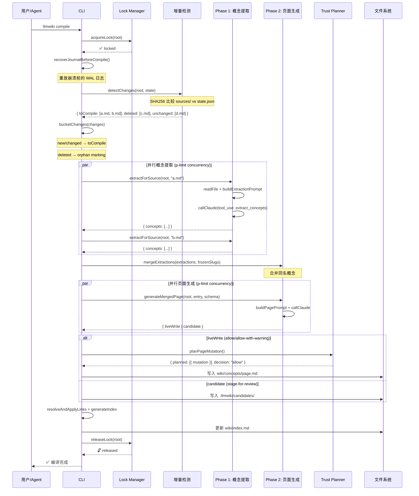
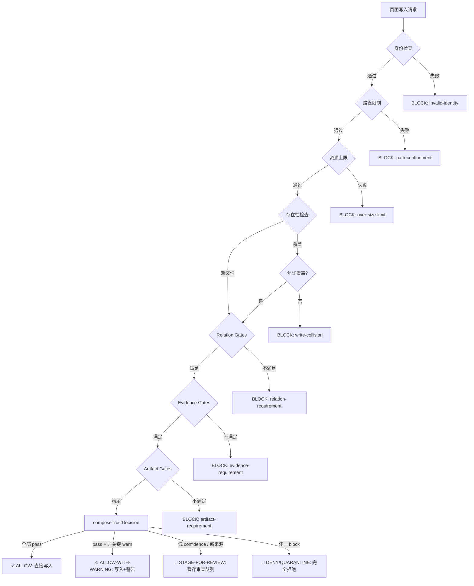

# 报告一：【战略与技术架构白皮书】

> **读者定位：** 技术管理层、架构师、团队技术汇报  
> **核心交付物：** 完整的技术价值论证、系统架构图、与传统方案对比  
> **llm-wiki-compiler 版本：** v1.0.0  
> **分析日期：** 2026-07-12

---

## 1. 项目定位与战略价值

### 1.1 一句话定位

> **llm-wiki-compiler 是一个知识编译器 CLI —— 原始资料进，互连 Wiki 出。**

它不是又一个 RAG 包装器，不是另一个 Obsidian 插件，也不是一个静态站点生成器。它是一个**编译器**——其核心隐喻来自编程语言的编译过程：原始源文件（`sources/`）经过两阶段 LLM 流水线（概念提取 → 页面生成），产出互连的、可审计的、可复用的知识产物（`wiki/`）。

### 1.2 Karpathy LLM Wiki 模式的原旨

Andrej Karpathy 在 2025 年提出的 LLM Wiki 模式，其核心洞察是一次经济学转化：

```
传统 RAG 范式：每次查询 → 检索原始 chunks → LLM 重建关系 → 输出答案 → 丢弃上下文
LLM Wiki 范式：一次编译 → 结构化互连页面 → 每次查询基于编译产物 → 知识持续积累
```

**关键转变：将工作从查询时移到编译时。** 每次对话的知识增量被持久化为 Wiki 的结构化页面，下一次查询自动受益。这不仅是工程优化，更是将 LLM Token 从"消耗品"重新定义为"资本品"（参考 Knowledge Compounding 论文 arXiv:2604.11243 的经济学分析，llm-wiki-compiler 作者本人参与）。

### 1.3 v1.0 的战略级变更

v1.0 最大的架构跃迁是引入 **Configurable Lifecycle Profiles (CLP)**。在此之前的版本只支持固定的 `concepts/` + `queries/` 布局；CLP 将 llm-wiki-compiler 从一个"个人知识管理 CLI"提升为一个**领域无关的知识编译基板**。

| 维度 | v0.x | v1.0 (CLP) |
|------|------|-----------|
| 页面类型 | 固定 4 种 (concept/entity/comparison/overview) | **声明式定义**，任意 domain-specific 类型 |
| 实体关系 | 仅 [[wikilink]] | **Typed Relations**（CAUSED_BY, IMPLEMENTS, RESOLVED_BY...） |
| 质量保障 | Prompt 约定 | **Runtime Trust Gates**（relation gate / evidence gate / artifact gate） |
| 生命周期 | 无 | **声明式状态机**（draft → reviewed → verified → deprecated） |
| 工作流 | 无 | **Multi-stage Workflows** with actions |
| 领域模板 | 无 | **autosci / newsroom** built-in + 可安装的 declarative templates |
| 外部数据 | 无 | **First-party Connectors**（Crossref 等）|

---

## 2. 核心创新点（6 大差异化能力）

### 2.1 编译型架构（Compile-then-Query）

```
RAG 循环（每次查询）:
  用户问题 → Embedding 检索 → Chunk 拼接 → LLM 回答 → (丢弃)

llmwiki 循环（知识积累）:
  原始源 → [编译] → Wiki 页面（持久化） → 每次查询 → 从 Wiki 检索 → LLM 回答
                                        ↓
                                  新知识 → [增量编译] → Wiki 更新
```

**数据支撑：** Knowledge Compounding 论文的实验表明，编译式 Wiki 在 4 次连续查询中消耗 47K Tokens，而等效 RAG 消耗 305K Tokens——节省 **84.6%**。30 天预测下累积节省 53.7%（中等主题浓度）到 81.3%（高主题浓度）。

### 2.2 Configurable Lifecycle Profiles (CLP)

CLP 是 v1.0 的核心创新。它不是一个文件格式，而是一个**运行时强制执行的合约**：

```json
// .llmwiki/profile.json 的结构示意
{
  "entities": {
    "protocol": {
      "fields": {
        "rfc_number": { "type": "string", "required": true },
        "version": { "type": "string" },
        "status": { "type": "string", "enum": ["current", "obsolete", "draft"] }
      }
    }
  },
  "relations": {
    "IMPLEMENTS": { "source": "device_config", "target": "protocol" },
    "CAUSED_BY": { "source": "fault", "target": "misconfiguration" }
  },
  "lifecycle": {
    "states": ["draft", "peer_reviewed", "verified", "deprecated"],
    "transitions": [
      { "from": "draft", "to": "peer_reviewed", "requires": ["human_gate"] }
    ]
  },
  "gates": {
    "relation_gates": [{ "type": "fault", "min_relations": { "CAUSED_BY": 1 } }],
    "evidence_gates": [{ "state": "verified", "artifact_type": "verification_log" }],
    "artifact_gates": [{ "type": "device_config", "required_artifacts": ["config_hash"] }]
  }
}
```

**关键设计原则：Fail-Closed。** 不合规的 profile 直接拒绝编译启动，而非静默降级。不合规的写入被 runtime gate 拒绝，而非依赖 prompt 约定。

### 2.3 信任门禁系统（Trust Gates）

这是 llm-wiki-compiler 最独特的工程架构。每个页面写入不是简单的文件系统操作，而是经过 `src/trust/planner.ts` 的统一写入缝：

```
写入请求 → planPageMutation()
              │
              ├── ① 身份检查（slug-safe / filename-safe）
              ├── ② 路径限制（confineUnderRoot，防 traversal）
              ├── ③ 资源上限（maxBodyChars by origin）
              ├── ④ 存在性检查（create vs update）
              ├── ⑤ Relation gates（最少关系数检查）
              ├── ⑥ Evidence gates（artifact 需求）
              └── ⑦ Artifact gates（hash-pinned 验证）
                    │
                    ▼
              composeTrustDecision()
                    │
          ┌────────┼────────┐
          ▼        ▼        ▼
       allow   stage-for  block/
       (写)    -review   quarantine
```

**四种决策结果：**
| 决策 | 行为 | 适用场景 |
|------|------|---------|
| `allow` | 直接写入 `wiki/` | 编译生成的常规页面 |
| `allow-with-warning` | 写入 + 记录警告 | 置信度不足但仍通过门槛 |
| `stage-for-review` | 暂存到 `.llmwiki/candidates/` | 高风险的 AI 生成内容 |
| `block/quarantine` | 完全拒绝 | 不满足 gate 要求或路径不安全 |

### 2.4 引文溯源（Citation Traceability）

每个编译页面的宣称都可以追溯到其源文件的具体行范围：

```markdown
# BGP Route Selection

BGP uses a multi-step decision process to select the best path.
^[sources/rfc4271-summary.md#L42-L58]

The LOCAL_PREF attribute is evaluated first in the path selection algorithm.
^[sources/rfc4271-summary.md#L15-L28]
```

`llmwiki lint` 会验证这些引文的完整性（文件存在 + 行号范围有效 + 内容匹配）。这意味着知识的每条 claim 都可以被审计——这对 ADN 网络自动驾驶这类安全敏感场景至关重要。

### 2.5 OKF 开放知识格式

OKF (Open Knowledge Format) 是 Google Cloud 发起的一项倡议，旨在将编译后的知识作为可移植的 Markdown 文件共享。llm-wiki-compiler 是 OKF 的生产者和消费者：

```
llmwiki export --target okf --out ./dist/okf
llmwiki import --okf ./dist/okf --dry-run    # 预览
llmwiki import --okf ./dist/okf                # 导入（默认进入审查队列）
llmwiki import --okf ./dist/okf --trusted      # 信任直写
```

**安全设计：** OKF 导入默认进入审查队列（`--dry-run` 先预览，正式导入等待 approve），防止外部知识未经审查直接污染 Wiki。

### 2.6 MCP 原生集成

llm-wiki-compiler 不是"支持 MCP"，而是**内建 MCP Server**：

```bash
llmwiki serve --root /path/to/project
```

启动后，MCP 客户端（Claude Desktop、Cursor、Codex、VS Code Copilot）可以直接调用 10 个 Wiki 工具：

| MCP 工具 | 功能 | 需要 Provider |
|----------|------|:---:|
| `ingest_source` | 摄入 URL 或本地文件 | ❌ |
| `compile_wiki` | 运行增量编译 | ✅ |
| `query_wiki` | 知识问答 | ✅ |
| `search_pages` | 语义检索页面 | ✅ |
| `read_page` | 读取单页面 | ❌ |
| `lint_wiki` | 运行质量检查 | ❌ |
| `wiki_status` | 项目状态快照 | ❌ |
| `get_context_pack` | 构建证据包（Agent 用） | ❌ |
| `run_eval` | 运行质量评估 | fast 套件 ❌ / full 套件 ✅ |
| `verify_artifact` | 验证哈希锚定的 artifact | ❌ |

---

## 3. 全局架构图

### 3.1 系统上下文图

```mermaid
graph TB
    subgraph 用户与Agent
        U[👤 用户 / AI Agent]
    end

    subgraph 接入层
        CLI[🖥️ CLI<br/>llmwiki ingest/compile/query/lint/...]
        MCP[🔌 MCP Server<br/>llmwiki serve]
        SDK[📦 SDK<br/>createWiki()]
        VIEWER[🌐 Local Viewer<br/>llmwiki view]
    end

    subgraph 核心引擎
        COMPILER[🧠 Compiler Engine<br/>增量检测 + 两阶段编译]
        TRUST[🔒 Trust System<br/>Planner → Checks → Decision]
        RETRIEVAL[🔍 Hybrid Retrieval<br/>语义 + BM25 + 图扩展]
        EVAL[📊 Eval Harness<br/>健康评分 + 引文支持度]
    end

    subgraph 数据层
        SOURCES[sources/<br/>原始源文件]
        WIKI[wiki/<br/>编译后的互连页面]
        STATE[.llmwiki/<br/>状态/配置/审查/日志]
    end

    subgraph 输出
        OKF[📤 OKF Bundle]
        JSON[📤 JSON / JSON-LD]
        GRAPHML[📤 GraphML]
        MARP[📤 Marp Slides]
        LLMS_TXT[📤 llms.txt]
    end

    U -->|命令行| CLI
    U -->|MCP协议| MCP
    U -->|JS API| SDK
    U -->|浏览器| VIEWER

    CLI --> COMPILER
    MCP --> COMPILER
    SDK --> COMPILER

    COMPILER --> TRUST
    COMPILER --> SOURCES
    COMPILER --> WIKI
    COMPILER --> STATE

    RETRIEVAL --> WIKI
    RETRIEVAL --> STATE

    EVAL --> WIKI
    EVAL --> STATE

    WIKI --> OKF
    WIKI --> JSON
    WIKI --> GRAPHML
    WIKI --> MARP
    WIKI --> LLMS_TXT
```

### 3.2 编译流程序列图



### 3.3 信任门禁决策流程（Trust Decision Pipeline）



---

## 4. 与技术方案的对比矩阵

### 4.1 vs 纯 RAG（Mem0 / Letta / Zep）

| 维度 | llm-wiki-compiler | 纯向量 RAG |
|------|:---:|:---:|
| **知识结构** | 编译后的互连页面，保留上下文、交叉引用、类型关系 | 语义 chunks，丢失文档结构 |
| **查询效率** | 渐进式披露（compact catalog → 按需加载），Token 省 84% | 每次从头检索 + 拼接 chunks |
| **知识积累** | ✅ 每次编译增量累积 | ❌ 每次查询后丢弃上下文 |
| **可审计性** | ✅ 引文溯源到行号 | ❌ Chunk 来源难以验证 |
| **人工可读** | ✅ Markdown + Obsidian 兼容 | ❌ 向量不可读 |
| **幻觉风险** | 编译时一次性验证 + 审查队列 | 每次检索都可能引入噪声 |
| **部署复杂度** | 单 CLI 工具 + Git | 需要向量 DB + Embedding 服务 |

### 4.2 vs 图数据库方案（GraphRAG / LightRAG）

| 维度 | llm-wiki-compiler | GraphRAG/LightRAG |
|------|:---:|:---:|
| **关系建模** | [[wikilink]] + Typed Relations（CLP） | 实体-关系三元组 |
| **社区检测** | 无（未来可扩展） | ✅ GraphRAG 的 Leiden 社区检测 |
| **查询语言** | 自然语言 + 语义搜索 | 自然语言 + Cypher/图遍历 |
| **运维成本** | Git 仓库 | Neo4j/PostgreSQL + 索引维护 |
| **增量更新** | ✅ 文件级增量编译 | ⚠️ 图增量更新复杂 |
| **人工介入** | ✅ Markdown 直接编辑 | ❌ 需要图数据库知识 |

### 4.3 vs 传统 Wiki（Confluence / Notion）

| 维度 | llm-wiki-compiler | 传统 Wiki |
|------|:---:|:---:|
| **知识录入** | AI 自动编译 + 人工审查 | 纯人工录入 |
| **知识维护** | lint + freshness 自动检测过期 | 人工检查 |
| **Agent 消费** | MCP + context pack + OKF | 需要爬虫/API 适配 |
| **版本控制** | Git native | 平台内置版本历史 |
| **离线可用** | ✅ 纯 Markdown 文件 | ❌ 依赖云服务 |
| **团队协作** | Git PR + review 队列 | 内置协作编辑 |

---

## 5. 目录结构即架构

```text
my-wiki-project/
├── sources/                # Layer 0: 原始源文件（不可变）
│   ├── rfc4271-summary.md
│   ├── bgp-troubleshooting.md
│   └── network-architecture-notes.md
│
├── wiki/                   # Layer 1: 编译后的知识产物
│   ├── concepts/           #   概念页面
│   ├── queries/            #   保存的问答
│   ├── <entity-type>/      #   CLP 声明的类型页面（如 protocol/, fault/）
│   ├── graph/              #   类型化关系和审计事件存储
│   ├── outputs/            #   工作流派生输出
│   └── index.md            #   自动生成的目录
│
├── .llmwiki/               # Layer 2: 编译器内部状态
│   ├── profile.json        #   CLP 合约（可选）
│   ├── config.json         #   审查策略配置
│   ├── schema.json         #   页面类型和交叉链接策略
│   ├── state.json          #   源文件哈希和所有权
│   ├── candidates/         #   审查队列
│   ├── workflows/          #   签名的工作流运行状态
│   └── eval/               #   质量历史
│
├── artifacts/              #   哈希锚定的文件（CLP 声明）
├── log.md                  #   活动日志
└── README.md               #   项目说明
```

---

## 6. 适用场景与边界

### ✅ 最佳适用场景（Sweet Spot）

| 场景 | 为什么适合 |
|------|-----------|
| **研究文件夹** | 论文 → 概念抽取 → 互连知识图谱 |
| **代码库文档** | README/设计文档 → 编译为结构化 Wiki |
| **团队手册** | 零散笔记 → 统一知识体系 |
| **标准规范** | RFC/3GPP/ISO 文档 → 可查询的知识库 |
| **决策记录** | 架构决策 → 编译 + 交叉引用 |
| **多 Agent 知识共享** | MCP 协议 → Agent 间知识传递 |

### ❌ 不适用场景

| 场景 | 原因 |
|------|------|
| 高流失 firehose | 编译速度跟不上数据产生速度 |
| 实时日志检索 | RAG 更适合毫秒级搜索原始日志 |
| 简单问答 | 不需要编译型知识库的开销 |
| 需要毫秒级延迟 | 编译型架构在查询时不保证亚毫秒响应 |

---

## 7. 与其他生态位的关系

```
┌─────────────────────────────────────────────────┐
│              开放上下文基础设施                   │
│                                                 │
│  ┌─────────────────┐    ┌─────────────────────┐ │
│  │ llm-wiki-       │    │ Atomic Memory      │ │
│  │ compiler         │    │ (atomicstrata)     │ │
│  │                 │    │                     │ │
│  │ 编译型知识管理   │◄──►│ 运行时 Agent 记忆   │ │
│  │ 源→结构化的互连  │    │ 可搜索/可纠正/可审查│ │
│  │ 知识产物         │    │                     │ │
│  └─────────────────┘    └─────────────────────┘ │
│                                                 │
│  通过 bridge 互通：llmwiki export --json →        │
│  Atomic Memory import                           │
└─────────────────────────────────────────────────┘
```

- **llmwiki** 处理"应该持久化的结构化知识"
- **Atomic Memory** 处理"Agent 运行时需要的动态记忆"
- 两者互补，通过 JSON 导出/导入桥接

---

## 8. 技术栈一览

| 层 | 技术 |
|----|------|
| **语言** | TypeScript 5.7+, ESM only |
| **运行时** | Node.js ≥ 24 |
| **CLI 框架** | Commander.js v13 |
| **构建** | tsup v8 |
| **测试** | Vitest v3 + 70+ 测试文件 |
| **LLM 提供商** | Anthropic SDK, OpenAI SDK, Claude Agent SDK, Ollama, GitHub Copilot, MiniMax |
| **MCP 协议** | @modelcontextprotocol/sdk v1.29 |
| **数据结构验证** | Zod v4, AJV v8 |
| **Markdown 处理** | markdown-it, turndown, sanitize-html |
| **格式处理** | pdf-parse, jsdom (@mozilla/readability), youtube-transcript |
| **嵌入** | Voyage AI (默认), OpenAI embeddings, Ollama embeddings |
| **代码质量** | fallow (dead code/duplication/complexity), madge (circular deps) |

---

> **下一份报告：** [报告二：源码级深度解构与核心算法报告](./02-源码级深度解构与核心算法报告.md)  
> **返回目录：** [README](./README.md)
