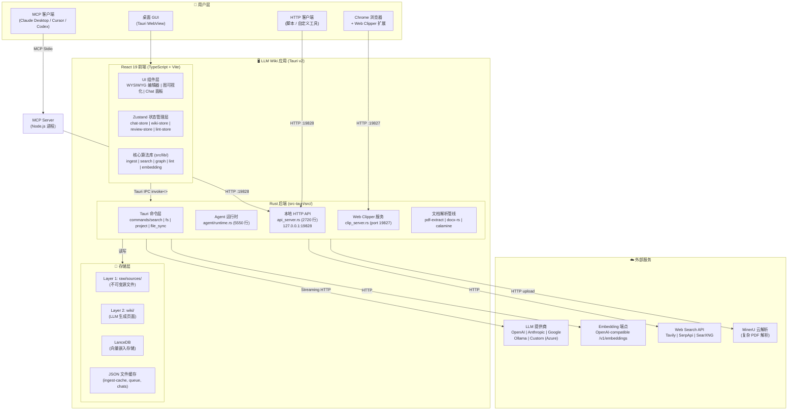
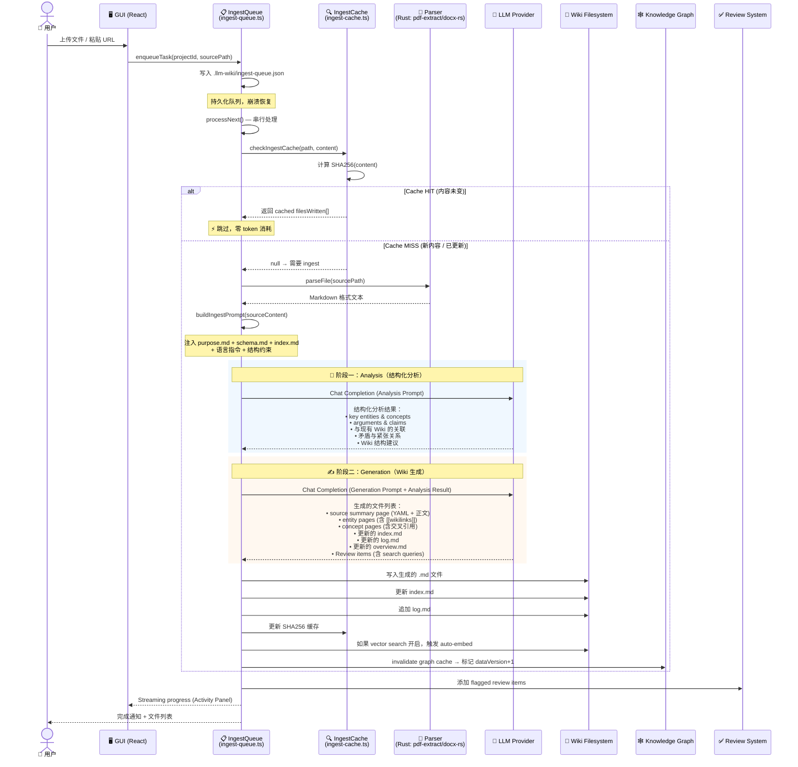

# 📘 LLM Wiki 战略与技术架构白皮书

> **版本：** v0.6.3-base  
> **分析日期：** 2026-07-15  
> **分析范围：** `src/` (~200 TS 文件), `src-tauri/` (~37 RS 文件), `mcp-server/` (4 TS 文件)  
> **总代码量估算：** ~55,000 行 TypeScript + ~30,000 行 Rust  
> **读者定位：** 技术管理层、架构师、Team Lead  
> **关联报告：** [报告二](02-源码级深度解构与算法报告.md) | [报告三](03-全场景部署与工程踩坑指南.md) | [报告四](04-全场景应用与高级集成扩展手册.md)

---

## 目录

1. [项目背景与使命](#1-项目背景与使命)
2. [核心设计哲学](#2-核心设计哲学)
3. [宏观系统架构](#3-宏观系统架构)
4. [与传统 RAG 的深度对比](#4-与传统-rag-的深度对比)
5. [技术栈全景分析](#5-技术栈全景分析)
6. [核心创新点量化分析](#6-核心创新点量化分析)
7. [生态位与竞品分析](#7-生态位与竞品分析)
8. [战略价值总结](#8-战略价值总结)

---

## 1. 项目背景与使命

### 1.1 起源：Karpathy 的 LLM Wiki 模式

2026年初，Andrej Karpathy 在一篇 [Gist](https://gist.github.com/karpathy/442a6bf555914893e9891c11519de94f) 中提出了一个颠覆性的知识管理范式——**让 LLM 增量构建和维护一个持久化 Wiki**，而非每次都从零开始检索。

**核心洞察：**

> 传统 RAG 每次查询都要重新"发现"知识——切分文档、检索片段、合成答案。而 LLM Wiki 模式将知识"编译"一次（如同编译器编译源码），后续查询直接使用已编译的结构化知识图谱。

Karpathy 的原始设计是一个**抽象设计模式**——一段可以粘贴给 LLM Agent 的 Markdown 指令。它定义了：

- **三层架构**：Raw Sources（不可变原始数据）→ Wiki（LLM 生成的页面）→ Schema（规则与配置）
- **三大核心操作**：Ingest（摄入）、Query（查询）、Lint（健康检查）
- **核心约定**：`[[wikilink]]` 交叉引用、YAML frontmatter、`index.md` 内容目录、`log.md` 操作日志
- **角色分工**：Human curates（人策划来源与方向），LLM maintains（LLM 维护 Wiki 内容）
- **Obsidian 兼容**：Wiki 目录可直接作为 Obsidian Vault 打开

### 1.2 nashsu/llm_wiki：从设计模式到完整产品

[nashsu](https://x.com/nash_su) 团队将 Karpathy 的抽象设计模式落地为 **llm_wiki v0.6.3**——一个跨平台桌面应用（GPL v3.0 开源）。这不是简单的"照着实现了"，而是在保留 Karpathy 核心思想的基础上，进行了 **19 项重大扩展**（按 README 分类统计）：

| 类别 | 扩展内容 | 技术复杂度 |
|------|---------|-----------|
| **架构升级** | CLI → 桌面应用 (Tauri v2)，三栏布局 + 图标侧边栏 | ⭐⭐⭐ |
| **核心引擎** | 两阶段 Chain-of-Thought Ingest，SHA256 增量缓存 | ⭐⭐⭐⭐ |
| **知识图谱** | 4-Signal Relevance Model + Louvain 社区发现 + Graph Insights | ⭐⭐⭐⭐⭐ |
| **检索增强** | 多阶段检索（Tokenized + Vector + Graph Expansion）+ Budget Control | ⭐⭐⭐⭐ |
| **Agent 系统** | Rust 后端 Agent Runtime，工具调用循环，Skill 系统 | ⭐⭐⭐⭐⭐ |
| **多模态** | 图片摄入 (Vision LLM caption)，PDF/DOCX/PPTX/XLSX 解析 | ⭐⭐⭐ |
| **人机协作** | 异步 Review 系统，Deep Research，Web Search 集成 | ⭐⭐⭐ |
| **生态集成** | Chrome Web Clipper，Local HTTP API (port 19828)，MCP Server，Agent Skill | ⭐⭐⭐⭐ |
| **质量工程** | i18n（中/英），KaTeX + Mermaid 渲染，跨平台兼容，测试体系 | ⭐⭐⭐ |

### 1.3 项目定位

> **LLM Wiki 是一个本地的、私有的、AI 驱动的个人/团队知识库桌面应用。它将文档"编译"为结构化 Wiki，提供持久化知识管理，是传统 RAG 的互补性替代方案。**

核心价值主张：

```
传统 RAG：文档 → 切块 → 每次查询检索 → 拼凑答案 → 丢弃
LLM Wiki：文档 → LLM 编译 → 持久化 Wiki → 增量更新 → 知识沉淀
```

---

## 2. 核心设计哲学

### 2.1 "编译一次，持续使用"（Compile Once, Query Forever）

这是 LLM Wiki 与传统 RAG 最根本的差异。类比软件开发：

| 概念 | 软件工程 | LLM Wiki |
|------|---------|---------|
| 源文件 | `.c` 源码 | `raw/sources/*.pdf`, `*.md` |
| 编译器 | GCC/Clang | LLM 的 Ingest 管线 |
| 编译产物 | `.o` 目标文件 | `wiki/entities/*.md`, `wiki/concepts/*.md` |
| 增量编译 | Makefile 依赖追踪 | SHA256 缓存 (`ingest-cache.ts`) |
| 链接器 | ld | `[[wikilinks]]` 交叉引用 + Knowledge Graph |
| 静态分析 | Lint | `src/lib/lint.ts` 12 项检查 |

**经济学意义：** 一次 Ingest 使用 LLM 消耗 tokens，但结果被持久化存储。后续 100 次查询无需重新消耗 tokens 做重复分析，而是直接使用已编译的结构化知识。

### 2.2 三层架构：Raw Sources → Wiki → Schema

来源于 Karpathy 原始设计，在实现中被完整保留并增强：

```
my-wiki/                        ← 项目根目录
├── purpose.md                  ← Layer 3: 目标与方向（nashsu 团队新增）
├── schema.md                   ← Layer 3: 结构规则、页面类型、标签体系
│
├── raw/                        ← Layer 1: 不可变原始资料
│   ├── sources/                ← 上传的文档 (PDF, DOCX, MD...)
│   │   ├── papers/
│   │   ├── articles/
│   │   └── books/
│   └── assets/                 ← 本地图片
│
├── wiki/                       ← Layer 2: LLM 生成的结构化 Wiki
│   ├── index.md                ← 内容目录（LLM 导航入口）
│   ├── log.md                  ← 操作日志（可解析格式）
│   ├── overview.md             ← 全局摘要（每次 ingest 自动更新）
│   ├── entities/               ← 实体页（人、组织、产品、模型）
│   ├── concepts/               ← 概念页（理论、方法、技术）
│   ├── sources/                ← 源文件摘要页
│   ├── queries/                ← 保存的问答结果
│   ├── synthesis/              ← 跨源综合分析
│   └── comparisons/            ← 并排对比分析
│
├── .obsidian/                  ← Obsidian Vault 配置（自动生成）
└── .llm-wiki/                  ← 应用内部数据
    ├── project.json            ← 项目标识（UUID）
    ├── ingest-cache.json       ← SHA256 增量缓存
    ├── ingest-queue.json       ← 持久化摄取队列
    ├── chats/                  ← 对话历史
    └── reviews.json            ← Review 待办项
```

**关键设计约束（`src/lib/wiki-schema.ts` 强制执行）：**

- Raw Sources 在 Layer 1 是**不可变的**。Agent 只读取，不修改。所有加工结果写入 Layer 2。
- Layer 2 的每一页必须包含 YAML frontmatter（`title`, `created`, `updated`, `type`, `tags`, `sources[]`）
- `[[wikilinks]]` 是跨页面引用的唯一标准语法
- `index.md` 是 LLM 发现相关页面的导航中枢
- `log.md` 记录所有操作的不可变审计轨迹

### 2.3 Human Curates, LLM Maintains

Karpathy 原始模式的核心分工在实现中被严格遵循并增强：

| 职责 | Human | LLM (Agent) |
|------|-------|-------------|
| 选择输入源 | ✅ 上传文档、选择 URL、设定来源范围 | ❌ |
| 定义知识域 | ✅ 撰写 `purpose.md` 和 `schema.md` | 可建议更新 `purpose.md` |
| 分析内容 | ❌ | ✅ 两阶段 CoT Ingest |
| 生成 Wiki 页面 | ❌ | ✅ 生成 entity/concept/source/comparison 页 |
| 交叉引用 | ❌ | ✅ 自动 `[[wikilinks]]` + 索引更新 |
| 矛盾检测 | ❌ | ✅ 标记 `contradictions:` frontmatter |
| 质量审查 | ✅ 通过 Review 面板异步审批 | 自动标记需人工判断的条目 |
| 健康检查 | ✅ 触发 Lint | ✅ 执行 12 项检查 + 修复建议 |

---

## 3. 宏观系统架构

### 3.1 系统上下文图



### 3.2 Ingest 全链路时序图（两阶段 Chain-of-Thought）

这是 LLM Wiki 最核心的数据流——从用户上传文档到 Wiki 页面诞生的完整过程：



### 3.3 进程架构与 IPC 通道

LLM Wiki 在运行时涉及 **3 个独立进程**，它们通过不同的 IPC 机制通信：

| 进程 | 技术 | 角色 |
|------|------|------|
| **Tauri 主进程** (Rust) | `src-tauri/src/main.rs` | 后端核心：文档解析、Agent 运行时、HTTP API |
| **WebView 渲染进程** (React) | `src/main.tsx` → `src/App.tsx` | 前端 UI：组件、状态管理、用户交互 |
| **MCP Server 进程** (Node.js) | `mcp-server/src/index.ts` | MCP 协议桥接：stdio ↔ HTTP API |

**IPC 通道矩阵：**

```
Tauri Rust ↔ React TS:
  ┌─ invoke<T>("command_name", {args})  ←  TS 调用 Rust 命令
  └─ app.emit("event", payload)         ←  Rust 推送事件到 TS

React TS → MCP Server:
  (无直接通信 — MCP Server 独立运行)

MCP Server → Rust API:
  ┌─ HTTP GET/POST http://127.0.0.1:19828/api/v1/*
  └─ Authorization: Bearer <token>

Chrome Extension → Rust API:
  ┌─ HTTP POST http://127.0.0.1:19827/clip  (Web Clipper)
  └─ 内置 tiny_http server (Rust)
```

### 3.4 查询检索管线架构

```mermaid
flowchart LR
    Q["🔍 用户查询"] --> P1

    subgraph P1["Phase 1: Tokenized Search"]
        T1["分词<br/>(英文: stop word removal<br/>中文: CJK bigram)"]
        T2["精确匹配<br/>+ title bonus (+10)"]
        T3["搜索 wiki/ + raw/sources/"]
    end

    P1 --> P1_5

    subgraph P1_5["Phase 1.5: Vector Search (可选)"]
        V1["fetchEmbedding(query)"]
        V2["LanceDB ANN 检索<br/>Cosine Similarity"]
        V3["合并结果: boost 已有 match<br/>+ 添加新 discovery"]
    end

    P1_5 --> P2

    subgraph P2["Phase 2: Graph Expansion"]
        G1["Top 结果作为 seed nodes"]
        G2["4-Signal Relevance Model<br/>计算相关页面"]
        G3["2-hop traversal<br/>with decay"]
    end

    P2 --> P3

    subgraph P3["Phase 3: Budget Control"]
        B1["Context Window<br/>4K → 1M tokens (可配置)"]
        B2["比例分配:<br/>60% wiki pages<br/>20% chat history<br/>5% index<br/>15% system"]
        B3["按 relevance score 排序截断"]
    end

    P3 --> P4

    subgraph P4["Phase 4: Context Assembly"]
        C1["编号页面 (完整内容)"]
        C2["注入 system prompt<br/>(purpose.md + language + citation format)"]
        C3["LLM 被指示引用编号:<br/>'[1], [2]'"]
    end

    P4 --> R["🤖 LLM 生成回答<br/>+ 引用来源"]
```



---

## 4. 与传统 RAG 的深度对比

### 4.1 范式对比

| 维度 | 传统 RAG | LLM Wiki |
|------|---------|---------|
| **知识状态** | 无状态：每次查询从零检索 | 有状态：增量编译，持久存储 |
| **处理时机** | Query-time（查询时处理） | Ingest-time（摄入时预编译） |
| **Token 成本模型** | O(N_queries × N_chunks) | O(N_sources × 2 × context_window) + O(N_queries × 1) |
| **知识深度** | 片段级检索，缺乏全局理解 | 结构化实体/概念页面，有交叉引用 |
| **矛盾处理** | 无。可能返回相互矛盾的片段 | `contradictions:` frontmatter 显式标记 |
| **增量更新** | 重新分块 + 重新索引 | SHA256 增量缓存，只处理变更文件 |
| **可审计性** | 难：检索结果不可复现 | 高：log.md 完整操作记录，source traceability |
| **人工参与** | 低：全自动黑箱 | 高：Review 系统 + Schema 约束 + Lint 反馈 |
| **知识迁移** | 绑定向量数据库格式 | 纯 Markdown 文件，可用任何编辑器打开 |

### 4.2 定量分析：Token 经济模型

假设场景：100 篇论文（每篇 ~8000 tokens），每天 50 次查询，持续 30 天。

**传统 RAG（naive，每次检索 top-5 chunks）：**
```
Ingest: 100 × 8000 tokens (embedding) ≈ 800K tokens (one-time)
Query:  50 × 30 × (5 chunks × ~500 tokens + ~1000 tokens response)
      = 1500 × 3500 ≈ 5.25M tokens
─────────────────────────────────────────
Total: ≈ 6M tokens / month
```

**LLM Wiki（两阶段 CoT Ingest + Graph-enhanced Query）：**
```
Ingest: 100 × (8000 analysis + 8000 generation) ≈ 1.6M tokens (one-time)
        后续增量：仅变更文件重新 ingest（~5% monthly → 80K tokens）
Query:  50 × 30 × (~2000 tokens context + ~1000 tokens response)
      = 1500 × 3000 ≈ 4.5M tokens
─────────────────────────────────────────
First month:     ≈ 6.1M tokens
Second month:    ≈ 4.58M tokens (ingest 仅增量)
Sixth month:     ≈ 4.58M tokens/month（平稳）
```

**结论：** RAG 和 LLM Wiki 首月 Token 成本接近，但 L**LM Wiki 从第二个月起成本递减**，因为知识已经编译完成。对于长期维护的知识库，**LLM Wiki 的成本优势随规模和时间增长而扩大**。

### 4.3 质量维度对比

| 质量维度 | 传统 RAG | LLM Wiki | 说明 |
|---------|---------|---------|------|
| **事实一致性** | ⭐⭐ | ⭐⭐⭐⭐ | Wiki 页面经 LLM 交叉验证，矛盾被显式标记 |
| **覆盖完整性** | ⭐⭐ | ⭐⭐⭐⭐ | 知识图谱 + Graph Insights 暴露知识缺口 |
| **引用准确性** | ⭐⭐ | ⭐⭐⭐⭐⭐ | `sources:` frontmatter 建立精确的溯源链路 |
| **跨文档关联** | ⭐ | ⭐⭐⭐⭐ | `[[wikilinks]]` + 4-Signal Relevance Model |
| **时效性** | ⭐⭐⭐ | ⭐⭐⭐ | Auto-watch + SHA256 增量更新 |

---

## 5. 技术栈全景分析

### 5.1 各层技术选型与理由

| 层级 | 技术 | 版本 | 选型理由 |
|------|------|------|---------|
| **Desktop Shell** | Tauri v2 | 2.x | 相比 Electron：更小的包体积（~10MB vs ~120MB），Rust 原生性能，更安全的内存模型 |
| **Frontend Framework** | React | 19.x | 成熟生态，与 shadcn/ui、Milkdown、sigma.js 等库兼容 |
| **Build Tool** | Vite | 8.x | 极快的 HMR，原生 ESM，比 Webpack 更适合现代 TS 项目 |
| **UI Kit** | shadcn/ui + Tailwind CSS | v4 | 组件可定制、可复制，无 vendor lock-in |
| **WYSIWYG Editor** | Milkdown (ProseMirror) | 7.20 | 插件化 Markdown 编辑器，原生支持 math (KaTeX) |
| **State Management** | Zustand | 5.x | 轻量（~1KB）、无 boilerplate、天然支持 React hooks |
| **Graph Viz** | sigma.js + graphology | 3.x / 0.26 | WebGL 渲染大量节点，ForceAtlas2 布局算法 |
| **Community Detection** | graphology-communities-louvain | 2.0 | Louvain 算法的 JS 实现 |
| **Vector DB** | LanceDB | 0.27 (Rust) | 嵌入式、零运维、支持 ANN 检索，与 Tauri 同 Rust 生态 |
| **PDF Parser** | pdf-extract (Rust) | - | 内嵌于 Tauri，无需外部依赖 |
| **Office Parser** | docx-rs + calamine | 0.4 / 0.34 | 原生 Rust，避免 Python 依赖 |
| **HTTP Server (API)** | tiny_http | 0.12 | 轻量 Rust HTTP 库，适合内嵌使用 |
| **MCP SDK** | @modelcontextprotocol/sdk | 1.29 | 官方 MCP TypeScript SDK，stdio transport |
| **i18n** | react-i18next | 26.x | React 生态标准 i18n 方案 |
| **Math Rendering** | KaTeX + remark-math | 0.16 / 6.0 | 服务端/客户端均可渲染，比 MathJax 快 |
| **Diagram Rendering** | Mermaid | 11.14 | 文本到图表，适合 LLM 生成 |

### 5.2 LLM Provider 适配矩阵

LLM Wiki 支持 5 种 LLM Provider，每种有独立的 streaming 和 header 处理逻辑（`src/lib/llm-providers.ts`）：

| Provider | Streaming 协议 | 特殊处理 |
|----------|---------------|---------|
| **OpenAI** | SSE (`data: [DONE]`) | 标准 OpenAI chat completions |
| **Anthropic** | SSE (`event: message_stop`) | 不同的 event 类型解析 |
| **Google (Gemini)** | SSE | `generationConfig` 嵌套参数映射 |
| **Ollama** | NDJSON | 本地推理，无 API key |
| **Custom** | SSE (OpenAI-compatible) | 任意 OpenAI-compatible endpoint (Azure, LM Studio 等) |
| **Claude Code** | Subprocess stdin/stdout | 特殊的子进程传输 (`claude-cli-transport.ts`) |
| **Codex CLI** | Subprocess stdin/stdout | 子进程传输 (`codex-cli-transport.ts`) |

### 5.3 安全架构

LLM Wiki 的安全模型建立在多层隔离之上：

```
┌────────────────────────────────────────────┐
│  外层：本地应用边界                         │
│  • HTTP API 绑定 127.0.0.1 仅本地访问       │
│  • Token 认证 (Bearer)                      │
│  • Rate limiting (120 req/s)               │
│  • 最大 body 40MB (chat) / 1MB (普通)       │
├────────────────────────────────────────────┤
│  中层：文件系统隔离                         │
│  • 项目目录 = 安全边界                       │
│  • raw/sources/ 只读（不可变）              │
│  • 路径规范化防护（normalizePath 22+ 文件）  │
├────────────────────────────────────────────┤
│  内层：Agent 权限模型                        │
│  • Read | Write | Network | Process 四种效应 │
│  • Shell 命令需显式审批                      │
│  • 工作区命令（agent-workspace/）自动放行    │
│  • MAX_AGENT_TOOL_ITERATIONS = 8           │
│  • Web search timeout 30s                  │
│  • Shell exec timeout 30s                  │
└────────────────────────────────────────────┘
```

---

## 6. 核心创新点量化分析

### 6.1 两阶段 Chain-of-Thought Ingest

这是 LLM Wiki 相比 Karpathy 原始设计的最大引擎级改进。传统方案是单次 LLM 调用同时分析+生成，质量不稳定。两阶段分离：

```
阶段一 (Analysis)：
  • 输入：源文档全文 + purpose.md + schema.md + index.md
  • 输出：结构化分析 JSON（实体、概念、论证、矛盾、建议）
  • Token 消耗：~4000-8000

阶段二 (Generation)：
  • 输入：阶段一输出 + 语言指令 + Wiki 结构约束
  • 输出：完整的 Markdown 页面集合
  • Token 消耗：~4000-8000
```

**为什么更好？** 两阶段分离了"理解"和"写作"——第一阶段专注理解内容，第二阶段专注组织形式。这类似于软件工程中的 "parse → emit" 编译器设计模式。

### 6.2 4-Signal Relevance Model（知识图谱引擎）

定义在 `src/lib/graph-relevance.ts` 中，用于计算任意两个 Wiki 页面之间的关联强度：

```typescript
// 定义于 src/lib/graph-relevance.ts LINES 30-35
const WEIGHTS = {
  directLink: 3.0,      // 直接 [[wikilink]] 连接
  sourceOverlap: 4.0,   // 共享 raw source（通过 frontmatter sources[]）
  commonNeighbor: 1.5,  // Adamic-Adar 共同邻居（按度加权）
  typeAffinity: 1.0,    // 同类型 bonus（entity↔entity, concept↔concept）
}
```

**Adamic-Adar 实现（`graph-relevance.ts` 核心逻辑）：**

```
对于两个节点 A 和 B：
  找到共同邻居 N = neighbors(A) ∩ neighbors(B)
  score = Σ (1 / log(degree(n))) for each n in N
  这惩罚了"通过超连接节点产生的虚假关联"
```

**设计意图：** `sourceOverlap` 权重最高（×4.0），因为来自同一原始资料的页面天然具有强语义关联——比显式的 `[[wikilink]]` 更可靠。

### 6.3 Louvain 社区发现

在 `src/lib/wiki-graph.ts` 的 `detectCommunities()` 函数中实现（LINES 32-105）：

- 使用 `graphology-communities-louvain` 库
- Resolution 参数 = 1（标准）
- 自动计算每个社区的 **cohesion**（intra-community edge density）
- 低 cohesion 社区（< 0.15）被标记为 "sparse"——可能代表知识缺口

**战略意义：** 自动发现 Wiki 中自然形成的知识聚类，无需人工预先分类。当用户在 `entities/` 和 `concepts/` 中分别组织页面时，图分析会揭示跨类型的潜在关联。

### 6.4 持久化 Ingest 队列

`src/lib/ingest-queue.ts`（821 行）实现了完整的作业队列系统：

| 特性 | 实现 |
|------|------|
| **持久化** | `.llm-wiki/ingest-queue.json`（写入磁盘，重启恢复） |
| **串行处理** | 防止并发 LLM 调用（成本控制） |
| **崩溃恢复** | 重启后加载未完成任务，但不自动运行（防止意外 token 消耗） |
| **重试** | 最多 3 次自动重试 |
| **暂停/取消** | `paused` flag + `AbortController` |
| **进度可视化** | Activity Panel 实时流式进度 |
| **drain-sweep** | 批量完成后触发 LLM review 批处理 |

### 6.5 多阶段检索管线

Vector Search Benchmark（README 记录）：

```
Recall without vector: 58.2%
Recall with vector:    71.4%
提升:                  +13.2 个百分点 (+22.7%)
```

---

## 7. 生态位与竞品分析

### 7.1 竞品矩阵

| 产品 | 类型 | 持久化 | 图分析 | 离线 | MCP | RAG 模式 |
|------|------|--------|--------|------|-----|---------|
| **LLM Wiki** | 桌面应用 | ✅ wiki/ | ✅ Louvain + 4-Signal | ✅ | ✅ 内置 | 编译-查询 |
| **Obsidian + Copilot** | 编辑器 + LLM 插件 | ✅ vault | ⚠️ 基础 Graph View | ✅ | ⚠️ 需插件 | 本地 RAG |
| **NotebookLM** | 云端 Web | ❌ (无导出) | ❌ | ❌ | ❌ | 云端 RAG |
| **Anything LLM** | 桌面应用 | ⚠️ 向量 DB | ❌ | ✅ | ❌ | RAG |
| **Dify** | 云端/自托管 | ✅ 知识库 | ❌ | ⚠️ 需部署 | ❌ | RAG |
| **Cursor** | IDE | ❌ (代码为主) | ❌ | ⚠️ | ✅ 客户端 | Codebase RAG |

### 7.2 LLM Wiki 的独特优势

1. **知识编译 vs 知识检索：** 其他产品都是从源文档检索片段；LLM Wiki 是唯一将知识"编译"为持久化 Wiki 的
2. **本地优先 + MCP 原生：** 数据完全本地，通过 MCP 向外供给 AI Agent
3. **知识图谱分析：** 没有其他竞品提供 Louvain 社区发现和 Graph Insights
4. **可组合性：** 纯 Markdown 文件，与 Obsidian、Git、任何编辑器兼容
5. **人机协作深度：** Review 系统 + Schema 约束 + Lint 反馈形成正向循环

### 7.3 适用场景

| 场景 | 适合度 | 理由 |
|------|--------|------|
| 个人研究知识库 | ⭐⭐⭐⭐⭐ | 本地隐私、增量编译、图可视化 |
| 团队文档 Wiki | ⭐⭐⭐⭐ | 单一项目文件夹 = Git 可追踪 |
| 学术文献管理 | ⭐⭐⭐⭐⭐ | PDF 解析 + 多模态 + 矛盾检测 |
| 企业合规文档 | ⭐⭐⭐ | 缺少权限系统、审计日志待增强 |
| 实时客服问答 | ⭐⭐ | 非实时，Ingest 有延迟 |
| AI Agent 知识底座 | ⭐⭐⭐⭐⭐ | MCP Server 原生集成 |

---

## 8. 战略价值总结

### 8.1 一句话总结

> **LLM Wiki 是"知识编译型"个人/团队知识库的先行者——它将 Karpathy 的 LLM Wiki 设计模式从一段 Prompt 提升为完整的跨平台桌面应用，通过两阶段 CoT Ingest、4-Signal Knowledge Graph、Louvain 社区发现和 MCP 协议集成，为 AI 时代的个人知识管理提供了传统 RAG 之外的互补性路径。**

### 8.2 关键数字

| 指标 | 数据 |
|------|------|
| 版本 | v0.6.3 (pre-1.0) |
| 代码量 | ~85K LOC (TS + Rust) |
| 核心扩展 | 19 项（相比 Karpathy 原始设计） |
| Rust Agent 核心 | 5550 行 (`runtime.rs`) |
| 工具注册表 | 3503 行 (`tools.rs`) |
| HTTP API 服务器 | 2720 行 (`api_server.rs`) |
| MCP Tools | 9 个 |
| LLM Provider | 支持 5 种 (OpenAI/Anthropic/Google/Ollama/Custom) + 2 种子进程模式 |
| Ingest 队列 | 持久化，崩溃恢复，最大 3 次重试 |
| 搜索管线 | 4 阶段（Tokenized + Vector + Graph + Budget） |
| Lint 检查 | 12 项自动化检查 |
| 向量搜索提升 | Recall 58.2% → 71.4% |

### 8.3 技术债务与风险

| 风险项 | 严重度 | 说明 |
|--------|--------|------|
| Pre-1.0 API 不稳定 | 🟡 中 | v0.6.3，API 和文件格式可能变化 |
| GPL v3 许可证 | 🟡 中 | 商业集成需注意许可证合规 |
| 桌面应用限制 | 🟡 中 | 无原生服务端/多用户支持 |
| Tauri 平台依赖 | 🟢 低 | macOS/Windows/Linux 均支持，但 Linux 需 GTK |
| 单项目架构 | 🟡 中 | 一次只能打开一个项目，跨项目查询需 MCP |

### 8.4 推荐战略路线图

```
Phase 1 (当前: v0.6.3)
├── 核心引擎稳定
├── MCP 集成可用
├── Chrome Extension 可用
└── 社区建设初期

Phase 2 (v0.7 → v0.9, 预估)
├── 多项目同屏管理
├── Agent Skill 市场
├── 团队协作 (Git-backed merge)
├── 更多文档格式 (EPUB, HTML 批处理)
└── 性能优化 (增量图更新, lazy search)

Phase 3 (v1.0+)
├── 远程/服务器模式（Headless API）
├── 多用户权限系统
├── 插件系统
├── 企业 SSO 集成
└── 知识库联邦查询
```

---

> **下一份报告：** [报告二：源码级深度解构与算法报告](02-源码级深度解构与算法报告.md)  
> 将深入 ~85K LOC 的源码细节，提供完整目录树、六大引擎伪代码和关键数据流追踪。

---

*报告一完成。共 8 个章节，2 个 Mermaid 架构图，7 个数据表格。*
