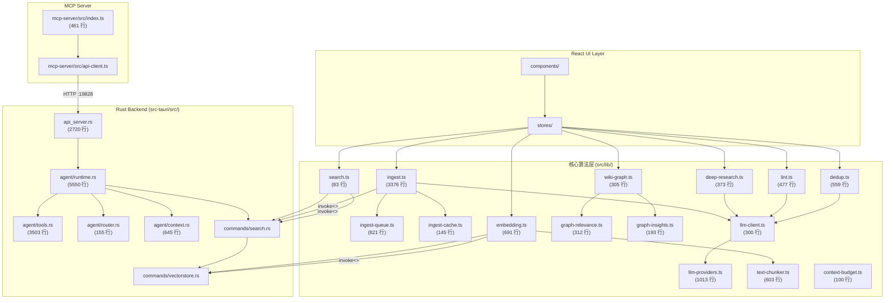

# 📗 LLM Wiki 源码级深度解构与算法报告

> **版本：** v0.6.3-base  
> **分析日期：** 2026-07-15  
> **分析范围：** 全量源文件，逐模块精读  
> **核心文件数：** ~200 TypeScript + ~37 Rust + 4 MCP  
> **读者定位：** 需要修改/扩展源码的高级工程师  
> **关联报告：** [报告一](01-战略与技术架构白皮书.md) | [报告三](03-全场景部署与工程踩坑指南.md) | [报告四](04-全场景应用与高级集成扩展手册.md)

---

## 目录

1. [完整源码目录树](#1-完整源码目录树)
2. [引擎一：两阶段 Chain-of-Thought Ingest](#2-引擎一两阶段-chain-of-thought-ingest)
3. [引擎二：多阶段检索管线](#3-引擎二多阶段检索管线)
4. [引擎三：知识图谱与相关性模型](#4-引擎三知识图谱与相关性模型)
5. [引擎四：Rust Agent 运行时](#5-引擎四rust-agent-运行时)
6. [引擎五：Lint 健康检查引擎](#6-引擎五lint-健康检查引擎)
7. [引擎六：重复实体检测与合并](#7-引擎六重复实体检测与合并)
8. [模块间依赖关系图](#8-模块间依赖关系图)
9. [MCP Server 源码分析](#9-mcp-server-源码分析)
10. [关键数据结构字典](#10-关键数据结构字典)

---

## 1. 完整源码目录树

### 1.1 项目根目录

```
llm_wiki/                              # 项目根
├── package.json                       # v0.6.3, React 19 + Vite 8
├── vite.config.ts                     # Vite 构建配置（Tailwind v4 插件）
├── tsconfig.json / .app.json / .node.json  # TypeScript 配置
├── README.md / README_CN.md           # 中英日韩四语 README
├── src-tauri/                         # Rust 后端（Tauri v2）
├── src/                               # TypeScript 前端（React）
├── mcp-server/                        # MCP 协议服务端（Node.js）
├── extension/                         # Chrome Web Clipper 扩展
├── assets/                            # 截图资源
└── reports/                           # 本报告集群
```

### 1.2 前端源码树（`src/`）

```
src/
├── main.tsx                           # React 入口，theme 加载，错误兜底
├── App.tsx                            # 顶级路由/布局组件
├── index.css                          # Tailwind 入口 + 全局样式
├── i18n/                              # react-i18next 国际化（中/英）
│
├── types/
│   └── wiki.ts                        # WikiProject, FileNode, WikiPage 类型定义
│
├── stores/                            # Zustand 状态管理
│   ├── wiki-store.ts                  # 🔑 项目、LLM 配置、embedding 配置
│   ├── chat-store.ts                  # 🔑 对话管理、消息流、Agent 模式
│   ├── review-store.ts                # 异步 Review 系统状态
│   ├── lint-store.ts                  # Lint 结果状态
│   ├── research-store.ts              # Deep Research 任务状态
│   ├── activity-store.ts              # Ingest 活动面板状态
│   ├── file-sync-store.ts             # 文件同步状态
│   ├── update-store.ts                # 应用更新检查
│   └── zoom-store.ts                  # 图缩放状态
│
├── lib/                               # 🔑 核心算法库（~80+ 文件）
│   ├── ingest.ts                      # 🏗️ Ingest 主引擎 (3376 行)
│   ├── ingest-queue.ts                # 持久化队列 (821 行)
│   ├── ingest-cache.ts                # SHA256 增量缓存 (145 行)
│   ├── ingest-sanitize.ts             # 内容净化（debug 输出 → markdown 转换）
│   ├── search.ts                      # 🔍 Tokenized 搜索 + Rust invoke
│   ├── embedding.ts                   # Vector embedding + LanceDB (691 行)
│   ├── text-chunker.ts                # Markdown 递归分块器 (603 行)
│   ├── context-budget.ts              # Context Window 预算分配 (100 行)
│   ├── wiki-graph.ts                  # 🕸️ 知识图谱构建 + Louvain (305 行)
│   ├── graph-relevance.ts             # 4-Signal Relevance Model (312 行)
│   ├── graph-insights.ts              # Surprising Connections + Knowledge Gaps (193 行)
│   ├── graph-search.ts                # Graph-expanded 搜索
│   ├── graph-filters.ts               # 图过滤逻辑
│   ├── graph-visibility.ts            # 图节点可见性控制
│   ├── lint.ts                        # 🩺 12 项 Lint 检查 (477 行)
│   ├── lint-fixes.ts                  # 智能修复建议
│   ├── dedup.ts                       # 重复实体检测 (559 行)
│   ├── dedup_embedding.ts             # Embedding-based 去重
│   ├── dedup-storage.ts               # 去重存储层
│   ├── dedup-runner.ts                # 去重执行器
│   ├── deep-research.ts               # 🔬 Deep Research 引擎 (373 行)
│   ├── web-search.ts                  # Tavily/SerpApi/SearXNG 适配
│   ├── scheduled-import.ts            # 定时导入
│   ├── source-lifecycle.ts            # 源文件生命周期
│   ├── source-watch-config.ts         # 源文件夹监控配置
│   ├── source-filter.ts               # 源文件过滤
│   ├── source-identity.ts             # 源文件身份标识
│   ├── source-delete-decision.ts      # 源删除决策
│   ├── sources-merge.ts               # 源文件合并
│   ├── sources-tree-delete.ts         # 级联删除
│   ├── llm-client.ts                  # 🤖 LLM 流式调用客户端 (300 行)
│   ├── llm-providers.ts               # Provider 适配层 (1013 行)
│   ├── wiki-schema.ts                 # Wiki Schema 验证
│   ├── wiki-page-types.ts             # 页面类型定义 (entity/concept/source...)
│   ├── wiki-page-resolver.ts          # 页面路径解析
│   ├── wiki-page-delete.ts            # 页面删除
│   ├── wikilink-transform.ts          # [[wikilink]] 转换
│   ├── wiki-filename.ts               # 文件名生成规则
│   ├── wiki-cleanup.ts                # Wiki 清理
│   ├── wiki-type-style.ts             # 页面类型样式
│   ├── frontmatter.ts                 # YAML frontmatter 解析
│   ├── page-merge.ts                  # 页面内容合并策略
│   ├── enrich-wikilinks.ts            # Wikilink 增强
│   ├── markdown-image-resolver.ts     # Markdown 图片路径解析
│   ├── extract-source-images.ts       # 源文件图片提取
│   ├── image-caption-pipeline.ts      # 图片描述生成管线
│   ├── vision-caption.ts              # Vision LLM 图片理解
│   ├── mineru.ts                      # MinerU 云解析集成
│   ├── review-utils.ts                # Review 工具函数
│   ├── review-create-page.ts          # Review → 创建页面
│   ├── sweep-reviews.ts               # Review 批量处理
│   ├── optimize-research-topic.ts     # LLM 优化研究主题
│   ├── reasoning-detector.ts          # `<think>` 推理块检测
│   ├── project-store.ts               # 项目列表管理
│   ├── project-identity.ts            # 项目 UUID 标识
│   ├── project-mutex.ts               # 项目互斥锁
│   ├── project-file-sync.ts           # 项目文件同步
│   ├── project-file-tree-refresh.ts   # 文件树刷新
│   ├── file-types.ts                  # 文件类型检测
│   ├── path-utils.ts                  # 跨平台路径规范化（22+ 文件使用）
│   ├── natural-sort.ts                # 自然排序
│   ├── persist.ts                     # 持久化工具
│   ├── llm-providers.ts               # 所有 LLM Provider 的 buildBody/parseStream
│   ├── llm-client.ts                  # 流式调用统一接口
│   ├── tauri-fetch.ts                 # Tauri HTTP 插件封装
│   ├── proxy-config.ts                # 代理配置
│   ├── endpoint-normalizer.ts         # 端点 URL 规范化
│   ├── output-language.ts             # 输出语言指令
│   ├── detect-language.ts             # 语言检测（中/英）
│   ├── greeting-detector.ts           # 问候语检测
│   ├── theme.ts                       # 主题管理（亮/暗/系统）
│   ├── latex-to-unicode.ts            # LaTeX → Unicode 符号映射（100+）
│   ├── templates.ts                   # 场景模板
│   ├── update-check.ts                # 版本更新检查
│   ├── chat-agent-types.ts            # Agent 类型定义
│   └── utils.ts                       # 通用工具函数
│
├── commands/                          # Tauri IPC 命令封装
│   └── fs.ts                          # 文件系统操作（read/write/list/exists）
│
├── components/                        # React UI 组件
│   ├── chat/                          # Chat 面板组件
│   ├── wiki/                          # Wiki 文件树组件
│   ├── graph/                         # 知识图谱可视化
│   ├── lint/                          # Lint 结果面板
│   ├── review/                        # Review 面板
│   ├── research/                      # Deep Research 面板
│   ├── settings/                      # 设置面板
│   ├── sources/                       # 源文件管理
│   └── activity/                      # 活动面板
│
└── test-helpers/                      # 测试辅助工具
    ├── mock-stream-chat.ts            # Mock LLM 流式响应
    ├── real-content.ts                # 真实内容测试数据
    ├── fs-temp.ts                     # 临时文件系统
    └── scenarios/                     # 场景测试数据
```

### 1.3 Rust 后端源码树（`src-tauri/src/`）

```
src-tauri/src/
├── main.rs                            # Tauri 应用入口
├── lib.rs                             # Tauri 插件注册 + 命令挂载
├── Cargo.toml                         # Rust 依赖：pdfium, lancedb, docx-rs, calamine...
│
├── agent/                             # 🔑 Agent 运行时核心
│   ├── runtime.rs                     # 🧠 Agent 主循环 (5550 行)  — 最核心
│   ├── tools.rs                       # 🔧 工具注册表 (3503 行)
│   ├── router.rs                      # 查询意图路由 (155 行)
│   ├── context.rs                     # Agent 上下文构建 (645 行)
│   ├── session.rs                     # 会话管理 (337 行)
│   ├── provider.rs                    # LLM Provider 抽象层
│   ├── skills.rs                      # Skill 扫描与加载
│   ├── permissions.rs                 # Agent 权限策略
│   ├── events.rs                      # Agent 事件系统
│   ├── cancel.rs                      # 取消/中断机制
│   ├── workspace.rs                   # 工作区文件管理
│   ├── types.rs                       # Agent 类型定义
│   └── mod.rs                         # 模块导出
│
├── commands/                          # Tauri IPC 命令
│   ├── search.rs                      # 🔍 搜索命令（tokenized + vector + graph）
│   ├── vectorstore.rs                 # LanceDB 向量存储操作
│   ├── fs.rs                          # 文件系统 IPC 命令
│   ├── project.rs                     # 项目管理命令
│   ├── file_sync.rs                   # 文件同步命令
│   ├── file_history.rs                # 文件历史
│   ├── extract_images.rs              # PDF 图片提取
│   ├── external_search.rs             # Web Search 命令
│   ├── cli_resolver.rs                # CLI 工具定位
│   ├── claude_cli.rs                  # Claude Code CLI 集成
│   ├── codex_cli.rs                   # Codex CLI 集成
│   └── mod.rs
│
├── api_server.rs                      # 🌐 本地 HTTP API (2720 行) — port 19828
├── clip_server.rs                     # 📎 Web Clipper HTTP 服务 — port 19827
├── server_bind.rs                     # 服务器绑定与重试
├── cors.rs                            # CORS 头处理
├── proxy.rs                           # HTTP 代理配置
├── tray.rs                            # 系统托盘
├── panic_guard.rs                     # 第三方解析器 panic 捕获
│
└── types/
    ├── mod.rs                         # 类型模块导出
    └── wiki.rs                        # Wiki 相关 Rust 类型
```

### 1.4 MCP Server 源码树（`mcp-server/`）

```
mcp-server/
├── package.json                       # @modelcontextprotocol/sdk ^1.29
├── tsconfig.json
├── src/
│   ├── index.ts                       # 🔌 MCP Server 主文件 (461 行) — 9 tools
│   ├── api-client.ts                  # LLM Wiki HTTP API 客户端封装
│   └── version.ts                     # 版本号
└── test/
    ├── api-client.test.ts
    └── version.test.ts
```

---

## 2. 引擎一：两阶段 Chain-of-Thought Ingest

**涉及文件：**
- `src/lib/ingest.ts` (3376 行) — 主引擎
- `src/lib/ingest-queue.ts` (821 行) — 队列管理
- `src/lib/ingest-cache.ts` (145 行) — SHA256 缓存
- `src/lib/ingest-sanitize.ts` — 内容净化

### 2.1 完整伪代码

```
PROCEDURE autoIngest(projectPath, sourcePath, folderContext):

  // ── 阶段 0: 预处理 ──
  sourceContent ← parseFile(sourcePath)        // Rust 文档解析
  sourceContent ← sanitizeIngestedFileContent(sourceContent)
  sourceSummarySlug ← sourceSummarySlugFromIdentity(sourceIdentityForPath(sourcePath))

  // ── 检查增量缓存 ──
  cachedFiles ← checkIngestCache(projectPath, sourceFileName, sourceContent)
  IF cachedFiles ≠ null:
    // 所有缓存文件仍存在 → 跳过
    RETURN { skipped: true, filesWritten: cachedFiles }

  // ── 图片提取（多模态） ──
  savedImages ← extractAndSaveSourceImages(projectPath, sourcePath, sourceSummarySlug)
  captionCache ← loadCaptionCache(...)
  unCaptionedImages ← filter(savedImages, img → img.relPath ∉ captionCache)
  IF unCaptionedImages ≠ ∅:
    captionMarkdownImages(unCaptionedImages, llmConfig, multimodalConfig)

  // ── 加载上下文 ──
  projectContext ← loadProjectContext(projectPath)
    // 包含: purpose.md, schema.md, index.md, overview.md, log.md
  languageDirective ← buildLanguageDirective()

  // ── 计算 token 预算 ──
  budget ← computeContextBudget(maxContextSize)
  maxTokens ← INGEST_GENERATION_TOKENS_DEFAULT  // 默认 8192

  // ═══════════════════════════════════════════
  // 🔬 阶段一: ANALYSIS（结构化分析）
  // ═══════════════════════════════════════════
  analysisPrompt ← buildAnalysisPrompt(
    sourceContent,
    sourceFileName,
    sourceSummarySlug,
    projectContext,
    languageDirective
  )
  // 要求 LLM 输出结构化 JSON：
  //   - keyEntities: [{name, type, description}]
  //   - keyConcepts: [{name, description, relatedEntities}]
  //   - mainArguments: [string]
  //   - contradictions: [{claim, conflictingWith}]
  //   - recommendations: [{action, page, reason}]
  //   - suggestedSearchQueries: [string]

  analysisResult ← streamChat(llmConfig, analysisPrompt, overrides={
    temperature: 0.1,     // 确定性输出
    maxTokens: maxTokens,
    reasoning: { mode: "off" }  // 禁用推理块（节省 token）
  })

  // ═══════════════════════════════════════════
  // ✍️ 阶段二: GENERATION（Wiki 生成）
  // ═══════════════════════════════════════════
  generationPrompt ← buildGenerationPrompt(
    sourceContent,
    sourceFileName,
    sourceSummarySlug,
    analysisResult,        // ← 阶段一的输出作为输入
    projectContext,
    languageDirective,
    savedImages,
    captionCache
  )
  // 要求 LLM 输出完整的 Markdown 文件集合：
  //   source summary page (wiki/sources/{slug}.md)
  //   entity pages (wiki/entities/{slug}.md)
  //   concept pages (wiki/concepts/{slug}.md)
  //   updated index.md
  //   updated overview.md
  //   log.md entries
  //   review items (需要人工判断的条目标记)

  generatedFiles ← streamChat(llmConfig, generationPrompt, overrides={
    temperature: 0.1,
    maxTokens: maxTokens,
    reasoning: { mode: "off" }
  })

  // ── 阶段 3: 写入与后处理 ──
  writtenFiles ← []
  FOR each generatedPage IN generatedFiles:
    // 与现有页面合并（如果存在）
    IF fileExists(generatedPage.path):
      existingContent ← readFile(generatedPage.path)
      mergedContent ← mergePageContent(existingContent, generatedPage.content)
      writeFile(generatedPage.path, mergedContent)
    ELSE:
      writeFile(generatedPage.path, generatedPage.content)
    writtenFiles.append(generatedPage.path)

  // 保证 source summary 始终存在（fallback）
  IF sourceSummarySlug ∉ generatedPagePaths:
    fallbackSummary ← buildFallbackSourceSummary(sourceContent)
    writeFile(sourceSummaryPath, fallbackSummary)
    writtenFiles.append(sourceSummaryPath)

  // 更新索引与日志
  updateIndexMd(writtenFiles)
  appendLogEntries(writtenFiles)
  updateOverviewMd(analysisResult)

  // 触发后续任务
  saveIngestCache(projectPath, sourceFileName, sha256, writtenFiles)
  triggerAutoEmbedding(writtenFiles)    // 如果 vector search 开启
  addReviewItems(generatedReviewItems)
  invalidateGraphCache()

  RETURN { filesWritten: writtenFiles }
```

### 2.2 长文档分块策略

定义在 `src/lib/ingest.ts` LINES 46-52：

```typescript
// 当源文档超过 LONG_SOURCE_MIN_BUDGET (8000 chars) 时触发分块
const LONG_SOURCE_CHUNK_MIN = 12_000    // 最小分块大小
const LONG_SOURCE_CHUNK_MAX = 60_000    // 最大分块大小
const LONG_SOURCE_DIGEST_MAX = 15_000   // 摘要最大长度
```

策略：
1. 如果源文档 < 8000 字符 → 单次全量处理
2. 如果源文档 > 8000 字符 → 分块处理：
   - 每个 chunk 12K-60K 字符
   - 每个 chunk 单独做 Analysis
   - 汇总所有 Analysis 结果生成 digest（< 15K 字符）
   - 用 digest 而非全文做 Generation

### 2.3 增量缓存机制

`src/lib/ingest-cache.ts` 核心逻辑（基于 Web Crypto API）：

```
checkIngestCache(projectPath, sourceFileName, sourceContent):
  cache ← load from .llm-wiki/ingest-cache.json
  entry ← cache.entries[sourceFileName]
  IF entry is null → RETURN null (需要 ingest)

  currentHash ← SHA256(sourceContent)          // 浏览器 crypto.subtle.digest
  IF entry.hash ≠ currentHash → RETURN null     // 内容已变更

  // 验证所有缓存文件仍存在
  FOR each filePath IN entry.filesWritten:
    IF NOT fileExists(filePath):
      // 幽灵条目 — 文件被外部删除，缓存无效
      RETURN null

  RETURN entry.filesWritten  // ✅ 缓存命中，跳过 ingest
```

**设计细节：**
- 哈希仅计算文件正文（不含 frontmatter），因此元数据更新不触发 re-ingest
- 如果 `filesWritten` 中的任何文件已被外部删除，缓存无效化（防止幽灵条目）
- 缓存文件位于 `.llm-wiki/ingest-cache.json`，纯 JSON 格式

### 2.4 持久化队列

`src/lib/ingest-queue.ts` 的状态机：

```
       ┌──────────┐
       │  pending │ ← enqueueTask() / 从磁盘恢复
       └────┬─────┘
            │ processNext() — 串行，一次一个
            ▼
       ┌──────────┐
  ┌───→│processing│
  │    └────┬─────┘
  │         │
  │    ┌────┴─────┐
  │    │          │
  │    ▼          ▼
  │  ┌────┐    ┌──────┐
  │  │done│    │failed│──→ retryCount < 3 → 回到 pending
  │  └────┘    └──────┘──→ retryCount ≥ 3 → 停止重试
  │                        │
  │    retryTask()         │
  └────────────────────────┘
```

关键设计：
- **`paused` flag**：用户可暂停队列（`pauseQueue()`），正在飞行的任务会被 `AbortController` 取消
- **`restoredPausedTaskIds`**：从磁盘恢复的任务**不会自动运行**（防止意外 token 消耗）
- **`completedSinceIdle` 计数器**：追踪自上次 drain 以来的完成数，触发 review-sweep
- **`currentProjectId` 检查**：如果中途切换项目，孤儿 runner 自动退出

---

## 3. 引擎二：多阶段检索管线

**涉及文件：**
- `src/lib/search.ts` (83 行) — 前端搜索接口
- `src-tauri/src/commands/search.rs` — Rust 后端搜索实现
- `src/lib/embedding.ts` (691 行) — 向量嵌入管线
- `src/lib/text-chunker.ts` (603 行) — Markdown 分块器
- `src/lib/context-budget.ts` (100 行) — Context 预算分配
- `src/lib/graph-relevance.ts` (312 行) — 图扩展

### 3.1 Phase 1: Tokenized Search

`src/lib/search.ts` 中的 `tokenizeQuery()` 函数（LINES 38-60）：

```
FUNCTION tokenizeQuery(query: string) → string[]:

  // 步骤 1: 小写 + 分词
  rawTokens ← query
    .toLowerCase()
    .split(/[\s,，。！？、；：""''（）()\-_/\\·~～…]+/)
    .filter(t → t.length > 1)
    .filter(t → t ∉ STOP_WORDS)        // 中英文停用词：的/是/the/is/a/at...

  tokens ← []

  // 步骤 2: CJK bigram 处理
  FOR each token IN rawTokens:
    hasCJK ← /[\u4e00-\u9fff\u3400-\u4dbf]/.test(token)

    IF hasCJK AND token.length > 2:
      chars ← [...token]                // Unicode 安全拆分
      // 生成所有相邻 bigram
      FOR i ← 0 TO chars.length - 2:
        tokens.push(chars[i] + chars[i+1])
      // 每个单字也加入
      FOR each ch IN chars:
        IF ch ∉ STOP_WORDS: tokens.push(ch)
      // 完整词也加入
      tokens.push(token)
    ELSE:
      tokens.push(token)

  RETURN [...new Set(tokens)]           // 去重
```

**示例：**
- 输入：`"深度学习模型"`
- 输出：`["深度", "度学", "学习", "习模", "模型", "深", "度", "学", "习", "模", "型", "深度学习模型"]`

匹配评分：
- 标题精确匹配：**+10 bonus**
- 正文 token 匹配：每个命中记 1 分
- 搜索范围：`wiki/` + `raw/sources/`

### 3.2 Phase 1.5: Vector Semantic Search

`src/lib/embedding.ts` 的核心管线（LINES 1-22 的注释精确描述了流程）：

```
EMBEDDING PIPELINE:

  1. chunkMarkdown(content) → Chunk[]
     // 使用 src/lib/text-chunker.ts 的递归分块器
     // 每个 chunk 携带 headingPath (如 "## Intro > ### Usage")

  2. FOR each chunk:
     fetchEmbedding(title + headingPath + chunk.text)
     WITH auto-halve retry on "input too long" errors
     // 自动减半重试：embedding 端点拒绝过长文本时

  3. vector_upsert_chunks(pageId, [{chunkIndex, chunkText, headingPath, embedding}])
     // 写入 LanceDB（Rust 后端）

SEARCH:
  1. fetchEmbedding(query)
  2. vector_search_chunks(queryEmbedding, topK × 3)
     // 过度检索（3×），后续 group by page_id 去重
  3. GROUP BY page_id, max-pool primary score + weighted tail sum
  4. RETURN top-K pages, with matchedChunks for UI display
```

**关键设计细节：**
- `incrementalOptimizeCounts` Map：追踪每个页面的增量优化次数，超过阈值（20 次）触发全量重新嵌入
- `lastEmbeddingError`：最近一次 embedding 失败描述，供 Settings 面板展示
- `auto-halve retry`：如果 embedding 端点返回 "input too long"，自动将文本减半后重试
- benchmark：Recall 58.2% → 71.4%（+22.7%）

**Text Chunker 分块策略**（`src/lib/text-chunker.ts`）：

```
SPLIT PRIORITY (降序):
  (a) 标题分隔 (## / ### / ####)
  (b) 段落边界 (\n\n)
  (c) 换行 (\n)
  (d) 句子终结符 (. / 。 / ! / ！ / ? / ？ / ; / ；)
  (e) 空白符 ( / 　/ \t)
  (f) 硬截断 (last resort)

安全规则:
  - 绝不在代码块内分割 (```...```)
  - 绝不在表格内分割 (|...|)
  - YAML frontmatter 在分块前剥离
  - 相邻 chunk 有 overlap (默认 200 chars)
  - 过小 chunk (<200 chars) 被合并到邻居
```

### 3.3 Phase 2: Graph Expansion

使用 `src/lib/graph-relevance.ts` 的 4-Signal Model 从 seed nodes 扩展相关页面（见引擎三）。

### 3.4 Phase 3-4: Budget Control & Context Assembly

`src/lib/context-budget.ts`（100 行）的分配逻辑：

```
INPUT: maxContextSize (characters)

budget:
  maxCtx          = max(maxContextSize, 204800)     // 默认 200K chars
  responseReserve = maxCtx × 0.15                    // 15% 留给 LLM 回答
  indexBudget     = maxCtx × 0.05                    // 5% 给 index.md
  pageBudget      = maxCtx × 0.50                    // 50% 给 wiki 页面
  historyAndSystem = maxCtx × 0.30                   // 30% 给历史+系统提示

perPageCap      = max(pageBudget × 0.3, 5000)       // 单页最多占 30% pageBudget
```

**可配置范围：** 用户通过 Settings 滑块设定 context window：4K → 1M tokens。

---

## 4. 引擎三：知识图谱与相关性模型

**涉及文件：**
- `src/lib/wiki-graph.ts` (305 行) — 图谱构建 + Louvain
- `src/lib/graph-relevance.ts` (312 行) — 4-Signal Relevance
- `src/lib/graph-insights.ts` (193 行) — 惊喜连接 + 知识缺口
- `src/lib/graph-search.ts` — 图扩展搜索
- `src/lib/graph-filters.ts` — 过滤逻辑

### 4.1 图谱构建（两遍扫描）

`src/lib/wiki-graph.ts` 中的 `buildRetrievalGraph()` 函数（LINES 155-244）：

```
FUNCTION buildRetrievalGraph(projectPath, dataVersion):

  // 缓存检查
  IF cachedGraph.dataVersion = dataVersion → RETURN cachedGraph

  // ═══ 第一遍：读取所有页面，提取元数据 ═══
  mdFiles ← listDirectory(projectPath/wiki/) → flatten
  rawNodes ← []

  FOR each file IN mdFiles:
    id ← fileNameToId(file.name)           // "deep-learning.md" → "deep-learning"
    content ← readFile(file.path)
    fm ← extractFrontmatter(content)       // title, type, sources[]
    wikilinks ← extractWikilinks(content)  // 正则 /\[\[([^\]|]+?)(?:\|[^\]]+?)?\]\]/g
    rawNodes.push({id, title: fm.title, type: fm.type,
                   path: file.path, sources: fm.sources,
                   rawLinks: wikilinks, fileName: file.name})

  nodeIds ← Set(all node ids)

  // ═══ 第二遍：解析链接，构建双向邻接 ═══
  outLinksMap ← new Map()       // A → {B, C, D}
  inLinksMap  ← new Map()       // B ← {A, E}

  FOR each raw IN rawNodes:
    FOR each linkTarget IN raw.rawLinks:
      resolvedId ← resolveTarget(linkTarget, nodeIds)
      // resolveTarget 做大小写/空格/连字符归一化匹配
      IF resolvedId ≠ null AND resolvedId ≠ raw.id:
        outLinksMap[raw.id].add(resolvedId)
        inLinksMap[resolvedId].add(raw.id)

  // 构建不可变节点
  nodes ← Map()
  FOR each raw IN rawNodes:
    nodes.set(raw.id, RetrievalNode{
      id: raw.id, title: raw.title, type: raw.type, path: raw.path,
      sources: Object.freeze(raw.sources),
      outLinks: Object.freeze(outLinksMap[raw.id]),
      inLinks:  Object.freeze(inLinksMap[raw.id])
    })

  cachedGraph ← { nodes, dataVersion }
  RETURN cachedGraph
```

### 4.2 4-Signal Relevance Model（逐行注释）

`src/lib/graph-relevance.ts` LINES 247-287：

```typescript
export function calculateRelevance(
  nodeA: RetrievalNode,
  nodeB: RetrievalNode,
  graph: RetrievalGraph,
): number {
  if (nodeA.id === nodeB.id) return 0

  // Signal 1: Direct links (weight 3.0)
  //   A 链接到 B 或 B 链接到 A → 直接关联
  const forwardLinks = nodeA.outLinks.has(nodeB.id) ? 1 : 0
  const backwardLinks = nodeB.outLinks.has(nodeA.id) ? 1 : 0
  const directLinkScore = (forwardLinks + backwardLinks) * 3.0

  // Signal 2: Source overlap (weight 4.0) — 最高权重
  //   两页引用相同的 raw source → 强语义关联
  const sourcesA = new Set(nodeA.sources)
  let sharedSourceCount = 0
  for (const src of nodeB.sources) {
    if (sourcesA.has(src)) sharedSourceCount += 1
  }
  const sourceOverlapScore = sharedSourceCount * 4.0

  // Signal 3: Common neighbors - Adamic-Adar (weight 1.5)
  //   Σ(1 / log(degree(neighbor))) 对每个共同邻居
  //   惩罚通过高连接度节点产生的"虚假关联"
  const neighborsA = getNeighbors(nodeA)  // outLinks ∪ inLinks
  const neighborsB = getNeighbors(nodeB)
  let adamicAdar = 0
  for (const neighborId of neighborsA) {
    if (neighborsB.has(neighborId)) {
      const neighbor = graph.nodes.get(neighborId)
      if (neighbor) {
        const degree = node.outLinks.size + node.inLinks.size  // getNodeDegree
        adamicAdar += 1 / Math.log(Math.max(degree, 2))
      }
    }
  }
  const commonNeighborScore = adamicAdar * 1.5

  // Signal 4: Type affinity (weight 1.0)
  //   同类型页面获得 affinity bonus
  //   entity↔concept = 1.2, entity↔entity = 0.8
  //   定义在 TYPE_AFFINITY 矩阵中 (LINES 37-43)
  const affinityMap = TYPE_AFFINITY[nodeA.type]
  const typeAffinityScore = (affinityMap?.[nodeB.type] ?? 0.5) * 1.0

  return directLinkScore + sourceOverlapScore + commonNeighborScore + typeAffinityScore
}
```

**TYPE_AFFINITY 矩阵**（`graph-relevance.ts` LINES 37-43）：

| | entity | concept | source | query | synthesis |
|---|--------|---------|--------|-------|-----------|
| **entity** | 0.8 | 1.2 | 1.0 | 0.8 | 1.0 |
| **concept** | 1.2 | 0.8 | 1.0 | 1.0 | 1.2 |
| **source** | 1.0 | 1.0 | 0.5 | 0.8 | 1.0 |
| **query** | 0.8 | 1.0 | 0.8 | 0.5 | 1.0 |
| **synthesis** | 1.0 | 1.2 | 1.0 | 1.0 | 0.8 |

> **设计意图：** entity↔concept 获得最高 affinity (1.2)，因为实体通常由概念定义；source↔source 获得最低 (0.5)，因为不同的源文件之间应该通过它们共享的实体/概念来关联，而非直接关联。

### 4.3 Louvain 社区发现

`src/lib/wiki-graph.ts` LINES 32-101：

```
FUNCTION detectCommunities(nodes, edges):

  // 步骤 1: 构建 graphology 无向图
  g ← new Graph({ type: "undirected" })
  FOR each node: g.addNode(node.id)
  FOR each edge: g.addEdgeWithKey(key, edge.source, edge.target, {weight: edge.weight})

  // 步骤 2: 运行 Louvain 算法 (resolution = 1)
  communityMap ← louvain(g, { resolution: 1 })

  // 步骤 3: 分组并计算 cohesion
  FOR each (commId, memberIds):
    n ← memberIds.length
    intraEdges ← count actual edges within community
    possibleEdges ← n > 1 ? (n*(n-1))/2 : 1
    cohesion ← intraEdges / possibleEdges

    // 低 cohesion (< 0.15) 社区标记为 sparse — 知识缺口信号
```

### 4.4 Graph Insights — 自动发现

`src/lib/graph-insights.ts` (193 行) 实现了两种自动分析：

**Surprising Connections（惊喜连接）** — `findSurprisingConnections()`：
- Signal 1: 跨社区边 (+3)
- Signal 2: 跨类型边 — 远距离类型对 (source↔concept 等) 额外 +2
- Signal 3: 边缘节点 ↔ Hub 节点 — 度≤2 连接到度≥50% max 的 hub (+2)
- Signal 4: 弱连接但依然存在的边 (+1)
- 排除 structural pages (index, log, overview)
- 最低阈值：score ≥ 3 且有原因描述

**Knowledge Gaps（知识缺口）** — 三种类型：
1. **isolated-node**：度 ≤ 1 的孤立页面
2. **sparse-community**：cohesion < 0.15 且 ≥3 个节点的社区
3. **bridge-node**：连接 3+ 个不同社区的桥接节点

---

## 5. 引擎四：Rust Agent 运行时

**涉及文件：**
- `src-tauri/src/agent/runtime.rs` (5550 行) — Agent 主循环
- `src-tauri/src/agent/tools.rs` (3503 行) — 工具注册表
- `src-tauri/src/agent/router.rs` (155 行) — 查询意图路由
- `src-tauri/src/agent/context.rs` (645 行) — 上下文构建
- `src-tauri/src/agent/session.rs` (337 行) — 会话管理
- `src-tauri/src/agent/permissions.rs` — 权限模型
- `src-tauri/src/agent/skills.rs` — Skill 系统
- `src-tauri/src/agent/provider.rs` — LLM Provider 抽象

### 5.1 Agent 核心循环

`src-tauri/src/agent/runtime.rs` 中 Agent 的核心循环（简化伪代码）：

```
FUNCTION agent_chat(request: AgentChatRequest) → AgentChatResponse:

  runtime ← AgentRuntime { projectId, projectPath, embeddingConfig,
                           llmConfig, webSearchConfig, anytxtConfig }
  token ← AgentCancellationToken::new()

  // ── 上下文准备 ──
  projectCtx ← loadProjectContext(projectPath)
    // 读取 overview.md (max 8K), schema.md (max 6K)
  explicitFiles ← loadExplicitContextFiles(request.contextFiles, max 8 files, each max 8K)
  skills ← loadProjectSkills(projectPath, projectCtx, request.selectedSkills, request.disabledSkills)
    // 扫描 .llm-wiki/skills/*/SKILL.md (max 48 skills)
  routerDecision ← routeQuery(request.message, request.mode, tools)
  session ← agentSessionStore.get(projectPath, request.sessionId)

  // ── 构建 system prompt ──
  systemContext ← buildSystemContext(projectCtx, routerDecision, skills)
  userContext ← buildUserContext(query, routerDecision, history, references, explicitFiles)

  // ── 工具注册 ──
  toolRegistry ← BuiltinToolRegistry
  tools ← [
    wiki_search,   source_search,   graph_search,   web_search,
    anytxt_search, workspace_read,  workspace_write, workspace_delete,
    skill_read,    shell_exec,      shell_approve
  ]

  // ═══════════════════════════════════════════
  // 工具调用循环（最多 MAX_AGENT_TOOL_ITERATIONS = 8 次）
  // ═══════════════════════════════════════════
  messages ← [system, user]
  FOR iteration ← 1 TO 8:
    response ← llm_provider.chat_completion(messages, tools, token)
    // LLM 返回: { content, tool_calls? }

    IF response.tool_calls IS EMPTY:
      // 最终回答
      references ← collectReferences(retrievalSummary)
      RETURN AgentChatResponse { message: response.content, references, ... }

    // 执行工具调用
    FOR each toolCall IN response.tool_calls:
      toolResult ← toolRegistry.execute(toolCall.name, toolCall.input, context)
        // 权限检查：permissions.check(toolSpec.effects, toolCall)
        // Read/Write/Network/Process 四种权限效应

      // Shell 命令需要审批
      IF toolCall.name = "shell_exec":
        IF NOT permissions.hasShellApproval:
          EMIT userInputRequest → 等待用户审批
          CONTINUE

      messages.push({ role: "assistant", content: null, tool_calls: [...] })
      messages.push({ role: "tool", tool_call_id: ..., content: toolResult })

      EMIT AgentEvent::ToolResult { tool, status, ... }  // 流式推送到前端

  // 超过最大迭代次数
  RETURN error("max tool iterations exceeded")
```

### 5.2 查询意图路由

`src-tauri/src/agent/router.rs` (155 行) — `routeQuery()` 函数：

```
FUNCTION routeQuery(message, mode, tools) → RouterDecision:

  lower ← message.toLowerCase()

  // 关键词匹配（中英文）
  explicit_web ← containsAny(lower, [
    "web search", "search the web", "internet", "online",
    "latest", "today", "新闻", "联网", "网上", "最新"
  ])
  explicit_raw ← containsAny(lower, [
    "raw source", "source file", "原始资料", "原始文件", "源文件"
  ])
  explicit_graph ← containsAny(lower, [
    "graph", "relationship", "知识图谱", "关系图"
  ])

  // 模式优先级:
  //   "fast" → 不触发搜索，直接对话
  //   "local_first" → 优先内部搜索，不提示外部
  //   "deep" → 广泛搜索，搜索更多结果

  // 决定：
  //   should_search_wiki: boolean
  //   should_hint_web: boolean
  //   should_hint_anytxt: boolean
  //   should_include_sources: boolean
  //   intent: NeedsInternalSearch | NeedsExternalSearch |
  //           NeedsRawSourceSearch | NeedsGraph |
  //           NeedsWrite | SimpleConversational | Ambiguous
```

### 5.3 工具注册表

`src-tauri/src/agent/tools.rs` (3503 行) 定义的工具清单：

| 工具名 | 效应类型 | 安全约束 |
|--------|---------|---------|
| `wiki.search` | Read | MAX results=10 |
| `source.search` | Read | MAX_SOURCE_SEARCH_FILES=10K, MAX_SNIPPET_CHARS=500 |
| `graph.search` | Read | MAX_GRAPH_SEARCH_FILES=10K |
| `web.search` | Network | WEB_SEARCH_TIMEOUT=30s |
| `anytxt.search` | Network | DEFAULT_ENDPOINT 127.0.0.1:9920 |
| `workspace.read` | Read | 2MB max, relative to agent-workspace/ |
| `workspace.write` | Write | 2MB max, rollback snapshot max 512KB |
| `workspace.delete` | Write | 限制在 agent-workspace/ 内 |
| `skill.read` | Read | MAX_SKILL_REFERENCE_BYTES=256KB |
| `shell.exec` | Process | MAX_COMMAND=4000 chars, MAX_OUTPUT=20K chars, TIMEOUT=30s |
| `workspace.list` | Read | 限制在 agent-workspace/ 内 |
| `skill.user_input` | (form) | MAX_FIELDS=12, MAX_OPTIONS=8, MAX_TEXT=400 |

### 5.4 会话管理

`src-tauri/src/agent/session.rs` (337 行)：

```rust
// 内存缓存限制
const MAX_SESSION_MESSAGES: usize = 40;   // 每次对话最多 40 条消息
const MAX_CACHED_SESSIONS: usize = 128;   // 内存中最多缓存 128 个 session

// 会话持久化
// 每个 session 保存到 .llm-wiki/chats/{session_id}.json
// session 文件包含完整的消息历史
// API/MCP 调用者可以恢复旧会话
```

### 5.5 Skill 系统

`src-tauri/src/agent/skills.rs` — Agent Skills 的加载机制：

```
FUNCTION loadProjectSkills(projectPath) → AgentSkill[]:
  skillsDir ← projectPath/.llm-wiki/skills/
  IF NOT exists(skillsDir) → RETURN []

  skills ← []
  FOR each dir IN listDirs(skillsDir):
    skillMd ← read(dir/SKILL.md)
    IF skillMd exists:
      // 解析 YAML frontmatter
      fm ← parseFrontmatter(skillMd)
      skills.push(AgentSkill{
        name: fm.name,
        description: fm.description,
        content: skillMd.body,          // 完整的 SKILL.md 内容
        combinedChars: len(skillMd),     // 用于上下文预算
      })

  // 排序、截断到 MAX_AUTO_SKILLS (48)
  RETURN skills
```

---

## 6. 引擎五：Lint 健康检查引擎

**涉及文件：**
- `src/lib/lint.ts` (477 行) — 12 项检查
- `src/lib/lint-fixes.ts` — 智能修复建议

### 6.1 12 项检查清单

`src/lib/lint.ts` 中实现的核心检查：

| # | 检查项 | 严重度 | 说明 |
|---|--------|--------|------|
| 1 | **Orphan pages** | warning | 零入链的页面（不被任何其他页面引用） |
| 2 | **Broken wikilinks** | warning | `[[link]]` 指向不存在的页面 |
| 3 | **No outlinks** | info | 页面没有任何出链 |
| 4 | **Semantic issues** | warning | LLM 标记的内容问题（矛盾、缺失等） |
| 5 | **Index completeness** | info | `index.md` 中缺失的页面 |
| 6 | **Frontmatter validation** | info | 缺少必填字段（title, type, tags, sources） |
| 7 | **Stale content** | info | updated 日期超过 90 天 |
| 8 | **Contradictions** | warning | `contested: true` 或 `contradictions:` 标记 |
| 9 | **Quality signals** | info | `confidence: low` 或单源无 confidence 标记 |
| 10 | **Source drift** | info | raw/ 文件 SHA256 与缓存不匹配 |
| 11 | **Page size** | info | 超过 200 行的页面 |
| 12 | **Tag audit** | info | 使用未在 SCHEMA.md 中定义的 tag |

### 6.2 智能 wikilink 修复

`src/lib/lint.ts` 中 `normalizeLinkTarget()` 和 brokend link 建议逻辑（LINES 58-80）：

```
FUNCTION normalizeLinkTarget(target: string) → string:
  // 归一化到 slug 形式以便精确匹配
  normalizedTarget ← normalizePath(target)
    .replace(/^wiki\//i, "")
    .replace(/\.md$/i, "")
    .trim()
    .toLowerCase()

// broken link 修复建议：
//   min score = 0.74 (BROKEN_LINK_SUGGESTION_MIN_SCORE)
//   related page min score = 0.08 (RELATED_PAGE_SUGGESTION_MIN_SCORE)
//   same folder bonus = +0.08
//   same basename = 0.96 (几乎确定是同一个页面)
//   contains target name = 0.82
```

**修复建议排名算法**（`lint.ts`）：
1. 如果存在完全同名的 slug（归一化后）→ score = 1.0
2. 如果存在 basename 相同但路径不同的页面 → score = 0.96
3. 如果目标字符串被某个页面路径完全包含 → score = 0.82
4. 对每个候选页面，计算 token 重叠度 → weighted by CJK token 权重
5. 同文件夹 bonus → +0.08

---

## 7. 引擎六：重复实体检测与合并

**涉及文件：** `src/lib/dedup.ts` (559 行)

### 7.1 三阶段架构

```
STAGE 1: extractEntitySummaries(projectPath)
  → walk wiki/entities/ + wiki/concepts/
  → for each page: extract (slug, title, description, tags)
  → RETURN EntitySummary[]   // 纯数据提取，无 LLM

STAGE 2: detectDuplicateGroups(summaries, llmCall)
  → 将摘要列表发送给 LLM
  → LLM 识别可能的重复组
  → RETURN DuplicateGroup[]   // [ {slugs:[...], reason, confidence} ]

STAGE 3: mergeDuplicateGroup(group, canonicalSlug, otherWikiPages, llmMerge)
  → LLM 合并重复页面的内容
  → 确定性地合并 frontmatter 数组字段（sources, tags）
  → 重写所有 wikilink 引用
  → 重写 related: 条目
  → RETURN MergeResult
```

**设计亮点：**
- Stage 1 和 Stage 2/3 完全解耦，可独立测试
- LLM 调用通过参数注入，单元测试不依赖真实 LLM
- 合并时保留两个页面的所有 `sources[]`（union），确保溯源链不断

---

## 8. 模块间依赖关系图



---

## 9. MCP Server 源码分析

### 9.1 架构总览

`mcp-server/src/index.ts` (461 行) 是一个标准的 **MCP Server**，基于 `@modelcontextprotocol/sdk` v1.29：

```
mcp-server/src/index.ts 架构:

  ┌─────────────────────────────┐
  │  Server (MCP SDK)           │
  │  name: "llm-wiki"           │
  │  version: from version.ts   │
  ├─────────────────────────────┤
  │  ListToolsRequestSchema     │  → 返回 9 个 tools 定义
  │  CallToolRequestSchema      │  → 路由到具体 handler
  └──────────┬──────────────────┘
             │
  ┌──────────▼──────────────────┐
  │  LlmWikiApiClient           │
  │  (api-client.ts)            │
  │  baseURL: env or 127.0.0.1  │
  │  auth: Bearer token         │
  └──────────┬──────────────────┘
             │ HTTP
  ┌──────────▼──────────────────┐
  │  LLM Wiki Rust API          │
  │  127.0.0.1:19828/api/v1/*   │
  └─────────────────────────────┘
```

### 9.2 9 个 MCP Tools 详解

| # | Tool Name | API 端点 | 安全约束 |
|---|-----------|---------|---------|
| 1 | `llm_wiki_status` | `GET /health` | 无 auth |
| 2 | `llm_wiki_projects` | `GET /projects` | 需 MCP enabled |
| 3 | `llm_wiki_files` | `GET /projects/{id}/files` | max_files=10K, root: wiki/sources/all |
| 4 | `llm_wiki_read_file` | `GET /projects/{id}/files/content` | MAX_TEXT_BYTES=120K, 仅项目内路径 |
| 5 | `llm_wiki_reviews` | `GET /projects/{id}/reviews` | status filter: unresolved/resolved/all |
| 6 | `llm_wiki_search` | `POST /projects/{id}/search` | hybrid (keyword + vector) |
| 7 | `llm_wiki_chat` | `POST /projects/{id}/chat` | mode: fast/standard/deep/local_first |
| 8 | `llm_wiki_graph` | `GET /projects/{id}/graph` | 过滤器: q, node_type, limit |
| 9 | `llm_wiki_rescan_sources` | `POST /projects/{id}/sources/rescan` | 触发后端重新扫描 |

### 9.3 关键安全设计

```typescript
// mcp-server/src/index.ts LINES 249-257
async function assertMcpEnabled(): Promise<void> {
  const health = await client.health()
  if (health.mcpEnabled === false) {
    throw new McpError(
      ErrorCode.InvalidRequest,
      "LLM Wiki MCP access is disabled. Enable Settings -> API + MCP -> Enable MCP access..."
    )
  }
}
```

- 每次工具调用前检查 `mcpEnabled` flag
- `llm_wiki_status` 除外（始终可用，用于探测连接状态）
- 文件读取有 120KB 文本截断保护
- 搜索结果有最大数量限制

---

## 10. 关键数据结构字典

### 10.1 TypeScript 核心类型

```typescript
// src/types/wiki.ts
interface WikiProject {
  id: string        // UUID, 持久化在 .llm-wiki/project.json
  name: string
  path: string
}

interface FileNode {
  name: string
  path: string
  is_dir: boolean
  children?: FileNode[]
}

interface WikiPage {
  path: string
  content: string
  frontmatter: Record<string, unknown>  // title, type, tags, sources[], created, updated
}

// src/lib/graph-relevance.ts
interface RetrievalNode {
  readonly id: string
  readonly title: string
  readonly type: string               // entity | concept | source | query | synthesis
  readonly path: string
  readonly sources: readonly string[]  // 溯源的 raw source 引用
  readonly outLinks: ReadonlySet<string>
  readonly inLinks: ReadonlySet<string>
}

// src/lib/ingest-queue.ts
interface IngestTask {
  id: string
  projectId: string           // UUID，非路径（路径可变化）
  sourcePath: string          // relative: "raw/sources/folder/file.pdf"
  folderContext: string       // e.g. "AI-Research > papers"
  status: "pending" | "processing" | "done" | "failed"
  addedAt: number
  error: string | null
  retryCount: number
}

// src/lib/search.ts
interface SearchResult {
  path: string
  title: string
  snippet: string
  titleMatch: boolean
  score: number
  vectorScore?: number        // 来自 LanceDB 的余弦相似度
  images: ImageRef[]
}
```

### 10.2 Rust 核心类型

```rust
// src-tauri/src/agent/runtime.rs - LINE 50-57
pub struct AgentRuntime {
    project_id: String,
    project_path: String,
    embedding_config: Option<SearchEmbeddingConfig>,
    llm_config: Option<LlmConfig>,
    web_search_config: Option<WebSearchConfig>,
    anytxt_config: Option<AnyTxtConfig>,
}

// src-tauri/src/agent/session.rs - LINE 22-31
pub struct AgentSession {
    pub session_id: String,
    pub project_id: String,
    pub messages: Vec<AgentSessionMessage>,
    pub updated_at: u64,
}

// src-tauri/src/agent/router.rs - LINES 7-16
pub enum QueryIntent {
    NeedsInternalSearch,
    NeedsExternalSearch,
    NeedsRawSourceSearch,
    NeedsGraph,
    NeedsWrite,
    SimpleConversational,
    Ambiguous,
}
```

---

> **下一份报告：** [报告三：全场景部署与工程踩坑指南](03-全场景部署与工程踩坑指南.md)  
> 将涵盖三种部署模式、硬件需求、Top 10 常见报错及解决方案。

---

*报告二完成。包含完整目录树、6 大引擎深度解构（含精确行号引用）、模块依赖图、MCP 源码分析和核心数据结构字典。*
