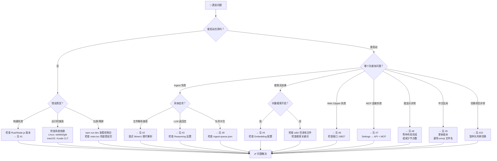

# 📙 LLM Wiki 全场景部署与工程踩坑指南

> **版本：** v0.6.3-base  
> **分析日期：** 2026-07-15  
> **读者定位：** DevOps / SRE / 自托管开发者  
> **关联报告：** [报告一](01-战略与技术架构白皮书.md) | [报告二](02-源码级深度解构与算法报告.md) | [报告四](04-全场景应用与高级集成扩展手册.md)

---

## 目录

1. [环境要求矩阵](#1-环境要求矩阵)
2. [三种部署模式](#2-三种部署模式)
3. [LLM Provider 配置矩阵](#3-llm-provider-配置矩阵)
4. [硬件资源预估](#4-硬件资源预估)
5. [Chrome Extension 安装](#5-chrome-extension-安装)
6. [Obsidian 生态集成](#6-obsidian-生态集成)
7. [性能调优指南](#7-性能调优指南)
8. [Top 10 常见报错与解决方案](#8-top-10-常见报错与解决方案)
9. [CI/CD 自动化构建](#9-cicd-自动化构建)
10. [故障排查流程图](#10-故障排查流程图)

---

## 1. 环境要求矩阵

### 1.1 各平台最低要求

| 组件 | macOS | Windows | Linux |
|------|-------|---------|-------|
| **操作系统** | macOS 11 (Big Sur)+ | Windows 10 1803+ | Ubuntu 20.04+ / Debian 11+ |
| **Node.js** | ≥ 20.x | ≥ 20.x | ≥ 20.x |
| **Rust** | ≥ 1.70 | ≥ 1.70 | ≥ 1.70 |
| **系统依赖** | Xcode Command Line Tools | Visual Studio Build Tools (C++ workload) | `build-essential`, `libwebkit2gtk-4.1-dev`, `libgtk-3-dev`, `libayatana-appindicator3-dev` |
| **磁盘空间** | ~2 GB（含依赖） | ~2 GB（含依赖） | ~2 GB（含依赖） |

### 1.2 版本兼容性检查清单

```bash
# 节点环境
node --version   # 需要 ≥ v20.0.0
npm --version    # 需要 ≥ v10.0.0

# Rust 工具链
rustc --version  # 需要 ≥ 1.70
cargo --version

# Linux 特有：Tauri v2 系统依赖
# 参考: https://v2.tauri.app/start/prerequisites/#linux
sudo apt-get install -y \
  libwebkit2gtk-4.1-dev \
  build-essential \
  curl \
  wget \
  file \
  libxdo-dev \
  libssl-dev \
  libayatana-appindicator3-dev \
  librsvg2-dev
```

### 1.3 关键环境变量

| 变量 | 默认值 | 说明 |
|------|--------|------|
| `LLM_WIKI_BIND_HOST` | `127.0.0.1` | HTTP API 绑定地址。设 `0.0.0.0` 允许 LAN 访问（需同时开启 Settings 中的 Allow LAN Access） |
| `LLM_WIKI_API_BASE_URL` | `http://127.0.0.1:19828` | MCP Server 连接目标，用于非默认端口 |

---

## 2. 三种部署模式

### 2.1 模式一：预编译二进制安装（推荐）

从 [GitHub Releases](https://github.com/nashsu/llm_wiki/releases) 下载：

| 平台 | 安装包格式 | 安装方式 |
|------|-----------|---------|
| **macOS (Apple Silicon)** | `.dmg` | 双击挂载，拖入 Applications |
| **macOS (Intel)** | `.dmg` | 同上 |
| **Windows** | `.msi` | 双击运行安装向导 |
| **Linux (Debian/Ubuntu)** | `.deb` | `sudo dpkg -i llm-wiki_*.deb` |
| **Linux (通用)** | `.AppImage` | `chmod +x llm-wiki_*.AppImage && ./llm-wiki_*.AppImage` |

**启动后配置清单：**

```
1. 打开 Settings → LLM Provider
2. 选择 Provider：OpenAI / Anthropic / Google / Ollama / Custom
3. 填入 API Key（Ollama 无需 key）
4. 选择 Model
5. （可选）配置 Web Search：Tavily / SerpApi / SearXNG
6. （可选）配置 Embedding：选择 embedding model + endpoint
7. （可选）Settings → API + MCP：开启 HTTP API 和 MCP 访问
```

### 2.2 模式二：源码编译

```bash
# 1. 克隆仓库
git clone https://github.com/nashsu/llm_wiki.git
cd llm_wiki

# 2. 安装前端依赖
npm install

# 3. 构建 MCP Server
npm run mcp:build

# 4. 开发模式运行
npm run tauri dev
# 注意：首次运行会下载 Rust 依赖（可能需要 5-15 分钟）

# 5. 生产构建
npm run tauri build
# 产物位于 src-tauri/target/release/bundle/

# 6. 只做类型检查
npm run typecheck

# 7. 运行测试
npm run test:mocks      # 不依赖 LLM 的单元测试
npm run test:llm        # 依赖 LLM 的集成测试（需要配置 API key）
```

**常见编译问题：**

| 问题 | 解决方案 |
|------|---------|
| `error: linker 'cc' not found` (Linux) | `sudo apt install build-essential` |
| `libwebkit2gtk not found` (Linux) | `sudo apt install libwebkit2gtk-4.1-dev` |
| `Could not find libclang` (Windows) | 安装 Visual Studio Build Tools + LLVM |
| `npm install` 失败 (Windows, `better-sqlite3`) | 安装 Node.js 原生编译工具链 |

### 2.3 模式三：服务器无头部署

LLM Wiki 是 Tauri 桌面应用，**原生不支持纯无头模式**。但可以通过以下方案间接实现服务器场景：

#### 方案 A：MCP Server 单独部署

MCP Server 是纯 Node.js 进程，可在服务器上运行：

```bash
# 1. 安装 Node.js 20+
# 2. 构建 MCP Server
cd mcp-server
npm install
npm run build

# 3. 配置环境变量
export LLM_WIKI_API_BASE_URL="http://192.168.1.x:19828"
# 需要在桌面端 Settings → API + MCP → 开启 Allow LAN Access
# 并设置 LLM_WIKI_BIND_HOST=0.0.0.0

# 4. 运行
node dist/src/index.js
```

#### 方案 B：远程桌面 + LLM Wiki

在 Linux 服务器上安装 Xvfb 虚拟显示器 + Tauri：

```bash
# 安装 Xvfb
sudo apt install xvfb

# 设置虚拟显示器
export DISPLAY=:99
Xvfb :99 -screen 0 1920x1080x24 &

# 运行 LLM Wiki
npm run tauri dev
# 或通过 VNC/xRDP 连接远程桌面
```

#### 方案 C：Headless API 直接调用

LLM Wiki 的本地 HTTP API（`127.0.0.1:19828`）可被任何能访问该地址的工具调用：

```bash
# 健康检查
curl http://127.0.0.1:19828/api/v1/health

# 搜索（需要 token）
curl -X POST http://127.0.0.1:19828/api/v1/projects/current/search \
  -H "Authorization: Bearer YOUR_TOKEN" \
  -H "Content-Type: application/json" \
  -d '{"query": "transformer architecture", "topK": 10}'
```

---

## 3. LLM Provider 配置矩阵

### 3.1 各 Provider 的端点与参数映射

基于 `src/lib/llm-providers.ts`（1013 行）的适配逻辑：

| Provider | URL 模板 | API Key 位置 | 特殊处理 |
|----------|---------|-------------|---------|
| **OpenAI** | `https://api.openai.com/v1/chat/completions` | `Authorization: Bearer` | GPT-5/o-series: `max_tokens` → `max_completion_tokens`, 移除 `temperature`, `top_p` |
| **Anthropic** | `https://api.anthropic.com/v1/messages` | `x-api-key` | system: 数组形式以支持 prompt caching; image: `source.media_type` + `source.data` |
| **Google** | `https://generativelanguage.googleapis.com/v1beta/models/{model}:streamGenerateContent` | `x-goog-api-key` (query param) | 参数嵌套在 `generationConfig` 下; `top_p` → `topP`, `max_tokens` → `maxOutputTokens`; 过滤 `thought: true` parts |
| **Ollama** | `http://localhost:11434/v1/chat/completions` | 无需认证 | `Origin: http://localhost` 头; `reasoning_effort` 字段 (low/medium/high/none) |
| **Custom** | 用户自定义 URL | `Authorization: Bearer` | OpenAI-compatible 端点; Azure OpenAI 使用 `api-version` query param |
| **Claude Code** | 子进程 (stdin/stdout) | 系统级 CLI 认证 | `streamClaudeCodeCli()` 通过 tokio::process 调用 |
| **Codex** | 子进程 (stdin/stdout) | 系统级 CLI 认证 | `streamCodexCli()` 通过 tokio::process 调用 |

### 3.2 DeepSeek 模型特殊处理

```typescript
// src/lib/llm-providers.ts LINES 282-415
// DeepSeek V4: thinking.type 控制
//   mode="off"  → thinking: { type: "disabled" }
//   mode="high"/"max" → reasoning_effort
// 对非 V4 的 DeepSeek 模型: 仅设置 thinking 字段
```

### 3.3 各 Provider 的 Streaming 解析

| Provider | SSE 格式 | 解析函数 | 行号 |
|----------|---------|---------|------|
| OpenAI / Custom | `data: {...}\n\n` | `parseOpenAiLine()` | L141-153 |
| Anthropic | `data: {...}\n\n` | `parseAnthropicLine()` | L155-196 |
| Google | `data: {...}\n\n` | `parseGoogleLine()` | L198-225 |
| Ollama | NDJSON (每行一个 JSON) | `parseOpenAiLine()` (复用) | — |

### 3.4 推荐模型与配置

| 场景 | 推荐 Provider | 推荐模型 | 原因 |
|------|-------------|---------|------|
| **Ingest（编译）** | Anthropic | Claude Sonnet 4 | 长上下文处理能力强，结构化输出可靠 |
| **Chat（查询）** | OpenAI | GPT-4o | 快速响应，工具调用稳定 |
| **本地/隐私** | Ollama | Qwen 2.5 72B / Llama 3 70B | 完全本地，无需网络 |
| **中文优先** | DeepSeek / Zhipu | DeepSeek-V4 / GLM-4 | 中文理解和生成能力强 |
| **Embedding** | OpenAI | text-embedding-3-small | 高性价比，1536 维向量 |

---

## 4. 硬件资源预估

### 4.1 仅使用云端 LLM（最轻量）

这是推荐的常规配置——LLM Wiki 只负责前端和文件管理，推理走云端 API：

| 资源 | 最低 | 推荐 |
|------|------|------|
| CPU | 双核 | 四核 |
| RAM | 4 GB | 8 GB |
| 磁盘 | 1 GB + 知识库大小 | 5 GB + 知识库大小 |
| GPU | 无需求 | 无需求 |
| 网络 | 稳定互联网 | 低延迟互联网 |

### 4.2 使用本地 Ollama 推理

| 资源 | 7B 模型 | 13B 模型 | 70B 模型 |
|------|---------|---------|---------|
| RAM | 8 GB | 16 GB | 48 GB+ |
| VRAM (如用 GPU) | 6 GB | 10 GB | 40 GB+ |
| 磁盘 (模型文件) | ~5 GB | ~8 GB | ~40 GB |

### 4.3 使用本地 Embedding

向量嵌入（LanceDB）的资源需求：

| 知识库规模 | 向量维度 | 磁盘空间 (LanceDB) | RAM |
|-----------|---------|-------------------|-----|
| 100 个页面 | 1536 | ~10 MB | 可忽略 |
| 1,000 个页面 | 1536 | ~100 MB | ~500 MB |
| 10,000 个页面 | 1536 | ~1 GB | ~2 GB |
| 100,000 个页面 | 1536 | ~10 GB | ~8 GB |

> LanceDB 是嵌入式向量数据库（Rust 实现），运行在 Tauri 进程内，无需额外的数据库服务。

### 4.4 大型知识库（1000+ 源文件）

```
估算基准: 每篇论文/文档 ~5MB PDF, ~10 个 wiki 页面

1000 篇论文:
  raw/sources/ 磁盘: ~5 GB
  wiki/ 磁盘:     ~200 MB
  LanceDB:        ~1 GB
  Cache files:    ~50 MB
  ─────────────────────
  Total:          ~6.5 GB

Ingest 时间 (使用 Claude Sonnet 4):
  • 每篇 15-45 秒 (两阶段 LLM)
  • 1000 篇 = 4-12 小时 (串行处理)
  • 可通过重启继续（队列持久化）
```

---

## 5. Chrome Extension 安装

### 5.1 加载步骤

```
1. 打开 chrome://extensions
2. 开启右上角 "开发者模式" (Developer mode)
3. 点击 "加载已解压的扩展程序" (Load unpacked)
4. 选择 extension/ 目录
```

### 5.2 Web Clipper 工作流

```
浏览器 → Extension (Readability.js + Turndown.js)
  → HTTP POST 127.0.0.1:19827/clip
    → Rust clip_server.rs (tiny_http)
      → 写入 raw/sources/clips/
        → auto-watch 检测新文件
          → ingest 管线自动触发
```

### 5.3 故障排查

| 问题 | 解决 |
|------|------|
| Extension 显示 "无法连接" | 确保 LLM Wiki 桌面应用正在运行 |
| 剪藏内容为空 | 页面可能需要 JavaScript 渲染，尝试先保存为 PDF |
| 端口冲突 (19827) | `clip_server.rs` 使用 `tiny_http` 绑定；检查是否有其他程序占用 |

---

## 6. Obsidian 生态集成

### 6.1 直接作为 Obsidian Vault

LLM Wiki 的项目目录即是一个合法的 Obsidian Vault：

```
1. 打开 Obsidian
2. 点击 "Open folder as vault"
3. 选择你的 LLM Wiki 项目目录
4. .obsidian/ 配置已自动生成

可用功能：
  • Graph View — 可视化 [[wikilinks]] 网络
  • Dataview 插件 — SQL-like 查询 wiki 页面
  • 双向链接面板
  • Canvas — 可视化知识地图
```

### 6.2 无头模式同步（服务器场景）

```bash
# 安装 obsidian-headless
npm install -g obsidian-headless

# 登录 Obsidian Sync 账户
ob login --email <email> --password '<password>'

# 创建远程 vault
ob sync-create-remote --name "LLM Wiki"

# 连接本地 wiki 目录
cd ~/my-wiki
ob sync-setup --vault "<vault-id>"

# 初始同步
ob sync

# 创建 systemd 服务（持续同步）
cat > ~/.config/systemd/user/obsidian-wiki-sync.service << 'EOF'
[Unit]
Description=Obsidian LLM Wiki Sync
After=network-online.target
Wants=network-online.target

[Service]
ExecStart=/usr/bin/ob sync --continuous
WorkingDirectory=/home/user/wiki
Restart=on-failure
RestartSec=10

[Install]
WantedBy=default.target
EOF

systemctl --user daemon-reload
systemctl --user enable --now obsidian-wiki-sync

# 允许服务在用户登出后继续运行
sudo loginctl enable-linger $USER
```

---

## 7. 性能调优指南

### 7.1 Context Window 配置

| 使用场景 | 推荐 Context Window | 理由 |
|---------|-------------------|------|
| 快速问答 | 32K tokens | 减少 token 消耗，加快响应 |
| 深度研究 | 128K-256K tokens | 容纳更多 wiki 页面上下文 |
| 大型知识库 (>500 页) | 512K-1M tokens | 配合支持长上下文的模型 |

对应 `context-budget.ts` 的分配：
- 15% response reserve
- 5% index budget
- 50% wiki page budget
- 30% history + system

### 7.2 Ingest 优化

```bash
# 1. 批量导入时关闭自动 Embedding（节省 API 调用）
# Settings → Embedding → 关闭 "Auto-embed on ingest"
# 导入完成后手动触发全量 embedding

# 2. 使用 reasoning: "off" 模式进行 ingest
# ingest.ts 默认对所有 LLM 设置 reasoning mode = "off"
# 这避免了 DeepSeek 等模型在 ingest 时消耗大量 token 做推理

# 3. 控制并发
# ingest-queue.ts 强制串行处理（一次一个源文件）
# 如需加速：启动多个 LLM Wiki 实例，分别处理不同的项目
```

### 7.3 图可视化优化

```javascript
// 大型图谱 (>500 节点) 优化建议：
// 1. 使用社区着色模式（而非按类型着色）
// 2. 在 graph-filters.ts 中设置过滤条件
// 3. ForceAtlas2 布局有 O(N²) 复杂度，大规模图谱需要耐心等待
// 4. 图数据有模块级缓存（graph-relevance.ts line 49），
//    仅在 dataVersion 变化时重建
```

### 7.4 搜索优化

```bash
# 向量搜索的 recall 提升
# 基准: Tokenized search recall = 58.2%
# 向量增强后: recall = 71.4%
# 建议：对 >100 页的知识库，开启向量搜索

# 小知识库 (<100 页): 仅用 tokenized search 即可
# 大知识库 (>500 页): 强烈推荐开启向量搜索
```

---

## 8. Top 10 常见报错与解决方案

### 🔴 #1: Tauri 构建失败 — Rust 工具链问题

```
错误: error[E0463]: can't find crate for `core`
原因: Rust toolchain 未正确安装或版本过低
```

**解决：**
```bash
# 更新 Rust 工具链
rustup update stable

# 验证版本
rustc --version  # 需要 ≥ 1.70

# 如果仍失败，重新安装
rustup self uninstall
curl --proto '=https' --tlsv1.2 -sSf https://sh.rustup.rs | sh
```

### 🔴 #2: 第三方文档解析器崩溃 (Panic)

```
错误: "Internal error in parse_pdf: attempted to read past end of file"
原因: pdf-extract / docx-rs / calamine 对畸形文件 panic
```

**解决：**

LLM Wiki 内置 `panic_guard.rs` 防护（`src-tauri/src/panic_guard.rs`）：
```rust
// panic_guard 使用 catch_unwind 捕获解析器的 panic
// 将 panic 转换为 Tauri Err，前端可显示错误而非崩溃
// Cargo.toml 配置: panic = "unwind" (而非 "abort")
```

但**极少数情况**下仍可能导致问题：
1. 更新到最新版 LLM Wiki（可能修复了特定解析器的 bug）
2. 使用不同的解析器处理该文件（如用 MinerU 替代内置 PDF 解析器）
3. 手动将文件转换为更标准的格式

### 🔴 #3: LLM 流式响应中断 / "Reasoning only" 错误

```
错误: "Model produced N characters of reasoning, but no actual response content"
原因: DeepSeek/QwQ 等推理模型将所有 token 用于 chain-of-thought
```

**解决：**

`src/lib/llm-client.ts` LINE 55-58 检测此情况：
```typescript
// isReasoningOnlyResponseError() 检测此模式的错误消息
// 设置 reasoning.mode = "off" (参见 llm-providers.ts)

// 在 Settings 中：
// LLM Config → Reasoning → Mode: "Off"
// 这对 ingest 管线自动应用（ingest.ts 默认设为 off）
```

对于 DeepSeek V4：
```typescript
// llm-providers.ts LINES 399-414
// thinking: { type: "disabled" } 阻止模型将所有时间花在推理上
```

### 🔴 #4: Embedding 端点配置错误

```
错误: "fetchEmbedding failed: HTTP 401 / 403"
原因: API key 未配置或不正确
```

**解决：**
1. Settings → Embedding → 验证 API Key
2. 确保 Endpoint URL 格式正确：`https://api.openai.com/v1/embeddings`
3. 测试端点连通性：`curl -H "Authorization: Bearer YOUR_KEY" https://api.openai.com/v1/models`

```
错误: "chunk too long for embedding model"
原因: 文本块超过模型的 context 限制
```

**解决：**
`src/lib/embedding.ts` 内置 `auto-halve retry`（LINES 54-61）：
```typescript
// 如果嵌入端点返回 "input too long"
// 自动将文本减半后重试
// 递归直到成功或文本过短
```

### 🔴 #5: CJK 文件名编码问题

```
错误: 中文文件名显示为乱码或导致搜索失败
原因: 字节级切片而非字符级切片
```

**解决：**
`src/lib/path-utils.ts` 使用 `[...string]` 展开进行 Unicode-safe 切片，22+ 个文件使用 `normalizePath()` 处理路径。如果仍遇到问题：
1. 更新到最新版本
2. 避免在文件名中使用 emoji 和全角特殊字符
3. 使用英文/拼音命名源文件，在 Wiki 页面的 title frontmatter 中使用中文

### 🔴 #6: Web Clipper 连接失败

```
错误: Extension 显示 "Cannot connect to LLM Wiki"
原因: 桌面应用未运行，或端口 19827 被占用
```

**解决：**
```bash
# 1. 确认桌面应用正在运行
# 2. 检查端口占用
# Windows:
netstat -ano | findstr :19827
# macOS/Linux:
lsof -i :19827

# 3. 如果有其他程序占用端口 19827，杀掉它
# 4. 重启桌面应用（clip_server.rs 会重新绑定）
```

### 🔴 #7: MCP Server 认证配置

```
错误: "LLM Wiki MCP access is disabled"
原因: MCP 访问未在桌面应用中启用
```

**解决：**
```
1. 打开 LLM Wiki 桌面应用
2. Settings → API + MCP
3. 勾选 "Enable HTTP API"
4. 勾选 "Enable MCP access"
5. 生成或复制 API Token
6. 在 MCP Client 配置中使用该 Token
```

MCP Server 每次工具调用前执行 `assertMcpEnabled()`（`mcp-server/src/index.ts` LINES 249-257）。

### 🔴 #8: 图可视化卡顿

```
问题: 大型知识库 (>500 页面) 的图谱加载缓慢
原因: ForceAtlas2 布局算法 O(N²) 复杂度
```

**解决：**
1. 等待初始布局完成（首次加载需要时间）
2. 使用社区着色模式按聚类查看
3. 在 `graph-filters.ts` 中设置节点数和边数过滤
4. 图数据缓存在 `graph-relevance.ts` 模块级变量中，切换页面不会重建

### 🔴 #9: 队列持久化损坏

```
问题: 重启后 ingest 队列条目丢失或重复
原因: .llm-wiki/ingest-queue.json 写入中途崩溃
```

**解决：**
```bash
# 1. 检查队列文件
cat .llm-wiki/ingest-queue.json | python3 -m json.tool

# 2. 如果 JSON 损坏，手动修复或删除重建
rm .llm-wiki/ingest-queue.json
# 重启应用，队列将重新初始化

# 3. 如果不想重新 ingest 已处理的文件：
# 保留 ingest-cache.json（SHA256 缓存），队列重建后会自动跳过已处理的文件
```

### 🔴 #10: 多项目切换竞态

```
问题: 切换到另一个项目后，旧项目的 ingest 继续写入
原因: ingest-queue.ts 的 processNext 检查 currentProjectId
```

**现有防护（`ingest-queue.ts`）：**
```typescript
// LINES 43-47
let currentProjectId = ""    // 项目 UUID
let currentProjectPath = ""  // 缓存的项目路径

// processNext 中检查：
// 如果 currentProjectId 在 ingest 过程中改变，
// 孤儿 runner 自动退出，不会写入旧项目
```

但如果问题仍出现：
1. 在 Activity Panel 中手动取消正在进行的任务
2. 暂停队列 → 切换项目 → 恢复队列

---

## 9. CI/CD 自动化构建

### 9.1 GitHub Actions 配置分析

LLM Wiki 的 CI/CD 使用 GitHub Actions 自动构建多平台二进制文件：

```yaml
# 平台矩阵:
#   macOS ARM (aarch64-apple-darwin)
#   macOS Intel (x86_64-apple-darwin)
#   Windows (.msi)
#   Linux (.deb + .AppImage)

# 构建步骤（摘要）：
#   1. setup-node (Node.js 20)
#   2. setup-rust (stable)
#   3. Install system deps (Linux: webkit2gtk, etc.)
#   4. npm ci
#   5. npm run mcp:build
#   6. npm run build         # typecheck + vite build
#   7. npm run tauri build   # 原生二进制
#   8. Upload artifacts to release
```

### 9.2 自托管 CI 构建

```bash
#!/bin/bash
# 自托管构建脚本

set -e

echo "=== LLM Wiki CI Build ==="

# 1. 检查环境
node --version
rustc --version

# 2. 安装依赖
npm ci
npm --prefix mcp-server ci

# 3. 构建 MCP Server
npm run mcp:build

# 4. 类型检查 + 前端构建
npm run build

# 5. 运行单元测试
npm run test:mocks

# 6. 构建桌面应用
npm run tauri build

echo "=== Build complete ==="
ls -la src-tauri/target/release/bundle/
```

---

## 10. 故障排查流程图



---

> **下一份报告：** [报告四：全场景应用与高级集成扩展手册](04-全场景应用与高级集成扩展手册.md)  
> 将涵盖基础到 MCP 集成的完整使用指南、RAG 增强方案、领域定制示例和 Skill 系统扩展。

---

*报告三完成。包含 3 种部署模式、Provider 配置矩阵、硬件预估、Top 10 排障指南和故障排查流程图。*
