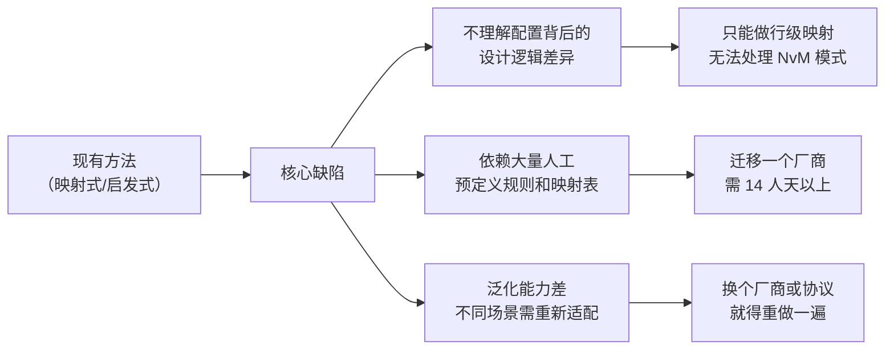
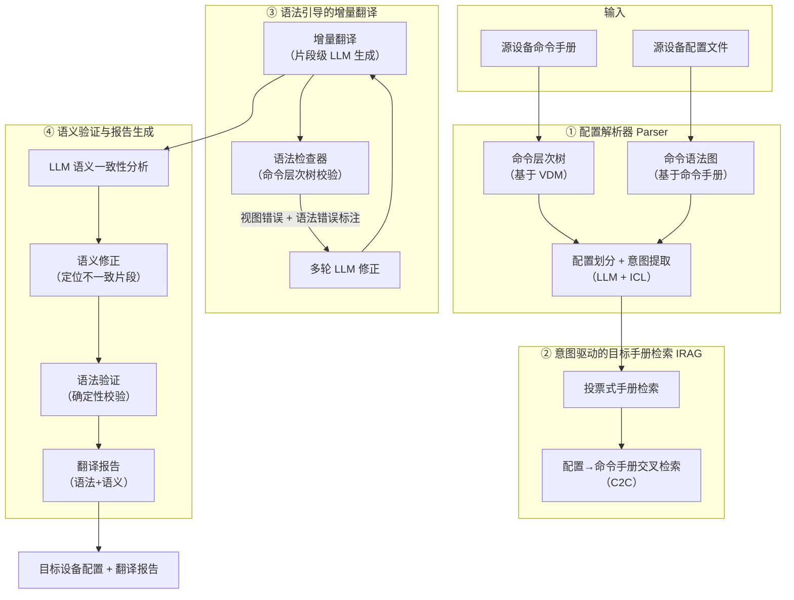
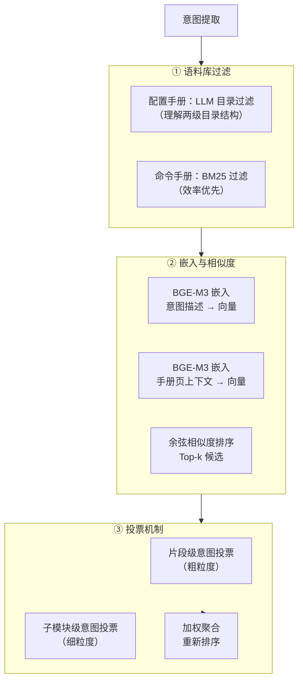

# INTA 论文详细分析报告

> **论文标题**: INTA: Intent-Based Translation for Network Configuration with LLM Agents
>
> **作者**: Yunze Wei, Xiaohui Xie\*, Tianshuo Hu, Yiwei Zuo, Xinyi Chen, Kaiwen Chi, Yong Cui\*（清华大学计算机系 + 澳大利亚国立大学）
>
> **发表信息**: IEEE 会议论文（979-8-3315-0376-5/25），arXiv: 2501.08760v2 (2025年9月)
>
> **关键词**: 网络配置、配置翻译、大语言模型、网络管理、网络运维

---

## 目录

1. [论文背景](#1-论文背景)
2. [目标与动机](#2-目标与动机)
3. [核心方法/算法流程](#3-核心方法算法流程)
4. [实验与结果](#4-实验与结果)
5. [启示与局限](#5-启示与局限)

---

## 1. 论文背景

### 1.1 要解决的问题

INTA 旨在解决**跨厂商网络设备配置翻译**（cross-vendor configuration translation）这一核心运维难题。在现代网络运维中，以下场景频繁出现：

- **硬件替换**：过时或故障设备需替换为新一代设备（通常是不同厂商）
- **SDN/NFV 转型**：将传统 CLI 配置迁移至 SDN 控制器或 NFV 环境
- **灾备与策略变更**：出于成本、策略或容灾考虑而更换设备厂商

该论文以**跨厂商 CLI 配置翻译**作为代表性场景（Nokia ↔ Huawei 路由器配置互转），系统论证了该任务的复杂性和自动化需求。

### 1.2 当前领域的痛点

#### 痛点一：厂商配置模型之间存在本质性差异

论文通过 Nokia 7750SR 与 Huawei NE40E 两台真实路由器，系统总结了三种差异类型：

| 差异类型 | 说明 | 示例 |
|---------|------|------|
| **一对多映射（One-to-many mapping）** | 一条源命令映射到多条目标命令 | Nokia 单条 `lldp` 命令 → Huawei 四条 `lldp tlv-enable` 命令 |
| **视图深度差异（View depth differences）** | 不同厂商的配置视图层级深度不同 | Huawei 一条 `ip ip-prefix` 命令 → Nokia 需要穿越 4 层视图 |
| **设计逻辑差异（Design logic differences）** | 根本性的设计理念不同 | Nokia 采用**服务为中心**（service-centric）→ 先定义逻辑接口再绑定服务；Huawei 采用**资源为中心**（resource-centric）→ 先创建协议实例再在物理接口启用 |

第三点是最根本的挑战：设计逻辑差异意味着**命令之间的依赖关系和组合方式完全不同**，不能通过简单的行级映射解决。

#### 痛点二：人工翻译成本极高

- 网络工程师需要**同时精通**源和目标两套厂商的配置模型
- 厂商配置手册体量巨大：华为 NE40E 路由器的配置手册约 8,000 页，命令手册约 14,000 页
- 培训成本高、知识难以维护，且厂商技术持续演进

#### 痛点三：现有自动化方案不足

| 方法 | 代表工作 | 局限 |
|------|---------|------|
| 映射式（Mapping-based） | NAssim (SIGCOMM'22) | 非端到端方案，仍需人工从推荐命令中选择 |
| 启发式+LLM | ConfigTrans (ICNP'24) | 依赖预定义规则和参数对应表，迁移开销大（每个新配置模式 ~500 行代码/14 人天） |
| 通用代码翻译 | TransCoder 等 | 不适用于网络配置语料稀缺、语法多样性强的场景 |

---

## 2. 目标与动机

### 2.1 作者的核心目标

提出一个**端到端**的、**低迁移开销**的、能**理解配置逻辑差异**的自动化配置翻译框架 INTA。

具体目标包括：

1. **自动化理解源配置的意图与逻辑**（替代人工分析）
2. **准确检索目标设备的相关手册**（从万页级手册中精准定位）
3. **生成语法正确且语义一致的翻译结果**（不是简单逐行映射）
4. **提供可解释的翻译报告**供运维人员审核（不是黑盒输出）

### 2.2 为什么现有方法不够好？

作者的论证逻辑链：



**关键洞察**：作者意识到，不同厂商的配置模型虽有巨大差异，但它们要实现的功能目标（即"意图"，Intent）是跨厂商一致的。因此，将"意图"作为中间表示（intermediate representation），可以桥接异构配置模型之间的鸿沟。这是 INTA 最核心的创新思想。

---

## 3. 核心方法/算法流程

### 3.1 系统架构总览

INTA 由四个核心模块组成，采用流水线架构：



### 3.2 组件详解

#### 3.2.1 配置解析器（Configuration Parser）

**作用**：解析源配置文件的语法和视图结构，为后续意图提取和翻译验证提供基础。

**实现**：
- **命令语法解析器**（Command Syntax Parser）：基于命令手册中的模板约定，构建**命令图**（Command Graph）。命令图包含三种非叶节点（seq 顺序、req_selector 必选、opt_selector 可选）和两种叶节点（keyword、parameter）
- **命令层次解析器**（Command Hierarchy Parser）：基于 NAssim 的 VDM（Vendor Device Model）构建，逐行解析配置文件，记录命令所属的视图层级

**设计亮点**：语法解析器与厂商解耦，只需命令手册遵循统一的模板约定即可复用；层次解析器是厂商特化的，但迁就新厂商仅需约 100 行代码（主要是处理华为 NE40E 109 种接口视图）。

#### 3.2.2 意图驱动的目标手册检索（Intent-Based Manual Retrieval）

这是 INTA **最核心的创新模块**，包含三个子阶段：

**阶段 1：配置划分与意图提取（Configuration Division & Intent Extraction）**

- 使用 LLM 将源配置按功能单元划分为片段（fragments）
- 对每个片段提取**两级意图**：
  - **片段级意图**（Fragment-level Intent）：对整个片段功能的概括描述
  - **子模块级意图**（Detail-level Intent）：对片段内每条命令的详细意图描述，包括参数语义
- 采用 In-Context Learning（ICL），通过模板和示例引导 LLM 输出结构化的 JSON 格式

**阶段 2：投票式目标手册检索（Voting-Based Retrieval）**

这是解决"大海捞针"问题的关键策略。整个检索管道如下：



**手册上下文的内容**：页面标题 + 页面描述 + 文件路径（提供视图信息），命令手册额外包含 CLI 命令示例。

**投票机制的价值**：将多个粒度的意图检索结果聚合，细粒度意图提供更精确的匹配信号，粗粒度意图提供更全面的覆盖。实验证明投票机制显著提升了 Recall@Top-5 到 Top-20 的命中率。

**阶段 3：配置→命令手册交叉检索（C2C）**

利用已检索到的配置手册中引用的命令，反向检索对应的命令手册。算法流程：

```
输入：已检索的配置手册页及分数 M = {m_i → s_i}
对于每个配置手册页 m：
  提取 m 中引用的配置命令集合 C
  对于每个命令 c：
    通过自动映射获取对应的命令手册页 m'
    M'[m'] += s  # 继承配置手册的检索分数
合并 M' 到已有命令手册检索列表，重新排序
```

此方法利用"配置手册告诉你要用哪些命令，命令手册告诉你怎么用这些命令"的自然关系。

#### 3.2.3 语法引导的增量翻译（Syntax-Guided Incremental Translation）

**增量策略**：不是一次性翻译整个配置文件，而是逐个片段翻译，每个片段的翻译**以前面片段的翻译结果作为上下文**。这是为了解决两个问题：
- LLM 上下文长度有限，长上下文会降低输出质量
- 配置片段之间存在前向依赖关系，独立翻译会丢失上下文

**语法引导机制**：每轮翻译后进行两轮语法校验：

| 轮次 | 检查内容 | 目的 |
|------|---------|------|
| 第一轮 | 在命令层次树上匹配 | 同时检查视图和语法正确性 |
| 第二轮 | 在全量命令集上匹配（忽略视图约束） | 区分语法错误和视图错误 |

推导逻辑：
- 两轮都不匹配 → **语法错误**（syntax error）
- 全量命令集匹配但层次树不匹配 → **视图错误**（view error）

**多轮修正**：将错误类型标注后，通过多轮 LLM 对话引导修正。仅当修正后的配置在语法和视图正确性上有所提升时才采用新版本。

#### 3.2.4 语义验证与报告生成

**语义验证与修正**：

```
1. LLM 分析 → 生成语义一致性报告 r0
   ├── 对每个片段：{源片段, 目标片段, 是否一致, LLM 注释}
2. 遍历 r0 中标记为"不一致"的单元：
   ├── 检索源和目标设备对应的手册页
   ├── LLM 根据手册和注释进行针对性修正
   └── 仅当修正后语法错误不增加时才采用
3. 最终 LLM 分析 → 生成正式语义一致性报告 r1
```

**翻译报告**包含：
- **语法正确性报告**（确定性检查结果）：每行命令与命令模板的匹配状态，不匹配标注为 Mismatch
- **语义一致性报告**（LLM 生成）：每个片段的一对一语义对比，标注等效性

### 3.3 关键创新点总结

| 序号 | 创新点 | 解决的核心挑战 |
|------|--------|--------------|
| 1 | **意图作为中间表示** | 首次将 intent 用于配置翻译，桥接异构配置模型的设计逻辑差异 |
| 2 | **多级意图 + 投票检索** | 通过粗/细粒度意图组合 + 加权投票，在万页级手册中精准检索 |
| 3 | **语法引导的增量翻译** | 将确定性语法检查与 LLM 生成能力结合，两步区分视图错误和语法错误 |
| 4 | **配置→命令交叉检索（C2C）** | 利用配置手册中引用的命令反向增强命令手册检索 |
| 5 | **翻译报告机制** | 不是黑盒输出，而是附带可人工审核的语法+语义报告，降低部署风险 |

---

## 4. 实验与结果

### 4.1 实验设置

| 维度 | 详情 |
|------|------|
| **主场景** | Nokia 7750SR → Huawei NE40E 路由器配置翻译 |
| **泛化场景** | Cisco → Huawei 交换机配置翻译 |
| **模型** | GPT-4o、Qwen-Max、DeepSeek-V3（671B），避免单模型偏差 |
| **嵌入模型** | BGE-M3（568M 参数） |
| **硬件** | NVIDIA RTX 3090 或 A100 |
| **数据集** | 1,063 行配置命令（53 个文件）：16 个工业真实配置 + 20 个华为手册示例 + 17 个诺基亚手册示例 |
| **覆盖范围** | 系统信息、接口、路由策略、过滤策略、BGP/IGP、VPRN 等 |
| **验证环境** | GNS3 模拟器（华为 NE40E）+ 物理华为 CE6881 交换机 |
| **代码规模** | ~3,500 行 Python |

### 4.2 评估指标

| 指标 | 含义 | 评估维度 |
|------|------|---------|
| **Tree Match** | 在命令层次树上的匹配率 | 视图 + 语法正确性 |
| **Syntax Correctness** | 纯语法正确率（忽略视图约束） | 语法正确性 |
| **BLEU-2** | 机器翻译常用指标 | 表面文本相似度 |
| **Exact Match** | 整行命令严格匹配率 | 表面精确度（有局限性） |
| **Command Match** | 所需命令是否被召回 | 语义正确性的量化代理 |
| **Recall Rate@Top-k** | 至少一篇正确答案出现在 Top-k 中的查询比例 | 手册检索质量 |

### 4.3 关键结果

#### 4.3.1 端到端翻译性能（主场景：Nokia → Huawei）

| 方法 | Tree Match | Syntax Correctness | Command Match |
|------|-----------|-------------------|---------------|
| LLM-only Baseline | 0.7315 | 0.8654 | 0.6944 |
| IRAG-only | 0.8690 (+13.75%) | 0.9511 | 0.8148 (+12.04%) |
| IRAG + Syntax | 0.9727 | 0.9913 | 0.8256 |
| **INTA (Full)** | **0.9815** (+25.00%) | **0.9966** (+13.12%) | **0.8472** (+15.28%) |

> 以上为 DeepSeek-V3 作为基模型的结果。GPT-4o 和 Qwen-Max 也呈现出相似的趋势。

#### 4.3.2 消融实验解读

1. **IRAG（意图检索增强生成）** 贡献最大：单独加入即带来 13.75% 的 Tree Match 提升和 12.04% 的 Command Match 提升 → 专门知识的注入是关键
2. **语法检查与修正** 使 Tree Match 从 86.90% 跃升至 97.27% → 确定性校验对消除 LLM 幻觉至关重要
3. **语义验证与修正** 贡献了额外的 2.16% Command Match 和更精确的语义报告

#### 4.3.3 与 ConfigTrans 的对比

| 方法 | 准确率（含参数命令） | 准确率（不含参数命令） |
|------|-------------------|---------------------|
| INTA (GPT-4o) | **0.8615** | **0.8957** |
| ConfigTrans | 0.8247 | 0.7550 |

> INTA 在不依赖预定义规则和参数映射表的前提下超越了 ConfigTrans。

#### 4.3.4 意图检索模块的消融（Top-30 Recall）

**配置手册检索**：
- BGE 基础检索 → 加入 LLM 目录过滤显著提升 Top-20~30 的"尾部"性能
- 加入投票机制提升 Top-5~20 的"头部"性能
- **最终 Recall@Top-30 ≈ 0.90**（Qwen-Max）

**命令手册检索**：
- BM25 和 LLM 过滤效果接近，BM25 更高效
- 投票机制提升整体性能，C2C 交叉检索进一步提升"头部"召回
- **最终 Recall@Top-30 ≈ 0.74**（DeepSeek-V3）

#### 4.3.5 不同难度级别的分析

| 翻译类型 | 说明 | INTA vs LLM-only 提升 |
|---------|------|----------------------|
| 1v1 | 一源命令 → 一目标命令 | 中等提升 |
| 1vM | 一源命令 → 多目标命令 | 显著提升 |
| **NvM** | **多源命令 → 多目标命令** | **最大提升**（Syntax Correctness 最大增幅） |

> NvM 是最难的类型，涉及设计逻辑差异，INTA 在此类场景中表现最优。

#### 4.3.6 泛化场景：Cisco → Huawei 交换机

| 方法 | Syntax Correctness | Command Match |
|------|-------------------|---------------|
| LLM-only (DeepSeek-V3) | 0.7188 | 0.6950 |
| INTA (DeepSeek-V3) | **0.9650** (+24.62%) | **0.7884** (+9.34%) |

> 从路由器到交换机、从 Nokia→Huawei 到 Cisco→Huawei 均有效，说明 INTA 具备强泛化能力。

#### 4.3.7 翻译报告人工评估

| 模型 | TN | TP | FN | FP | Accuracy |
|------|----|----|----|----|-----------|
| GPT-4o | 73 | 10 | 0 | 6 | 93.26% |
| Qwen-Max | 64 | 9 | 0 | 10 | 87.95% |
| DeepSeek-V3 | 87 | 10 | 0 | 8 | 92.38% |

**关键发现**：
- **零漏报（FN=0）**：所有错误配置都被检测出来 → 运维人员可以放心地只关注标记的问题
- 存在一定误报（FP）：LLM 对字面差异过于严格，有时把语义正确但字面不同的配置标记为不一致

#### 4.3.8 开销分析

| 维度 | 数据 |
|------|------|
| **时间** | A100: 16.12 秒/行，RTX 3090: 30.93 秒/行 |
| **LLM 成本** | Qwen-Max: ~$0.0015/行，GPT-4o: ~$0.0116/行 |
| **Token 消耗** | 平均 3,536 prompt + 276 completion tokens/行 |
| **迁移开销** | ~100 LoC + 2 人天/新厂商（vs ConfigTrans ~500 LoC + 14 人天） |

> 人工翻译通常需要数小时/行，INTA 在时间和成本上均有数量级优势。

#### 4.3.9 小模型表现

| 模型 | Syntax Correctness | Command Match |
|------|-------------------|---------------|
| Llama3.1-8B | 55.96% | 41.91% |
| Qwen3-8B | 73.76% | 55.18% |

> 8B 级别小模型目前无法胜任此任务，主要问题：格式输出不稳定、无法生成有效 JSON、缺乏足够的领域知识。

#### 4.3.10 其他实验发现

- **输入长度**：10-40 行范围内性能稳定，架构可扩展至更长配置（LLM 上下文窗口是唯一瓶颈）
- **配置名称保留**：96.49% 的配置名称（接口名、路由策略名等）在翻译中保持一致

---

## 5. 启示与局限

### 5.1 对工业交换机自动配置方案的启示

#### 启示 1：意图驱动 + RAG 的组合范式

INTA 的核心方法论——**用 LLM 提取意图 → 用意图检索领域知识 → 用知识引导 LLM 生成**——可以直接推广到工业交换机配置场景：


这本质上是一种**可迁移的配置自动化范式**，不只是路由器，对交换机、防火墙、负载均衡器等任何 CLI 配置设备都适用。

#### 启示 2：确定性与概率性相结合的验证策略

INTA 的分层验证设计非常精巧：

| 验证层 | 类型 | 可靠性 | 用途 |
|--------|------|--------|------|
| 命令层次树校验 | 确定性 | 100%（理论保证） | 语法和视图正确性 |
| LLM 语义分析 | 概率性 | ~90-93% | 语义一致性评估 |

这种"确定性校验兜底 + LLM 分析辅助"的模式在工业场景中尤为重要：确定性校验保证不出致命错误，LLM 报告帮助人工快速定位需审查的部分。

#### 启示 3：低迁移开销的设计哲学

INTA 强调"支持新厂商只需 ~100 行代码 + 2 人天"，这背后有几个设计原则值得借鉴：
- **语法解析器与厂商解耦**：只要手册能转换为统一的模板约定，解析器完全可复用
- **基于 LLM 而非规则**：避免编写每个配置模式的特化算法
- **基于检索而非微调**：不需要为每个厂商重新训练/微调模型

对于工业交换机方案，这意味着：**不要为每种交换机写定制代码，而是构建通用的配置解析 + 意图提取 + 检索生成管道**。

#### 启示 4：翻译报告作为人机协作接口

INTA 不追求 100% 自动化（论文明确承认尚不能完全自主），而是通过翻译报告提供一个**人机协作的接口**：

- 零漏报（FN=0）意味着运维人员可以只审查标记的问题
- 即使有误报，修正误报也比从头翻译容易得多
- 报告同时覆盖语法和语义两个维度，降低部署风险

#### 启示 5：关键技术的可迁移性

| INTA 的技术组件 | 在交换机配置方案的对应应用 |
|----------------|--------------------------|
| 命令层次树（VDM） | 交换机命令模型/配置模型构建 |
| 意图提取（ICL + JSON） | 交换机配置意图的结构化表示 |
| 投票式手册检索 | 交换机配置手册/CLI 参考的精准 RAG |
| 语法引导增量翻译 | 交换机 CLI 语法的实时校验 |
| C2C 交叉检索 | 配置指南→CLI 参考的关联检索 |

### 5.2 论文的局限性

#### 局限 1：当前仅限单设备翻译

INTA 聚焦于**单个设备**的配置翻译，不支持网络级场景。在实际网络中，配置翻译往往涉及：
- 设备之间的拓扑依赖（IP 地址分配、路由策略协调、VLAN 划分等）
- 跨设备的一致性约束（ACL 规则、QoS 策略等）
- 端到端服务的配置协调（如 MPLS VPN 需要 PE-P-PE 多跳协调）

**影响**：在工业交换机部署中，单设备翻译只是第一步，网络级配置协调才是真正的难点。

#### 局限 2：输入长度受限于数据集

论文的实验数据集配置长度为 10-40 行。虽然架构设计上可以扩展，但缺少对**大规模配置**（如数百行的 ACL 策略、复杂的 QoS 配置）的实验验证。实际工业生产环境中的交换机配置远不止几十行。

#### 局限 3：语义验证依赖 LLM，缺少形式化保证

虽然 INTA 使用确定性语法检查，但语义一致性验证完全依赖 LLM：
- LLM 的语义判断可能存在偏差（实验中 FP 率约 6-12%）
- 缺少形式化方法（如模型检查、符号执行）来保证语义等价性
- 无法捕获运行时行为差异（如 BFD 检测间隔的微妙语义差异）

#### 局限 4：翻译报告存在误报问题

虽然 FN=0（零漏报），但 FP 率在 6-12% 之间。在工业场景中，如果每 10 个正确翻译中有 1 个被误标记，运维人员的信任度会受到影响。误报的主要来源是 LLM 对字面差异的过度敏感，这在跨大版本翻译或不同 CLI 风格迁移时会更严重。

#### 局限 5：缺少实时设备交互

INTA 的翻译过程不涉及目标设备的实时状态：
- 无法获取端口状态、当前配置、硬件版本等运行时信息
- 无法在目标设备上验证翻译结果的实际行为
- 某些配置参数（如接口索引、VLAN ID）可能需要根据实际硬件信息调整

#### 局限 6：SDN/NFV 场景尚未覆盖

论文明确将 CLI 配置翻译作为重点场景，暂未扩展到 SDN 控制器配置（如 OpenFlow 流表规则、NETCONF/YANG 模型）或 NFV 环境（如 VNF 描述符、服务链配置）。

#### 局限 7：中文语境下的适配问题未讨论

论文使用英文手册和英文配置，未讨论在中文手册（如华为中文版文档）场景下的适配。工业交换机方案需要处理中文技术文档，这可能涉及：
- 中文手册的目录结构和语言特征不同
- NER（命名实体识别）在中文技术文本上的准确性
- 中英混排术语（interface GigabitEthernet 千兆以太网接口）的处理

#### 局限 8：Token 成本在规模化部署时的累计效应

虽然单行成本很低（$0.0015/行），但换算到实际场景：
- 一台典型路由器配置 ~500 行 → ~$0.75 (Qwen-Max) 或 ~$5.80 (GPT-4o)
- 一个中型数据中心 100 台设备 → $75-$580
- 大规模迁移可能涉及数千台设备

对于大规模部署，成本需纳入考量。此外，论文未测试更经济的模型（如 DeepSeek-V3 的具体成本，或使用本地部署的量化模型）。

---

## 总结

INTA 是**将 LLM Agent 应用于网络配置自动化的一次系统而严谨的探索**。其核心贡献不在于某个单一技术的突破，而在于**将意图驱动、RAG 检索、语法校验、语义验证等多个技术组件有机整合成一个端到端的、低迁移开销的配置翻译框架**。

对工业交换机自动配置方案的启示是：**不必追求完美的端到端黑盒方案，而是构建一个"意图提取 → 知识检索 → 增量生成 → 分层验证 → 报告辅助"的模块化、可审计、人机协作的自动化系统**。INTA 的四层架构和"意图作为中间表示"的核心思想，为这一方向提供了验证过的技术路线。

---

> **分析者注**：本报告基于对论文全文的逐页阅读和分析撰写，所有数据和结论均来自原文。如需进一步讨论某个技术细节或与组内其他论文进行横向对比，欢迎提出。
