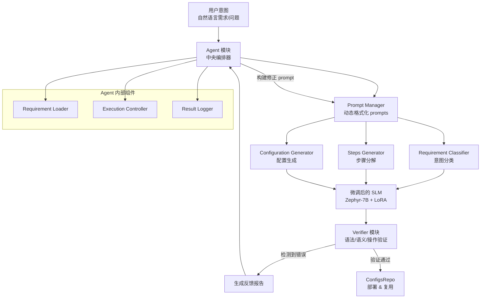
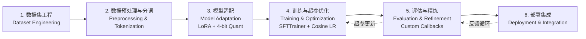
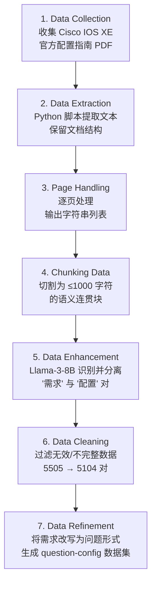

# SLM netconfig 论文深度分析报告

> **论文信息**
> - **标题**: Network Self-Configuration based on Fine-Tuned Small Language Models
> - **作者**: Oscar G. Lira (University of Campinas), Oscar M. Caicedo (Universidad del Cauca), Nelson L. S. Da Fonseca (University of Campinas)
> - **arXiv ID**: 2512.02861
> - **领域**: cs.NI (计算机网络)
> - **发表时间**: 2025年12月
> - **代码仓库**: https://github.com/oscarGLira/Fine-tuned-Configuration-Agent.git

---

## 1. 论文背景：这篇论文要解决什么问题？

### 1.1 行业趋势

随着网络规模持续扩大和拓扑日趋复杂，**人工执行网络设备配置**已变得低效且容易出错。在此背景下，ETSI（欧洲电信标准化协会）提出了 **ZSM（Zero-touch Network and Service Management，零接触网络与服务管理）** 框架，目标是实现自运营、自维护、自优化的网络，其中**自配置（Self-Configuration）** 是 ZSM 的核心组件。

### 1.2 现有方案及其痛点

目前该领域存在三类方案，各有明显局限：

| 方案类别 | 代表性工作 | 主要痛点 |
|----------|-----------|---------|
| **基于闭源大模型（LLM）的意图驱动方案** | NETBUDDY (GPT-4), GeNet, S-Witch | 依赖外部云基础设施，配置数据外泄风险高；计算成本极高（千亿/万亿参数）；延迟大 |
| **本地部署 LLM 方案** | LLM-NetCFG（作者自己之前的工作） | 幻觉严重，语法准确率仅 42%，目标准确率 64%；翻译延迟 5–7.5 分钟；输出冗余 |
| **纯 Prompt Engineering 方案** | LLNet, Network Copilot | 缺乏领域 ground truth 对齐；确定性差，结果不可复现；无法根除幻觉 |

### 1.3 核心矛盾

大模型参数规模与其在实际网络运维中的可用性之间存在**结构性冲突**：
- 参数越大 → 幻觉越难控制 → 语义不可靠
- 参数越大 → 计算开销越高 → 延迟不可接受
- 参数越大 → 必须依赖云平台 → 隐私不可保证

论文指出，现有的 LLM 方案在配置生成中即使生成语法正确的命令，也经常出现**语义偏离**——命令与预期目标不一致、引用不存在的网络实体、或包含不支持的语法变体。这种幻觉对生产网络是致命的：**一个微小的配置错误就可能导致服务中断或安全漏洞**。

---

## 2. 目标与动机

### 2.1 作者的目标

作者试图证明一个反直觉的假设：**一个经过精心微调的小模型（7B参数）可以在网络配置生成任务上全面超越大得多的通用 LLM**。具体目标包括：

1. **用 SLM（小语言模型）+ 微调替代 LLM**：保持或提升准确率的前提下，大幅降低算力开销和延迟
2. **实现完全本地部署**：配置数据不出企业内网，满足隐私合规要求
3. **通过数据集工程驱动质量**：自动从厂商文档中提取结构化的"意图→配置"映射对
4. **融入 Agent 架构实现闭环验证**：不仅生成配置，还要自动验证和迭代修正

### 2.2 为什么现有方法不够好？

作者从三个维度论证现有方法（包括自己之前的 LLM-NetCFG）的不足：

- **幻觉根因分析**：通用 LLM 在预训练阶段缺乏网络配置领域的语法和语义监督信号。提示工程（Prompt Engineering）只能约束输出格式，无法改变模型内部对 Cisco IOS 命令结构的"理解"
- **成本维度**：LLM 的推理延迟（5–20 分钟）无法满足网络运维对于实时性或近实时性的要求
- **隐私维度**：将企业内部网络拓扑和配置策略发送给第三方 LLM API 提供商存在安全风险

---

## 3. 核心方法/算法流程

### 3.1 系统架构总览

SLM netconfig 采用 **Agent-based（智能体）架构**，遵循 "感知—推理—行动"（Perception-Reasoning-Action）循环。以下是系统架构的 Mermaid 描述：

### 3.2 三大核心模块详解

#### （1）Agent 模块 —— 中央编排器

Agent 是系统的"大脑"，包含四个子组件：

| 组件 | 职责 |
|------|------|
| **Requirement Loader** | 加载和检索网络配置意图 |
| **Prompt Manager** | 动态格式化和分发三类结构化 prompt（分类/步骤分解/配置生成） |
| **Execution Controller** | 管理任务执行顺序、记录推理时间、保证数据完整性 |
| **Result Logger** | 聚合、加时间戳并持久化所有中间和最终输出 |

#### （2）Verifier 模块 —— 闭环验证（论文的核心创新点之一）

这是论文区别于大多数 LLM 方案的关键模块，直接嵌入配置生成流程：

- **语法检查**：验证命令行是否符合 Cisco IOS 语法规范
- **语义分析**：检测逻辑不一致、依赖违规和潜在冲突
- **操作合规**：确保配置与目标网络意图一致
- **反馈机制**：发现问题后生成结构化反馈 → Agent 据此重构 prompt → 重新调用模型 → 循环迭代直到通过验证或达到最大迭代次数

这种闭环验证大幅降低了生产环境中部署错误配置的风险。

#### （3）Model 模块 —— 微调后的小模型

**基础模型选择**：Zephyr-7B-β（基于 Mistral-7B 的指令微调版本）

**微调策略**（参数高效适配）：
- **4-bit 量化**（BitsAndBytes）：大幅缩减显存占用
- **LoRA（Low-Rank Adaptation）**：只更新少量低秩矩阵参数，保持预训练知识的同时注入领域专长
- 训练出两个变体：requirement-to-configuration 和 question-to-configuration
- 最终选定 question-configuration 模型作为主力（实验证明其性能更优）

**三类 Prompt 设计**：

| Prompt 类型 | 系统角色 | 助手角色 | 用户角色 |
|------------|---------|---------|---------|
| Requirement Classifier | 指导分类任务 | 定义输出结构（第一行标注意图类型） | 提供管理员意图和可能的类别 |
| Steps Generator | 指导翻译过程 | 决定输出结构 | 输入意图及上下文信息 |
| Configuration Generator | 定义操作上下文 | 指定配置格式（只输出命令，用 `~~~` 分隔不同设备） | 提供具体需求 |

### 3.3 微调流程（六阶段）

### 3.4 数据集工程 Pipeline（七阶段，论文的核心贡献）

这是论文最具工程价值的贡献。作者将大量**非结构化的 Cisco 官方配置指南 PDF** 自动转化为结构化训练数据：

**最终产出**：

| 数据集 | 样本数 | 格式 | 用途 |
|--------|--------|------|------|
| requirement-configuration | 5,104 对 | `requirement: ... \n answer: ...` | 需求→配置映射训练 |
| question-configuration | 5,097 对 | `question: ... \n answer: ...` | 问题→配置映射训练（更优） |

**举例**：
- Requirement: "Enable OSPF routing on all interfaces."
- Configuration: `router ospf 1` + `network 192.168.1.0 0.0.0.255 area 0`

### 3.5 关键创新点总结

1. **SLM + 微调替代 LLM**：首次系统证明 7B 参数模型可在网络配置生成上超越大模型
2. **全自动数据集工程 Pipeline**：从厂商 PDF 文档到结构化训练对的全自动化流水线
3. **Agent 架构 + 闭环验证**：Verifier 模块提供语法/语义双重检查，实现自我纠正
4. **参数高效微调（LoRA + 4-bit 量化）**：在 Tesla T4（免费 GPU）上即可完成训练
5. **双数据集策略**：requirement 和 question 两种格式增强模型的意图理解泛化能力

---

## 4. 实验与结果

### 4.1 实验环境

| 项目 | 详情 |
|------|------|
| 平台 | Google Colab |
| GPU | Tesla T4（免费版，16GB 显存） |
| 基础模型 | Zephyr-7B-β |
| 微调框架 | Hugging Face SFTTrainer |
| 量化 | 4-bit (BitsAndBytes) |
| 参数高效方法 | LoRA |
| 学习率策略 | Cosine scheduler |
| 评估数据集 | 99 条网络配置需求（语法/目标准确率）；90 条需求（翻译时间/复杂度） |
| 覆盖的配置域 | 接口初始化、IP 寻址、ACL、路由策略、隧道机制 |

### 4.2 评估指标

| 指标 | 定义 | 评分 |
|------|------|------|
| **语法准确率 (Syntax Accuracy)** | 每条配置行是否符合 Cisco IOS 语法 | 1=全部有效, 0=部分不完整, -1=有无效行 |
| **格式准确率 (Format Accuracy)** | 类似语法但关注命令格式是否标准 | 三级评分 |
| **目标准确率 (Goal Accuracy)** | 生成的配置是否满足原始需求 | 1=完全满足, 0=部分满足, -1=不满足 |
| **翻译时间 (Translation Time)** | 从需求到配置的总耗时 | 分钟 |
| **复杂度分数 (Complexity Score)** | 综合文本长度和翻译时间的归一化指标 | [0, 1] |

### 4.3 关键结果数据

#### (a) 内部消融实验：question-config 模型 vs requirement-config 模型

（参见论文 Figures 3-5，第 8-9 页）

question-configuration 模型在语法准确率、格式准确率和目标准确率上**全面领先** requirement-configuration 模型，因此被选定为最终部署模型。

#### (b) 主实验：SLM netconfig vs LLM-NetCFG

| 指标 | LLM-NetCFG | SLM netconfig | 提升 |
|------|-----------|---------------|------|
| **语法准确率（完全正确）** | 42% | **57%** | +15 个百分点 |
| **语法准确率（部分正确）** | 12% | **38%** | +26 个百分点 |
| **语法准确率（错误）** | 46% | **5%** | -41 个百分点 |
| **目标准确率（完全满足）** | 64% | **74%** | +10 个百分点 |
| **翻译时间（典型范围）** | 5–7.5 分钟 | **1–5 分钟** | 快 2–5 倍 |
| **翻译时间（高复杂度）** | 17–20 分钟 | 仅 1 个异常值 26 分钟，其余 <5 分钟 | 显著改善 |
| **配置复杂度分布** | 0.3–0.8（中高范围） | **0.1–0.2（极低范围）** | 输出简洁度极大提升 |

### 4.4 结果分析亮点

1. **语法错误率从 46% 降至 5%**：这是最显著的改进，说明微调后的小模型在 Cisco IOS 语法规范性上有质的飞跃
2. **"部分正确"从 12% 提升到 38%**：虽然部分正确的配置仍无法直接部署，但包含可恢复的信息，可通过轻量级后处理修正——这反映了模型实际上理解了配置意图，只是在 CLI 格式上有偏差
3. **配置简洁度大幅提升**：SLM netconfig 生成的配置避免了 LLM-NetCFG 中常见的冗余和重复命令，输出更加精简
4. **翻译延迟降低**：从 LLM-NetCFG 的 5–7.5 分钟降至 SLM netconfig 的 1–5 分钟，在复杂性接近 1.0 时差距更明显

### 4.5 与相关工作的全面对比

| 工作 | 意图输入 | 配置生成 | 验证 | 仿真 | 混合架构 | 闭环 |
|------|---------|---------|------|------|---------|------|
| NETBUDDY [4] | ✓ | ✓ | - | ✓ | - | - |
| GeNet [5] | ✓ | - | - | - | - | - |
| S-Witch [7] | ✓ | ✓ | - | ✓ | - | - |
| Mondal et al. [6] | ✓ | ✓ | ✓ | - | - | - |
| Donadel et al. [8] | ✓ | - | - | - | - | - |
| Mekrache et al. [9] | ✓ | ✓ | - | ✓ | - | - |
| LLNet [38] | ✓ | ✓ | - | ✓ | ✓ | - |
| **SLM netconfig** | ✓ | ✓ | ✓ | - | ✓ | **✓** |

**SLM netconfig 是唯一同时支持验证、混合架构（SLM+FLM）和闭环反馈的方案。**

---

## 5. 启示与局限

### 5.1 对工业交换机自动配置方案的启示

#### （1）小模型替代大模型是工业落地的可行路径

该论文最直接的启示是：**对于特定厂商/特定设备的配置生成任务，7B 参数的 SLM 经过微调后即可达到实用水平**。这意味着工业交换机厂商（如华为、H3C、锐捷等）完全可以基于开源小模型训练自己的配置生成模型，实现：
- **本地部署**：无需依赖云端 API，配置数据不出企业内网，满足金融、政府、运营商等行业的合规要求
- **低成本推理**：Tesla T4 级别的 GPU（或甚至量化到 CPU 推理）即可运行
- **低延迟**：配置生成从分钟级降至秒级

#### （2）数据集工程比模型选型更重要

论文的关键成功因素不是模型架构的创新，而是**从厂商文档到结构化训练数据的 Pipeline**。对工业交换机方案的启示：
- 投入精力建设 **"配置意图→CLI 命令"映射数据集**，覆盖主流场景（VLAN、OSPF、BGP、ACL、QoS、VXLAN 等）
- 数据质量（一致性、完整性）比数据量更重要——论文用 5000+ 对就取得了可观效果
- 可以利用已有的厂商配置手册、最佳实践指南、排错文档等作为数据源

#### （3）Agent 架构 + 闭环验证是保障可靠性的关键

单纯的"意图→配置"翻译模型不可靠（仍有 26% 的目标不满足率），但 **Agent 架构中的 Verifier 模块可以在部署前捕获错误**。工业交换机方案应借鉴：
- 在配置下发前进行**语法校验**（CLI parser）和**语义校验**（依赖分析、冲突检测）
- 建立"生成→验证→反馈→修正"的闭环机制
- 结合**数字孪生（Digital Twin）** 进行配置预验证

#### （4）多厂商适配是下一步挑战

该论文目前仅支持 Cisco IOS 单一厂商。工业交换机方案面临更复杂的多厂商环境（华为 VRP、H3C Comware、Juniper Junos、Arista EOS 等），需要考虑：
- 为每个厂商 CLI 语法训练独立的 LoRA 适配器
- 或者设计统一的中间表示（IR），然后生成各厂商的具体配置

#### （5）部分正确输出需要后处理

38% 的"部分正确"配置虽然不能直接运行，但包含了可恢复的配置意图。工业方案可以设计**轻量级后处理模块**：
- 对常见 CLI 格式错误（如参数顺序、关键字别名）进行自动修正
- 基于模板补全缺失的命令行
- 结合 RAG（检索增强生成）实时查阅官方文档进行修正

### 5.2 论文局限性

#### （1）覆盖范围窄

- **仅支持 Cisco IOS** 单一厂商的单一操作系统。实际生产网络通常是多厂商（Cisco/Juniper/Huawei/Arista）混合环境
- **仅覆盖 5 类配置场景**（接口初始化、IP 寻址、ACL、路由策略、隧道机制），缺少对 BGP、MPLS、VXLAN、SDN 控制器配置等更复杂场景的支持
- **单设备配置**，缺乏对多设备协同配置（如跨设备 VLAN trunk、链路聚合、VRRP/HSRP 等）的支持

#### （2）准确率仍有提升空间

| 不足 | 数据 | 风险 |
|------|------|------|
| 目标准确率仅 74% | 仍有 26% 不满足或部分满足 | 生产部署中不可接受的失败率 |
| 语法错误率 5% | 每 20 条需求有 1 条产生无效命令 | 可能导致设备拒绝配置或进入错误状态 |
| 部分正确率 38% | 需要后处理才能部署 | 引入额外的修正步骤和不确定性 |

#### （3）实验规模和验证方法有限

- **评估数据集仅 99 + 90 条需求**，统计意义有限
- **未在真实物理设备上验证**——所有评估基于语法分析和人工评判，而不是实际在交换机上执行配置并测量网络行为
- **缺乏与 RAG（检索增强生成）方案的对比**——这是当前缓解幻觉的主流方法之一
- **未测试模型在分布外（OOD）场景的泛化能力**——训练数据来自 Cisco 16.11.1 版本，对新版本的兼容性未知

#### （4）缺乏多轮交互能力

- 当前的交互模式是单轮"需求→配置"。实际网络运维中，管理员往往需要多轮对话来逐步细化需求
- 缺少对**持续学习**的支持——模型无法从运维人员的反馈中在线学习

#### （5）Agent 架构的 Verifier 能力未经独立评估

- 论文没有单独评估 Verifier 模块的验证准确率（即它检测到错误的召回率和精确率）
- 如果 Verifier 本身漏报错误，闭环验证就形同虚设

#### （6）计算资源与实际部署

- 虽然在免费 Tesla T4 上完成训练，但推理仍需要 GPU 资源
- 对边缘/分支节点的交换机管理场景（无 GPU 可用），需要进一步的模型压缩（如 INT8 量化、蒸馏）才能部署
- 未提供模型吞吐量（每秒生成多少配置）的数据

### 5.3 未来研究方向（论文中提及）

1. 在**大规模运营环境**（多样化拓扑）中部署测试
2. 扩展到 **Cisco IOS 以外的多厂商生态系统**
3. 研究**部分正确输出的自动修复机制**
4. 将**设备级验证**集成到推理过程的闭环反馈中
5. 引入 **RAG** 以动态访问权威配置文档

---

## 附录：论文元数据

| 属性 | 值 |
|------|-----|
| 论文页数 | 16 页 |
| 参考文献数 | 42 篇 |
| 基础模型 | Zephyr-7B-β |
| 训练数据集规模 | 5,104 + 5,097 对 |
| 数据来源 | Cisco IOS XE Gibraltar 16.11.1 官方配置指南 |
| 训练硬件 | Google Colab Tesla T4 (免费) |
| 关键对比基线 | LLM-NetCFG（作者前作，本地部署的 LLM） |
| 代码开源 | GitHub: oscarGLira/Fine-tuned-Configuration-Agent |
| 作者所属机构 | 巴西坎皮纳斯州立大学 (UNICAMP) / 哥伦比亚考卡大学 |

---

> **分析完成时间**: 2025年7月20日
> **分析方法**: 基于论文全文（arXiv 2512.02861v1）的系统性阅读与分析
