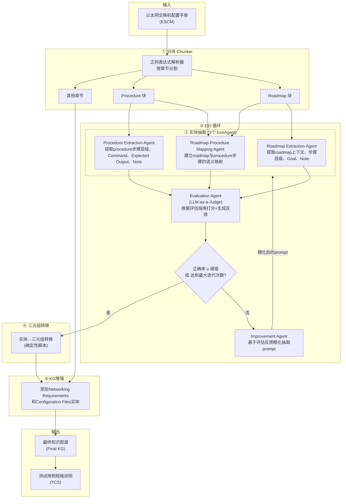

# 论文分析：支持系统测试的多智能体LLM知识图谱提取框架——以太网交换机案例研究

> **论文标题**: Supporting System Testing with a Multi-Agent LLM-based Framework for Knowledge Graph Extraction: A Case Study with Ethernet Switch Systems  
> **论文编号**: arXiv:2605.19180v1  
> **作者**: Rongqi Pan, Mahboubeh Dadkhah, Jean Baptiste Minani, Hussein Al Osman, Lionel Briand, Haiwei Dong  
> **机构**: 渥太华大学 + 华为加拿大  
> **发表时间**: 2026年5月  

---

## 1. 论文背景

### 1.1 核心问题

以太网交换机的系统测试目前仍然是一个**高度依赖人工的、耗时且劳动密集**的过程。测试工程师需要：

1. 根据测试需求确定待测的交换机功能；
2. 依据领域经验选择合适的测试场景；
3. **手动编写**测试用例（自然语言描述的测试步骤）；
4. 将测试步骤转化为设备命令并在目标设备上自动执行。

在这条链路中，最核心的瓶颈在于：**测试用例的编写依赖人工从产品文档中提取和理解配置知识**。

### 1.2 以太网交换机配置手册（ESCM）的特性

ESCM 是半结构化技术文档，通常包含以下章节：

| 章节 | 内容 |
|------|------|
| Overview | 背景介绍与配置原理说明 |
| Configuration Notes | 平台适用性、设备型号/版本限制 |
| Networking Requirements | 目标网络环境、拓扑结构、配置目标 |
| Configuration Roadmap | 高层次配置步骤的概要序列 |
| Procedure | 详细的、逐步的配置操作和命令（含预期输出） |
| Configuration Files | 完整设备配置文件 |

### 1.3 当前领域的痛点

1. **隐式属性难以提取**：配置步骤的关键属性（如 Goal、Note、Command、Expected Output）散布在文本中，没有被显式标注和结构化。例如，Goal 可能以"to ..."引导的目的从句嵌入步骤描述中，Note 可能混在操作说明里。
2. **跨越章节的隐式依赖关系**：Configuration Roadmap 中的高层步骤与 Procedure 中的细化步骤之间存在**多对多的语义映射关系**，但这些映射从未被显式文档化。一个 Roadmap 步骤可能对应多个 Procedure 步骤，一个验证步骤可能同时验证多个 Roadmap 步骤。
3. **文档格式高度异构**：不同手册的写作风格、步骤编号方式、标记符号差异巨大。例如，命令和预期输出可能出现在独立代码块中，也可能嵌入步骤描述文本中。
4. **传统方法失效**：
   - **规则方法**：对文档结构变化敏感，只能做语法分析，无法捕捉语义依赖；
   - **本体方法**：缺乏可泛化性，迁移到新领域需大量人工重建本体；
   - **传统NLP**：难以处理长复杂句子，只能提取高层语义，无法捕捉隐式依赖。

---

## 2. 目标与动机

### 2.1 核心目标

**从ESCM中自动提取结构化知识，构建高正确率的知识图谱（KG），以支撑下游自动化测试（尤其是测试用例规格说明 TCS 的生成）。**

### 2.2 为什么现有 KG 构建方法不够好

现有基于LLM的KG构建方法（如EDC [Zhang & Soh, 2024]、Kommineni et al. [2024]）主要面向**通用文本**，其设计侧重点是 **KG Schema 的灵活性和动态构建**。然而，技术文档的KG构建面临不同的挑战：

- **正确性和精度**是第一优先级，而非灵活性；
- Schema 通常是**预定义**的（领域知识结构相对固定）；
- ESCM 的半结构化特性要求**细粒度的属性抽取**和**跨节依赖推理**；
- 通用方法无法保证工业场景所需的抽取精度（0.97+），特别是在隐式依赖提取方面。

### 2.3 论文的直接动机

> "Given that the Ethernet Switch testing is often performed manually in the industry, it remains one of the most time-consuming and labor-intensive tasks in Ethernet Switch production and the V&V process."

论文希望利用LLM的强大语义理解能力，在精心设计的框架约束下，实现从 ESCM 到高质量 KG 的自动化转换。

---

## 3. 核心方法/算法流程

### 3.1 整体架构

论文提出了一个**多智能体（Multi-Agent）LLM框架**，其核心是一个**迭代的 Extract-Evaluate-Improve（EEI）循环**。整体架构如下图所示：



### 3.2 KG Schema 设计

论文为 ESCM 设计了一个**细粒度的KG Schema**（Figure 1），包含以下核心实体和关系：

| 实体类型 | 说明 | 关键属性/关系 |
|----------|------|---------------|
| Use Case Scenario | 配置场景（即ESCM标题） | 顶层根节点 |
| Configuration Roadmap | 高层配置路线图 | hasContext, hasStep |
| Roadmap Step | Roadmap 中的步骤 | hasGoal, hasNote, hasSubStep |
| Procedure | 详细操作过程 | hasStep |
| Procedure Step | Procedure 中的步骤 | hasCommand, hasExpectedOutput, hasNote, hasSubStep |
| Networking Requirements | 网络环境要求 | hasNetworkingRequirements |
| Configuration Files | 设备配置文件 | hasConfigurationFiles |

**关键关系**：
- `mapsTo`: Roadmap Step → Procedure Step（多对多映射，是框架最核心的关系）
- `hasGoal`, `hasNote`, `hasCommand`, `hasExpectedOutput`: 步骤的属性标注
- `hasStep`, `hasSubStep`: 层级结构

### 3.3 三个抽取智能体（ExtrAgents）详解

#### (1) Roadmap Extraction Agent

**输入**: Configuration Roadmap 章节文本  
**抽取目标**:
- **Context**（可选）：第一步之前的引导性/背景描述
- **Main Steps 及其层级结构**：编号步骤（含子步骤、更深层级步骤）
- **Goal**（可选）：步骤中明确陈述的目标（如 "to detect loops in VLAN 100"）
- **Note**（可选）：补充说明、条件、背景信息

**Prompt 设计**：包含 Overview（角色定义）、Guidelines（提取规则，如步骤分割、层级编号、逐字复制）、Roadmap（输入文本）、Response（JSON Schema约束）

**输出**：结构化JSON，每个步骤包含 `step`、`step No`、`goal`、`note`、`sub_steps` 字段

#### (2) Roadmap-Procedure Mapping Agent

**输入**: Configuration Roadmap + Procedure 两个章节  
**抽取目标**: 为每个 Roadmap 主步骤找到 Procedure 中对应的一个或多个主步骤（多对多映射）

**关键挑战**：
- 需要**语义理解**配置意图，而非简单的关键词匹配
- 验证步骤（如 "Verify the configuration"）可能同时服务多个 Roadmap 步骤
- 映射关系没有在手册中显式标注

**Prompt 设计**：五段式结构（Overview、Guidelines、Roadmap、Procedure、Response），Guidelines 强调将主步骤作为原子单元处理、包含相关验证步骤等

#### (3) Procedure Extraction Agent

**输入**: Procedure 章节（由于Procedure较长，先按主步骤切割，独立抽取后合并）  
**抽取目标**:
- 步骤层级结构（主步骤、子步骤、更深层级）
- **Command**：命令行动作（含设备提示符如 `[Switch]`）
- **Expected Output**：命令执行后的预期输出及解释性文字
- **Note**：背景信息、建议、补充说明

**特殊处理**：
- Procedure 通常是 2.5K–4.5K tokens，包含复杂的嵌套结构和多种知识类型
- 按主步骤分割后独立抽取，降低推理成本、减少长上下文导致的准确度下降
- **使用 Few-Shot 示例**（3个代表性例子）——这与前两个任务不同。初始实验表明，Procedure 提取在无示例时效果较差，因为 Procedure 的结构和语言变化更大

### 3.4 EEI（Extract-Evaluate-Improve）循环 —— 核心创新

EEI 循环是论文最核心的方法贡献。它是一个**自动化的迭代改进机制**，用于在初始抽取未达到质量阈值时精化抽取 prompt。

#### 3.4.1 整体流程

```
初始 Prompt → ExtrAgent 抽取 → EvalAgent 评估 → 
    ↓ (score < 0.9 且 iter < 3)
ImprovAgent 精化 Prompt → 回到抽取步骤
    ↓ (score ≥ 0.9 或 iter = 3)
输出最终 KG
```

**停止条件**：
- 正确率 ≥ 0.9（预定义阈值）
- 或达到最大迭代次数（3次）

#### 3.4.2 EvalAgent：LLM-as-a-Judge

EvalAgent 采用 **LLM-as-a-Judge** 范式，不需要人工标注的真值（Ground Truth）即可自动评估抽取质量。

**为什么不用传统NLP指标？**
- BLEU、ROUGE、METEOR 在推理密集型任务中不可靠
- 传统指标依赖真值参考，而收集真值成本极高
- LLM-as-a-Judge 在明确评估准则下与人类判断具有高度一致性

**评估指南（按任务定制）**：

| 任务 | 评估指南 |
|------|----------|
| Roadmap 抽取 | Step Splitting, Context Identification, Goal Extraction, Note Extraction, Numbering, Verbatim Copying, Format Compliance |
| Roadmap-Procedure 映射 | Main-Step Boundary Compliance, Step-Numbering Compliance, Relevant Step Match, Multiple Match Inclusion, Device Identifier Consistency, Text Completeness, Structural Format |
| Procedure 抽取 | Step Coverage, Step-Numbering Compliance, Command Extraction Correctness, Expected-Output Extraction Correctness, Note Classification & Attachment Correctness, Text Completeness & Verbatim Copy, Structural Format & Schema Compliance |

**输出格式**：每个指南返回 `{score (0/1), num_checked, num_correct, reasons}`，加上 `overall_comment` 总结系统性问题。

**正确率计算公式**：

```
correctness_score = Σ(num_correct_i) / Σ(num_checked_i)，i = 1..m
```

#### 3.4.3 ImprovAgent：Prompt 精化

当 EvalAgent 判定正确率低于阈值时，ImprovAgent 被触发。

**精化规则**：
1. **不改动正确的行为**（score=1 的指南保持不动）
2. **只修失败的指南**（根据 EvalAgent 反馈的具体错误原因调整）
3. 避免模糊指令，提供具体规则
4. 不修改其他 prompt 部分（如 Overview、Response 格式）

**精化策略**：**重新生成（regenerate）而非修补**。论文发现，让 LLM 从原始 ESCM 用精化后的 prompt 重新生成 KG 实体，比直接修补前一轮的错误输出更可靠——因为直接修补可能被前一轮的错误输出所影响。

**实例**（Figure 14）：当 EvalAgent 检测到 Note Extraction 错误（如将操作范围 "on SwitchA and SwitchB" 误标为 Note），ImprovAgent 在 prompt 的 Note 指南中增加了：
> "Do not extract as notes any phrases that specify where/what is being configured (scope/targets), such as device/interface lists or 'on/for' prepositional phrases."

#### 3.4.4 为什么选择重新生成而非修补？

论文指出，直接修补前一轮的错误输出可能导致 LLM **被错误的 KG 实体影响，重复犯同样的错误**。而从原始文本重新生成可以避免这种"锚定效应"，确保问题被从根本上解决。

### 3.5 KG 增强与 TCS 生成

**KG 增强**：在三个主抽取任务完成后，加入 Networking Requirements 和 Configuration Files 作为补充实体，通过 `hasNetworkingRequirements` 和 `hasConfigurationFiles` 关系连接到 Use Case Scenario。

**TCS 生成**：将 KG 遍历转换为结构化的测试用例规格说明（TCS），包含：
- `use_case`：测试场景和目标
- `preconditions`：前置条件（来自 Networking Requirements）
- `configuration_steps`：集成的配置步骤（融合 Roadmap 和 Procedure 信息，包含映射关系）
- `configuration_file`：设备配置文件

TCS 的优势：相比 KG，TCS 更易于人工审查、验证和调试；前置条件、步骤和预期输出被显式分组和排序。

### 3.6 框架的领域可迁移性

论文强调框架是**模块化和领域可适应的**。迁移到其他技术文档只需：
1. 重用或定义新的 KG Schema
2. 修改 ExtrAgent 的角色定义和任务描述
3. 重新设计抽取指南（必要时加入 Few-Shot 示例）
4. 重新设计评估指南
5. 调整 EEI 循环的停止条件（阈值和最大迭代次数）

---

## 4. 实验与结果

### 4.1 数据集

- **来源**：华为 S300/S500/S2700/S5700/S6700 系列交换机产品文档（约1500份ESCM）
- **筛选**：从 "Typical Configuration Examples" 类别中筛选出同时包含 Configuration Roadmap 和 Procedure 章节的手册 → 208份
- **最终数据集**：采用**比例随机抽样**，从18个子类别中选取 **50份 ESCM**
- 格式：Markdown

### 4.2 实现细节

- **LLM**：GPT-5（通过 OpenAI API，使用默认配置）
- **框架**：LangChain
- **硬件**：MacBook Pro (Apple M4, 16GB RAM)
- **温度参数**：GPT-5 API 不支持设置 temperature，因此输出非完全确定性

### 4.3 研究问题（RQ）

| RQ | 问题 | 核心发现 |
|----|------|----------|
| RQ1 | 原始 prompt 的抽取正确率？ | 三个任务均值 0.97–0.99，Roadmap Extraction 均值=0.98，Mapping 均值=0.97，Procedure Extraction 均值=0.99 |
| RQ2 | EEI 循环改善了多少？ | 仅少数 ESCM 触发 EEI（Roadmap 2/50，Mapping 5/50，Procedure 0/50），平均 ΔCorr = 0.12–0.15 |
| RQ3 | LLM 评估与人类评估的一致性？ | Cohen's κ ≥ 0.72（三个任务均达到 substantial agreement） |
| RQ4 | KG 对下游 TCS 生成的有效性？ | 整体评分 4.18/5，正向评价率 95.3% |

### 4.4 详细实验结果

#### RQ1：原始 Prompt 性能

| 任务 | 正确率范围 | 均值 | 中位数 | 满分ESCM数 |
|------|-----------|------|--------|-----------|
| Roadmap Extraction | 0.88–1.00 | 0.98 | 1.00 | 38/50 |
| Roadmap-Procedure Mapping | 0.79–1.00 | 0.97 | 1.00 | 33/50 |
| Procedure Extraction | 0.96–1.00 | 0.99 | 1.00 | 33/50 |

**主要错误类型**：
- **Roadmap 抽取**：Note Extraction 错误（22%）和 Goal Extraction 错误（10%），主要因为 "to..." 模式的过度触发和操作范围被误标为 Note
- **Mapping**：Text Completeness（18%）多为 EvalAgent 误报（如 Markdown 标记 `**` 引起的幻觉），Relevant Step Match（12%）因验证步骤的映射不准确
- **Procedure 抽取**：Expected Output 识别错误（22%），多发生在命令/输出嵌入步骤描述中时

#### RQ2：EEI 循环效果

- **触发频率低**：Roadmap 2/50，Mapping 5/50，Procedure 0/50
- **改善幅度**：Roadmap 平均 ΔCorr=0.12，Mapping 平均 ΔCorr=0.15
- **多轮迭代**：Mapping 中有2个 ESCM 在第1轮后正确率反而下降，但第2轮恢复并超过原始分数——表明多轮 EEI 能检测并修复回归错误
- **Procedure 不需要 EEI**：因为 Procedure 抽取实体数量多，个别错误对总正确率影响小（但仍有17个 ESCM 正确率<1.00，存在小问题）

#### RQ3：LLM vs 人类评估一致性

| 任务 | Cohen's κ | 主要分歧来源 |
|------|-----------|-------------|
| Roadmap Extraction | 0.80 | Goal/Note 的分类标准差异（如"in delay mode"是否算 Note） |
| Roadmap-Procedure Mapping | 0.76 | 部分相关 vs 完全相关的映射判定差异；EvalAgent 对特殊字符的幻觉误报 |
| Procedure Extraction | 0.72 | 逐字复制的格式偏差（空格、换行）；EvalAgent 对符号的幻觉误报 |

> **关键结论**：大多数分歧源于**分类标准的细微差异**或**格式问题**，而非实质性抽取错误。被"误判"的信息仍然保留在抽取输出中。

#### RQ4：TCS 生成有效性

| 评估维度 | 平均分 | 正向评价率 |
|----------|--------|-----------|
| 实用性 (Practical usefulness) | 4.17 | 99.0% |
| 清晰度和可理解性 | 4.24 | 96.0% |
| 完整性 (Completeness) | 4.12 | 88.0% |
| 正确性和技术准确性 | 4.23 | 97.3% |
| 整体质量 | 4.36 | 100.0% |
| **总体** | **4.18** | **95.3%** |

**注意**：5位测试人员中4位有直接以太网交换机测试经验（经验0-4年，平均1.8年），工程经验1-16年（平均4.4年）。

**完整性评分相对较低的原因**：
- 前置条件有时不够具体（4个中性回应）
- 预期结果有时不够明确（1个不同意+3个中性）
- 测试人员建议将某些配置步骤的 Goal 移入前置条件、更明确地区分允许/拒绝访问的IP地址

---

## 5. 启示与局限

### 5.1 对工业交换机自动配置方案的直接启示

#### (1) KG Schema 的设计思路可直接复用

论文的 KG Schema 为以太网交换机配置知识的结构化表示提供了**经过验证的模板**：
- `mapsTo` 关系（Roadmap→Procedure 多对多映射）是核心，在工业自动配置方案中，这种**高层意图到低层实现的映射**极为关键；
- `hasGoal`、`hasNote`、`hasCommand`、`hasExpectedOutput` 等属性标注，实现了**比纯文本更细粒度的知识表示**，可直接用于自动配置验证。

#### (2) EEI 循环为自动配置中的知识提取提供了质量保障机制

在工业自动配置方案中，配置知识的**正确性是首要约束**（错误配置可能导致网络故障）。EEI 循环提供了一种**自动化的质量闭环**：
- 不需要人工标注真值即可评估质量（LLM-as-a-Judge）；
- 针对特定文档的写作风格进行 prompt 自适应精化；
- 正确率阈值可配置，适应不同严格程度的工业场景。

#### (3) 多智能体框架的模块化设计支持渐进式集成

三个 ExtrAgent 各司其职：提取高层意图（Roadmap）、建立映射（Mapping）、提取操作细节（Procedure）。这种分工可以逐步集成到自动配置流水线中：
- 可以先集成 Procedure Extraction Agent 获取结构化命令序列；
- 再加入 Mapping Agent 建立意图-实现对应关系；
- 最终整合 Roadmap Agent 实现端到端的配置理解和验证。

#### (4) TCS 作为 KG 到可执行测试的中间桥梁

论文的 KG→TCS 转换思路可以直接应用于自动配置方案：将抽取的结构化知识转化为**人类可审查的中间制品**（配置规格说明），在自动执行前提供审查点，降低错误配置的风险。

#### (5) Few-Shot 策略的选择具有指导意义

论文的初步实验表明：Roadmap Extraction 和 Mapping 任务**不需要 Few-Shot 示例**就能达到高正确率，但 Procedure Extraction **显著受益于** Few-Shot。这提示在构建自动配置方案时，应根据任务复杂度灵活选择提示策略，避免不必要的 token 消耗。

### 5.2 论文的局限性

#### (1) EEI 循环触发次数有限

- Roadmap 2/50、Mapping 5/50、Procedure 0/50 触发了 EEI
- 虽然改善效果明显（ΔCorr=0.12-0.15），但**样本量太小**，难以得出统计上强有力的结论
- 作者也承认："the limited number of triggered cases restricts the strength of our conclusions regarding its overall effectiveness"

#### (2) 单一 LLM 依赖

- 所有实验仅使用 **GPT-5**，未与其他模型（如 Claude、Gemini、开源模型）进行对比
- 无法评估框架对 LLM 选择的鲁棒性
- GPT-5 的 API 不支持设置 temperature=0，输出非完全确定性

#### (3) 领域泛化性未经验证

- 数据集局限于**华为 S系列交换机**的 ESCM
- 虽然框架设计是模块化和领域可适应的，但**未在其他网络设备（路由器、防火墙）或其他类型的技术文档上验证**
- 英文文档为主，未涉及多语言场景

#### (4) 下游任务验证有限

- TCS 仅生成了 5 个代表性样本
- 仅 5 位测试人员参与评估
- TCS 到**可执行测试用例**的转换尚未实现（仍停留在规格说明层面）
- 缺少端到端的测试有效性验证（如：基于 KG 生成的测试用例是否真的发现了 bug？）

#### (5) 评估机制存在偏差

- EvalAgent 对特殊字符（如 Markdown 标记 `**`）存在**幻觉问题**，约 18% 的 Mapping 违规被判为误报
- LLM-as-a-Judge 的评估标准比人类更**保守/严格**，导致部分正确映射被标记为错误
- 缺乏 EvalAgent 本身的可靠性校准机制

#### (6) Few-Shot 策略不一致

- 只有 Procedure Extraction 使用了 Few-Shot 示例
- 这使得**三个任务的性能不可直接比较**（可能部分优势来自 Few-Shot 而非任务本身更容易）
- 作者承认这一设计选择的局限性

#### (7) 成本和效率未量化

- GPT-5 的推理成本、每次 EEI 迭代的 token 消耗、端到端处理时间均未报告
- 对于工业部署，成本效益分析是决策的关键因素

#### (8) KG Schema 的完备性未讨论

- Schema 是手工设计的，未讨论是否遗漏了某些重要的实体或关系类型
- 未提供 Schema 设计的方法论（如是否经过领域专家评审的迭代过程）

---

## 6. 总结评价

### 6.1 论文贡献

| 贡献 | 评价 |
|------|------|
| 多智能体 LLM 框架 | 设计精巧，分工合理，模块化好 |
| EEI 循环 | 核心创新，自动化质量闭环，有实用价值 |
| 细粒度 KG Schema | 针对 ESCM 量身定制，覆盖关键实体和关系 |
| 工业级验证 | 50个真实 ESCM + 工业测试人员评估，可信度高 |
| 领域可迁移性设计 | 提供了清晰的迁移路径和指导 |

### 6.2 与工业自动配置方案的关系

本文的方法与工业交换机自动配置方案**高度互补**：

- **本文解决的是**：如何从半结构化的配置手册中**可靠地提取结构化知识**（KG）
- **自动配置方案需要的是**：结构化知识来驱动配置生成、验证和测试

因此，本文的 KG 提取框架可以作为自动配置方案的**知识获取前端**，将非结构化的产品文档转化为机器可理解、可推理的结构化知识库。

### 6.3 改进方向建议

1. **多模型对比**：在 Claude、Gemini、开源模型上评估框架，确保对 LLM 选择的鲁棒性
2. **EvalAgent 校准**：针对特殊字符的幻觉问题，增加后处理规则或引入更结构化的评估策略
3. **扩大 EEI 验证**：在更大数据集（如全部 208 份 ESCM）上评估 EEI 循环效果
4. **端到端验证**：从 KG → TCS → 可执行测试用例 → 实际测试执行，建立完整的验证链路
5. **跨领域验证**：在路由器配置、防火墙策略等其他网络设备文档上测试迁移能力
6. **成本建模**：量化 LLM 推理成本与人工节省的比例，为工业采纳提供经济依据
