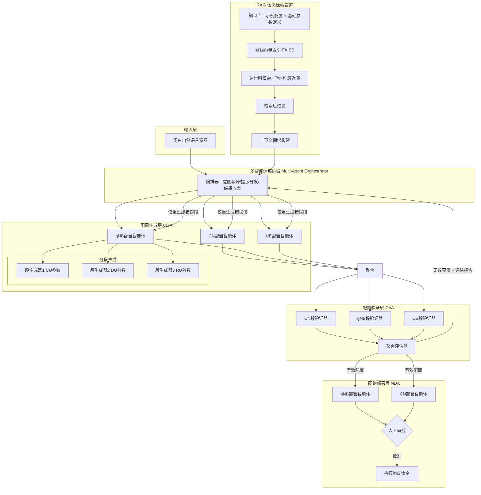

# RAG驱动多智能体LLM框架论文详细分析报告

**论文题目**: RAG-driven Multi-Agent LLM Framework with Task Decomposition for Beyond 5G Auto-Configuration  
**作者**: İrşat Emin Sarıdaş, Onur Salan, Ali Görçin, İbrahim Hokelek, Hakan Ali Çırpan  
**机构**: TÜBİTAK BİLGEM (土耳其科学技术研究委员会) & 伊斯坦布尔技术大学  
**发表**: arXiv:2606.01222, 2026年5月

---

## 1. 论文背景

### 1.1 核心问题

B5G（Beyond 5G）/ 6G 网络环境日益异构化，网络配置和运维管理变得极其复杂，严重依赖专家知识。传统人工配置方式在面对多厂商、多频段、多切片等多样化部署场景时，效率低下且易出错。

### 1.2 领域痛点

- **配置复杂性爆炸**：未来IMT-2030系统要求网络支持极其多样的使用场景，需要AI原生能力。网络配置涉及CU/DU/RU参数组、CN功能参数、UE参数等多个维度，参数间存在严格的依赖关系、取值范围约束和语法格式要求。
- **LLM的幻觉问题**：尽管LLM（大语言模型）在意图驱动的网络管理中展现出潜力，能够将自然语言意图翻译为机器可读的配置，但在多步骤、复杂任务中经常产生幻觉（hallucinations）和结构性不一致——输出表面上语法合理但语义不一致或操作上不可行。
- **单次/单体方法的局限**：单次提示（single-shot）或单体式（monolithic）生成方法会导致错误累积，尤其是在涉及多步骤工作流、严格语法约束和多依赖决策的场景中。
- **标准合规性要求高**：网络配置任务对3GPP标准合规性、厂商特定约束和平台依赖实现高度敏感，LLM输出的可靠性关键依赖于推理时能否获取准确相关的领域知识。
- **缺乏验证反馈机制**：传统方法缺少闭环验证和自修正机制，一旦生成错误配置，缺乏自动检测和纠正的能力。

---

## 2. 目标与动机

### 2.1 核心目标

论文旨在构建一个**可部署、符合标准、可靠**的B5G网络自动配置框架，将自然语言用户意图转化为经过验证的、可直接部署的网络配置。具体而言，框架需要实现：

1. 将非结构化自然语言意图自动转化为结构化、机器可读的配置文件
2. 确保生成的配置符合3GPP标准和厂商规范
3. 通过验证-修正闭环机制消除幻觉和错误
4. 实现端到端的网络部署自动化

### 2.2 现有方法的不足

| 现有方法 | 存在问题 |
|---------|---------|
| 单体式LLM生成 | 单次传递生成整个配置，错误累积严重，幻觉率高 |
| 无检索增强的LLM | 缺乏标准知识和厂商文档的对齐，输出偏离领域约束 |
| 无验证机制 | 无法自动检测配置错误，依赖人工审查 |
| 无任务分解 | 复杂任务整体处理，LLM负担重，成功率低 |
| 纯文本意图驱动 | 缺乏结构化验证和部署闭环 |

作者明确指出现有技术栈中存在一个重要**空白**：尽管LLM在意图驱动自动化方面展现强大潜力，但**可靠地将用户意图转化为可部署的、符合标准的网络配置**仍然需要**领域知识基础（domain grounding）**和**结构化推理（structured reasoning）**两者的结合。

---

## 3. 核心方法/算法流程

### 3.1 系统架构图



### 3.2 三大核心机制

#### 机制一：RAG（检索增强生成）

```
输入意图 → 意图编码(embedding) → FAISS向量检索(Top-K) 
→ 检索后过滤(去除不相关/冲突项) → 上下文捆绑 → 注入LLM提示
```

**知识库构成**：
- 37个gNB和5个UE配置文件（来自OAI官方仓库）
- 每个参数包含：形式化定义、数据类型、允许范围、依赖关系、计算方式（如载波频率推导、栅格对齐约束）
- 基础配置参数定义（强制必须出现在生成输出中的参数）

**技术栈**：
- FAISS：向量相似度搜索
- all-MiniLM-L6-v2：HuggingFace嵌入模型
- 语义检索管道：离线索引 → 运行时检索 → 检索后过滤 → 上下文捆绑构建

#### 机制二：任务分解（Task Decomposition）

**核心思想**：将复杂的整体配置任务分解为逻辑上隔离的参数块。

**分解策略**：
- **gNB域**：分解为CU（中央单元）、DU（分布式单元）、RU（射频单元）相关参数组
- **CN域**：按CN各功能模块对应的参数集分解
- 每个"段生成器智能体"（segment generator agent）独立生成一个严格格式化的配置段
- 各域专项智能体负责聚合段级输出为域级配置

**对比单体方法**：
- 单体方法：每个专项智能体在单次传递中生成域级配置，不进一步分区
- 分解方法：将任务拆分为更小的子任务，由专门智能体并行处理

#### 机制三：闭环验证与选择性重生成（Closed-Loop Verification & Selective Regeneration）

这是论文的**关键创新**之一：

```
生成配置 → 分解为段 → 并行验证各段 → 生成结构化评估报告(JSON)
        ↓
    有效段保留 ← 无效段标记(错误参数+根因+修正策略)
        ↓
    仅重生成错误段 → 重新验证 → 迭代直到全部有效
```

**验证内容**：
- 缺失的强制参数
- 无效或超出范围的参数值
- 参数间依赖违反
- 语法错误

**评估报告格式**：JSON结构化输出，包含：
- 二进制有效性指示器
- 检测到的问题列表
- 故障参数的根因分析
- 建议的修正策略

**优势对比**：

| 特性 | 单体验证（MV） | 分解验证（DV） |
|------|-------------|-------------|
| 输入 | 整个配置作为单一输入 | 将配置分解为逻辑段 |
| 错误处理 | 单个错误就需重新生成整个配置 | 仅重生成出错段，有效段保留复用 |
| 计算开销 | 高（整个配置重新生成） | 低（选择性重生成） |
| Token消耗 | 高 | 低 |

### 3.3 算法流程总结

```
Algorithm: RAG-driven Multi-Agent Auto-Configuration

Input:  用户自然语言意图 $I$
Output: 已验证并部署的网络配置

1.  RAG检索：
    - 对意图 I 进行嵌入编码
    - 从知识库中检索Top-K相关配置模板和参数定义
    - 过滤不相关/冲突项后构建上下文捆绑 $C$

2.  多智能体编排器生成任务提示：
    - 将 I 和 C 组合为智能体专用提示
    - 分发给 CN、gNB、UE 配置生成智能体

3.  for each domain d in {CN, gNB, UE}:
    - 将域任务分解为逻辑段 $S_d = \{s_1, s_2, ..., s_n\}$
    - for each segment s_i in $S_d$ (并行):
        - 段生成器智能体生成配置段
    - 聚合所有段为域级配置

4.  配置验证阶段（CVA）：
    - 将生成的配置分解为独立验证单元
    - for each 验证单元 v_i (并行):
        - 检查：强制参数完整性、值范围、参数依赖、语法
        - 生成结构化评估报告
    - 聚合评估报告为JSON格式

5.  if 存在无效段:
    - 将评估报告和配置反馈给编排器
    - 编排器仅将错误段送回到对应的生成智能体
    - 生成智能体根据反馈仅重生成错误段
    - goto step 4  // 迭代直到全部通过
    else:
        - 配置标记为有效

6.  网络部署阶段（NDA）：
    - 生成结构化的Shell启动命令
    - 提交给用户审批（Human-in-the-loop）
    - 审批通过后，部署到目标基础设施
```

### 3.4 关键创新点总结

1. **段级分解+选择性重生成**：将网络配置分解为CU/DU/RU等逻辑段，验证阶段仅对失败段进行重生成，而非整个配置。这是实现可靠LLM网络配置的**关键机制**。

2. **块结构生成策略（Block-structured generation）**：将复杂配置文件分解为逻辑隔离的参数块，降低幻觉率，提高结构正确性。

3. **人机协同验证框架（Human-in-the-loop）**：LLM驱动的验证器提供结构化自反馈，迭代修正直到满足合规标准，同时部署阶段保留人工审批环节。

4. **RAG驱动的领域知识对齐**：通过离线索引+运行时检索+检索后过滤+上下文捆绑的完整语义管道，确保LLM输出与3GPP标准和厂商手册对齐。

5. **模块化可独立部署架构**：CGA、CVA、NDA各模块可独立运行，支持运营商按需灵活采用。

---

## 4. 实验与结果

### 4.1 实验环境

| 组件 | 规格 |
|------|------|
| 5G网络模拟器 | OpenAirInterface (OAI) RF Simulator |
| 服务器 | Supermicro ARS-111GL-NHR |
| 操作系统 | Ubuntu Server 22.04 |
| CPU | 72核 ARM CPU |
| GPU | NVIDIA H100 |
| LLM模型 | GPT-OSS-120B（通过Ollama运行） |
| 编排框架 | LangChain |
| 温度参数 | 0.3 |

### 4.2 数据集

- 知识库：37个gNB + 5个UE OAI官方配置文件
- 10个不同的意图提示（意图由LLM辅助合成，但源自真实配置参数池）
- 每个提示生成100个配置，每种方法合计1000个配置
- 总计4种方法 × 1000 = 4000个生成配置（其中2000个实际部署测试）

### 4.3 对比方法

| 缩写 | 方法名称 | 说明 |
|------|---------|------|
| **MG** | 单体生成（Monolithic Generation） | RAG增强LLM单次生成整个配置 |
| **DG** | 分解生成（Decomposed Generation） | 任务分解为子任务后生成 |
| **MGMV** | 单体生成+单体验证 | MG后整体验证 |
| **DGDV** | 分解生成+分解验证 | DG后分段验证（本文提出） |

### 4.4 核心结果

#### 成功率对比

```
方法     平均成功率
MG:       ~71.7%
DG:       87.1%  (+15.4% over MG)
MGMV:     ~85.8% (+8.2% refines MG)
DGDV:     94.4%  (+22.7% over MG, 最高)
```

**关键发现**：
- **DG vs MG**：分解生成比单体生成平均提升15.4%
- **验证机制**：验证阶段使MG成功率提升8.2%
- **DGDV最优**：分解生成+分解验证的组合效果最优，达到94.4%

#### 推理时间统计

| 方法 | 生成时间（s） | 验证时间（s） | 总时间（s） |
|------|-------------|-------------|-----------|
| 单体 | 18.274 | 27.612 | 45.886 |
| 分解 | 47.055 | 32.905 | 79.961 |

- 分解方法的总推理时间约为单体方法的1.74倍
- 生成阶段时间增加明显（2.6倍），但验证阶段增加有限（1.2倍）

#### 错误分布

| 错误类型 | MG | DG | MGMV | DGDV |
|---------|----|----|------|------|
| 语法错误 | 7.66% | 29.73% | 17.86% | 0.55% |
| 参数重复 | 0.45% | 35.14% | 0.00% | 0.00% |
| 无效值 | 91.89% | 35.14% | 82.14% | 99.45% |

**有趣现象**：DG方法的**参数重复错误较高（35.14%）**和**语法错误较高（29.73%）**，这可能是因为分段并行生成导致段间聚合时出现重复和格式不一致。但DGDV的验证阶段有效地消除了这些错误（重复0.00%，语法0.55%）。

#### 特殊案例（Prompt 7）

Prompt 7在所有方法中表现最差：
- MG: 39% → MGMV: 89%（验证恢复50%）
- DG: 47% → DGDV: 88%（验证恢复41%）

原因分析：系统提示（prompt engineering）、检索到的上下文信息与LLM预训练知识之间存在冲突，导致幻觉。这凸显了验证器在恢复失败配置中的重要作用。

---

## 5. 启示与局限

### 5.1 对工业交换机自动配置方案的启示

该论文的方案架构对工业交换机/路由器等网络设备的自动配置具有直接的可迁移性：

1. **RAG知识库的构建思路**
   - 可构建包含交换机CLI配置模板、MIB参数定义、VLAN/ACL/QoS最佳实践的向量知识库
   - 将厂商配置手册、TAC案例库、已验证配置示例离线索引
   - 每个参数附带数据类型、允许范围、依赖关系和计算方式的形式化定义

2. **任务分解策略**
   - 将交换机配置按功能域分解：接口配置段、VLAN段、STP段、路由段（OSPF/BGP）、ACL段、QoS段、安全段等
   - 每个功能域由专门的段生成器处理
   - 注意：论文发现DG方法虽然提高了成功率，但引入了较多参数重复和语法错误，**必须有配套的验证机制**才能发挥分解的优势

3. **闭环验证机制**
   - 同样可以为交换机配置构建验证器，检查：命令语法正确性、参数值范围、配置间的依赖一致性（如VLAN ID在接口和全局的一致性）、安全策略冲突
   - **选择性重生成**是降低计算成本的关键——仅修正出错的功能段
   - 评估报告应采用结构化JSON格式，包含错误参数、根因、修正建议

4. **Human-in-the-loop部署**
   - 对于生产网络，部署前必须有人工审批环节
   - 生成结构化的SSH/Telnet部署脚本，而非自动执行
   - 这一点论文设计得非常务实

5. **多层次智能体架构**
   - 可以设计：编排智能体 → 域级智能体（路由/交换/安全） → 段级智能体（OSPF/BGP/ACL）
   - 每个智能体可以独立调用不同的知识库片段和不同的LLM模型

6. **启示性设计原则**
   - **分解+验证是互补的**：单独使用分解可能引入新错误（参数重复），但与验证结合后效果最优
   - **不是所有任务都需要分解**：简单配置任务可以跳过分解，复杂多域任务才启用
   - **LLM的选择很重要**：本文仅测试GPT-OSS-120B，工业场景需要对比多个模型

### 5.2 论文的局限性

1. **静态分解策略**
   - 当前分解是静态的（基于固定行范围划分），而非语义驱动的
   - 理想情况下应允许LLM根据参数间的语义和功能依赖关系自主分组
   - 对复杂工业场景，配置的参数依赖关系可能更复杂，静态分解可能不够灵活

2. **单模型评估**
   - 仅测试了GPT-OSS-120B这一个模型
   - 不同LLM在不同任务（生成vs验证）中的表现可能差异很大
   - 缺少AI-as-a-Service（AIaaS）部署范式的多模型基准比较

3. **实验规模有限**
   - 知识库仅有37个gNB和5个UE配置
   - 10个提示词 × 100次生成 = 1000个配置/方法
   - 仅有gNB配置被实际验证和部署，CN和UE使用默认配置
   - 实际工业场景的配置空间远大于此

4. **仅限OAI单一平台**
   - 所有实验基于OpenAirInterface模拟器
   - 未在不同厂商（如Nokia、Ericsson、Huawei）的配置格式间测试可移植性
   - 工业交换机领域涉及多厂商（Cisco、Juniper、Arista、Huawei），迁移性待验证

5. **推理延迟代价**
   - DGDV总推理时间约80秒，是单体方法（46秒）的1.7倍
   - 对于实时性要求高的场景（如故障恢复），这可能不可接受
   - 需要探索推理优化（如批处理、缓存、模型量化）

6. **缺乏可解释性**
   - 论文明确提出需要集成可解释LLM机制来提高透明度、减少误报和漏检
   - 当验证器误判时，目前缺乏对其决策的解释能力

7. **假阳性/漏检风险**
   - 验证器本身也是LLM驱动的，可能产生误判
   - CVA的准确性未单独评估
   - 论文未报告验证器本身的假阳性率和漏检率

8. **参数依赖关系的简化处理**
   - 论文在Prompt 7观察到系统提示、检索上下文和预训练知识之间的冲突导致幻觉
   - 这说明RAG并非银弹，当多个知识源产生冲突时，模型可能产生不一致输出
   - 现有的知识融合策略需要进一步优化

9. **成本考量不足**
   - 未详细分析LLM调用的Token成本和API费用
   - DGDV涉及更多LLM调用（并行段生成+并行段验证+可能的迭代重生成）
   - 工业部署中需要权衡成功率提升和成本增加

---

## 6. 总结

本论文提出了一个面向B5G网络自动配置的RAG驱动多智能体LLM框架，其核心贡献在于**证明了"段级分解+闭环验证+选择性重生成"是提升LLM网络配置可靠性的关键机制**。实验结果表明该方法较单体方法提升22.7%的成功率，达到94.4%。该框架的模块化设计（CGA/CVA/NDA可独立运行）和Human-in-the-loop设计使其具有较好的工业实用性。

对于工业交换机自动配置方案，该论文提供了一套可迁移的架构设计模式：**RAG知识库构建 → 功能域任务分解 → 闭环分段验证 → 选择性重生成 → 人工审批部署**。但需要注意：分解策略需要根据实际配置的语义依赖关系进行定制；验证器本身的可靠性需要独立评估；推理延迟和成本需要针对具体场景权衡优化。
